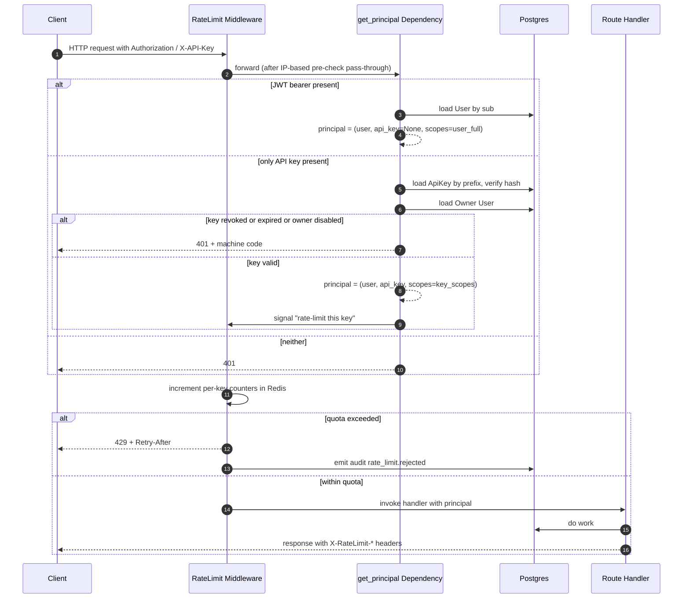
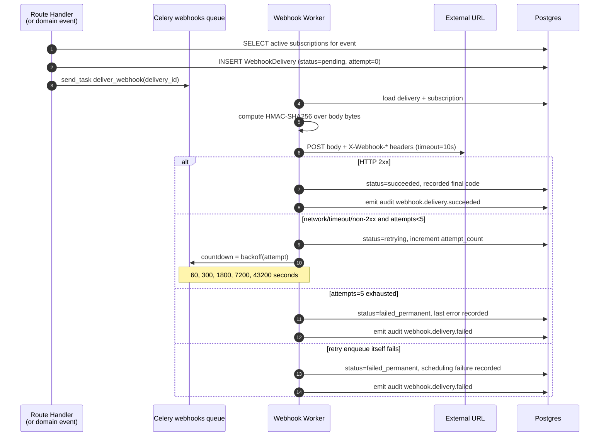
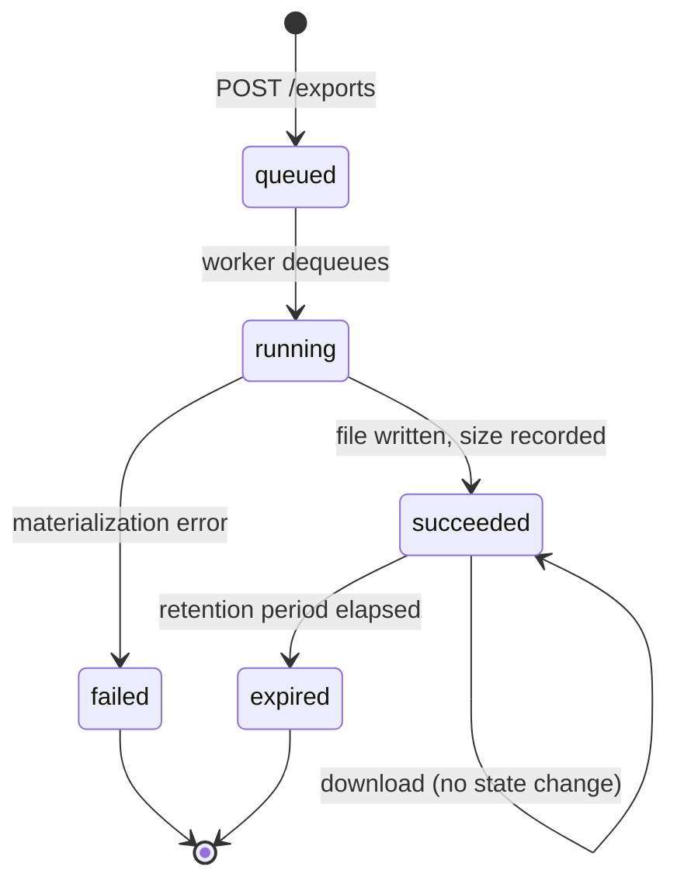

# Design Document

## Overview

T15 ("API Open Platform and Export Enhancement") adds four backend subsystems to the existing FastAPI service: API key lifecycle management, webhook subscription and delivery, multi-format asynchronous data export, and per-API-key rate limiting. All four subsystems share a single new authentication composition layer, a single audit emission helper, and a single set of Celery queues. The design deliberately reuses the existing JWT/RBAC stack (`app/core/security.py`, `app/core/deps.py`, `app/models/audit_log.py`) so that an API key never grants more access than its owning user already has, and so that compliance reporting under the T10 module continues to work without schema changes.

The feature is implemented as four new SQL tables, one new dependency function, one new middleware, two new Celery queues, one new admin scope set, two new HTTP routers (public `v1` integration routes and `v1/admin` administrative routes), and one supplemental OpenAPI configuration. No frontend pages are in this scope; the design assumes an admin pane will be added later from the same React monorepo and consume the admin endpoints described here. OAuth 2.0/SSO, GraphQL, gRPC, and a separate developer portal UI remain out of scope.

The design is anchored on three principles:

1. **Identity composition over duplication.** A single `Principal` object resolves from JWT or from API key in one place, and every existing route handler that already accepts `User = Depends(get_current_user)` keeps working unchanged. The new dependency sits beside the existing one rather than replacing it route-by-route.
2. **Retry-aware asynchronous work.** Webhook delivery and export materialization both hand off to Celery, both record their state in Postgres, and both emit terminal-state audit events. Failure paths converge on the same audit verbs so that compliance review is uniform.
3. **Storage and rate counters live where they belong.** Export files live on the local filesystem under a project-relative root (suitable for the current single-host deployment, swappable to S3 later). Rate limit counters live in Redis so they survive process restarts and span uvicorn workers — a known gap in the current per-process limiter at `app/middleware/rate_limit.py`.

## Architecture

### Component layout

```mermaid
flowchart LR
    subgraph Client["External / Internal Client"]
        EXT[External integrator<br/>API Key]
        UI[React Web UI<br/>JWT]
    end

    subgraph FastAPI["FastAPI Application"]
        AUTH[Auth Resolver<br/>get_principal]
        RL[Rate Limit<br/>Middleware]
        ROUTE_PUB[Public v1 Routers<br/>surveys, responses, ...]
        ROUTE_API[New API Platform Routes<br/>api_keys, webhooks,<br/>exports, admin]
        DOCS[OpenAPI / Swagger / ReDoc<br/>at /api/v1/docs]
        AUDIT[log_audit helper<br/>core/audit.py]
    end

    subgraph Workers["Celery Workers"]
        WHQ[(webhooks queue)]
        EXQ[(exports queue)]
        WHW[Webhook Delivery Worker]
        EXW[Export Worker]
    end

    subgraph State["Persistent State"]
        PG[(PostgreSQL 16)]
        RDS[(Redis 7)]
        FS[/Local FS<br/>storage/exports/{user}/{job}/]
    end

    EXT -- "Authorization: Bearer <key><br/>or X-API-Key" --> RL
    UI  -- "Authorization: Bearer <jwt>" --> RL
    RL --> AUTH
    AUTH --> ROUTE_PUB
    AUTH --> ROUTE_API
    ROUTE_API -- "enqueue delivery" --> WHQ
    ROUTE_API -- "enqueue export" --> EXQ
    WHQ --> WHW
    EXQ --> EXW
    WHW -- "HTTPS POST + HMAC" --> EXT
    EXW -- "writes file" --> FS
    EXW -- "updates job state" --> PG
    AUDIT --> PG
    RL <-- "counters / quotas" --> RDS
    AUTH <-- "validate key hash" --> PG
    ROUTE_PUB --> AUDIT
    ROUTE_API --> AUDIT
    DOCS -.derived from FastAPI metadata.- ROUTE_PUB
    DOCS -.derived from FastAPI metadata.- ROUTE_API
```

The dotted lines indicate that the `/api/v1/openapi.json`, `/api/v1/docs`, and `/api/v1/redoc` endpoints are not separate components — they are derived automatically by FastAPI from the routers' decorators and Pydantic schemas. The API Documentation Service is therefore configuration plus annotation, not a runtime service.

### Auth resolution flow



The middleware performs the rate limit check **after** authentication resolves, because the per-API-key counter requires a known key id. Requests authenticated by JWT are not subject to per-API-key rate limiting; they continue to be governed by whatever IP-based protection sits in front of the API. The middleware code path therefore branches on `principal.api_key is not None`.

### Webhook delivery sequence with retry



The retry schedule `{60s, 300s, 1800s, 7200s, 43200s}` is configured via `Celery.send_task(... countdown=...)`. Each retry re-reads the subscription so that a signing secret rotated between attempts is picked up.

### Export job state machine



The transition `succeeded → expired` is driven by a Celery beat job that runs hourly, scans `export_jobs` with `status='succeeded' AND completed_at < now() - retention_window`, deletes the on-disk file, and updates the row. There is no path from `failed` back to `running`; the user must submit a fresh export request.

## Components and Interfaces

### 1. Auth resolution dependency

**Module:** `apps/api/core/app/core/deps.py` (extension)

A new dependency `get_principal()` returns a small dataclass:

```python
from dataclasses import dataclass
from typing import Optional, FrozenSet
from .models.user import User
from .models.api_key import ApiKey

@dataclass(frozen=True)
class Principal:
    user: User
    api_key: Optional[ApiKey]
    scopes: FrozenSet[str]   # full RBAC if JWT, else key's stored scopes
```

Resolution order is fixed by Req 8 AC1: if both a JWT and an API key are presented, the JWT wins and the API key is ignored. The dependency reads the `Authorization: Bearer <token>` header first; only when the token does not validate as a JWT does it fall back to checking whether the same `Bearer <…>` value has the `sk_` prefix that identifies an API key. It also accepts a secondary `X-API-Key` header so existing client libraries that reserve `Authorization` for OAuth tokens can still authenticate.

The existing `get_current_user` continues to exist and continues to ignore API keys; it is now a thin wrapper that calls `get_principal()` and returns `principal.user`. This means every existing router (surveys, responses, etc.) becomes API-key-callable for free. New routers that need to inspect scopes or distinguish JWT-vs-key callers depend on `get_principal` directly. The per-survey RBAC dependency `check_survey_permission` is unchanged — it already takes a `User` and a target survey id, and the principal's user already represents the API key owner per Req 8 AC4.

Scope checks are layered on top via a small helper `require_scope("survey:read")` that raises 403 when the principal was authenticated by an API key whose stored scopes do not include the requested label. JWT-authenticated principals always pass scope checks (their RBAC role is what gates them).

### 2. API Key service

**Routes:** `apps/api/core/app/api/v1/api_keys.py`, prefix `/api/v1/api-keys`, all routes require JWT (a key cannot manage other keys per Req 8 AC5)

| Method | Path | Behavior |
|---|---|---|
| POST | `/` | Create key with name, scopes, optional expiration; return plaintext **once** |
| GET | `/` | List caller's own keys (no plaintext, no hash) |
| POST | `/{key_id}/rotate` | Rotate secret; return new plaintext **once** |
| POST | `/{key_id}/revoke` | Revoke (soft delete via `revoked_at`) |
| DELETE | `/{key_id}` | Hard delete only when revoked AND audit retention complete |

The plaintext format is `sk_<env>_<24 url-safe base64 chars>`, where `<env>` is `live` or `test` (reserved for future). The service stores `key_prefix` (the first 11 characters, used for fast lookup and to display in lists) and `key_hash` (a SHA-256 of the full plaintext, deliberately not bcrypt because we need O(1) verification per request). A SHA-256 over a 144-bit secret is acceptable here because the secret entropy already exceeds the brute-force threshold, and bcrypt's per-request cost would dominate the rate limiter and erase its accuracy.

Validation on creation: scope strings must match a fixed enum `{"survey:read", "survey:write", "response:read", "response:write", "export:read", "export:write", "webhook:manage", "admin:read", "admin:write", "audit:read"}`. Granting `admin:*` or `audit:read` requires the caller's user to have `User.is_admin` (a new boolean to be added in this revision).

### 3. Webhook service

**Routes:** `apps/api/core/app/api/v1/webhooks.py`, prefix `/api/v1/webhooks`

| Method | Path | Behavior |
|---|---|---|
| POST | `/` | Create subscription (target URL, event types) |
| GET | `/` | List caller's subscriptions |
| PATCH | `/{sub_id}` | Update target URL / event types / active flag |
| POST | `/{sub_id}/rotate-secret` | Generate new signing secret; previous secret stays valid until invalidation completes (Req 3 AC5) |
| DELETE | `/{sub_id}` | Stop new dispatches; delivery history retained per audit retention |
| GET | `/{sub_id}/deliveries` | Paginated history |
| POST | `/{sub_id}/deliveries/{delivery_id}/redeliver` | Manual redelivery, new id, original payload preserved byte-for-byte |

Domain event emission lives next to the existing handlers. For example, `apps/api/core/app/api/v1/responses.py` already commits a new `SurveyResponse`; immediately after that commit it calls a new helper:

```python
await emit_webhook_event(
    db,
    event_type="response.created",
    survey_id=survey.id,
    payload={"survey_id": ..., "response_id": ..., "submitted_at": ...},
)
```

`emit_webhook_event` queries active subscriptions whose event type list contains `response.created` and whose owner user has at least viewer permission on `survey_id`. For each match it inserts a `WebhookDelivery` row in status `pending` and calls `celery_app.send_task("app.tasks.webhook_tasks.deliver_webhook", args=[delivery_id], queue="webhooks")`. The two operations (DB insert and Celery enqueue) run inside the same transaction; if Celery is down the insert is rolled back. This is acceptable because in this deployment Redis (Celery broker) and Postgres typically share the same uptime envelope, and a webhook delivery without a corresponding `WebhookDelivery` row would be untraceable.

The supported event types `{response.created, response.completed, quota.reached, distribution.sent}` correspond to existing domain transitions in the codebase: `responses.py` covers the first two, `app/services/sample_service.py` covers `quota.reached`, and `app/api/v1/distribution.py` covers `distribution.sent`.

### 4. HMAC signature scheme

The exact byte sequence of the JSON body is signed using HMAC-SHA256 keyed by the subscription's current signing secret. The result is hex-encoded and sent in the `X-Webhook-Signature` header in the form:

```
X-Webhook-Signature: sha256=<64 lowercase hex chars>
```

Header set per Req 4 AC2:

| Header | Value |
|---|---|
| `Content-Type` | `application/json` |
| `User-Agent` | `IntelligenceSurveyPlatform-Webhook/1.0` |
| `X-Webhook-Event` | the event type label, e.g. `response.created` |
| `X-Webhook-Delivery` | UUID v4 unique per delivery attempt |
| `X-Webhook-Signature` | `sha256=<hex>` |

The body is built by `json.dumps(payload, ensure_ascii=False, separators=(",", ":"))` and the resulting `bytes` (UTF-8) are passed to both `httpx.post(content=body_bytes)` and to `hmac.new(secret.encode("utf-8"), body_bytes, sha256).hexdigest()`. Using the canonical bytes from a single serialization step removes any whitespace or key-order ambiguity that would otherwise cause the receiver's verification to fail. The receiver's verification recipe is published in the usage guide (Req 1 AC6).

During secret rotation the worker has access to both the new and the previous signing secret while the previous secret is being invalidated (Req 3 AC5). When in this dual-secret window the worker signs only with the new secret; the old secret is retained for receiver-side verification flexibility, but server-side outbound signing always uses the latest secret. The previous secret's invalidation is itself a Celery task with at-least-once retry semantics.

### 5. Webhook delivery worker

**Module:** `apps/api/core/app/tasks/webhook_tasks.py`, queue `webhooks`

Single task `deliver_webhook(delivery_id: str)`. It loads the `WebhookDelivery` and its subscription, computes the signature, performs the HTTPS POST with `httpx.AsyncClient(timeout=10)`, classifies the outcome, and either marks success, marks permanent failure, or enqueues itself with the next backoff. The retry counter is stored on the row, not on the Celery task, so a worker restart mid-flight cannot lose state. The schedule `[60, 300, 1800, 7200, 43200]` seconds is computed from the row's `attempt_count` rather than from Celery's `self.request.retries` for the same reason.

Concurrency guidance: webhook delivery is I/O bound. Recommend `--queues=webhooks --concurrency=8` on a dedicated worker container, with `worker_prefetch_multiplier=4` so a slow target URL does not stall other deliveries. This is intentionally different from the existing AI worker, which uses prefetch 1 because LLM calls are heavy.

Idempotency: the receiver gets the delivery's UUID in `X-Webhook-Delivery`. It is the receiver's responsibility to dedupe by this id if multiple delivery attempts arrive (which can happen during retry of a request that the receiver actually accepted but failed to ACK before timeout). The platform makes no claim about exactly-once.

### 6. Export service

**Routes:** `apps/api/core/app/api/v1/exports.py`, prefix `/api/v1/exports`

| Method | Path | Behavior |
|---|---|---|
| POST | `/` | Create job for `(survey_id, format, options)`; return job id |
| GET | `/{job_id}` | Status, with download URL if and only if `succeeded` |
| GET | `/{job_id}/download?token=<...>` | Serve the file via short-lived signed token |
| GET | `/` | List caller's jobs, paginated, filterable by status / survey |

Format support is detected at startup. The service module exposes a constant `SUPPORTED_FORMATS: FrozenSet[str]` initialized to `{"csv", "xlsx", "json"}` and conditionally extended with `{"sav", "sas7bdat"}` if `pyreadstat` imports cleanly. POSTs with unsupported formats are rejected with 400 + `export_format_unsupported` (Req 5 AC3). The OpenAPI spec for the create endpoint reflects the runtime-supported set so the published documentation is accurate per host.

### 7. Export worker

**Module:** `apps/api/core/app/tasks/export_tasks.py`, queue `exports`

Single task `materialize_export(job_id: str)`. It transitions the job to `running`, streams `SurveyResponse.answers` rows for the target survey in id order, materializes them per format, writes to a temporary file inside the job's storage directory, atomically renames the temp file to the final name on success, and updates the job to `succeeded` with `storage_path` and `byte_size`. On any exception during materialization, the temp file is unlinked and the job transitions to `failed` with the exception's class name and message recorded (truncated to 1000 chars). Critically, no partial output file is retained per Req 5 AC9, which is what the temp-then-rename pattern guarantees.

Format-specific producers are small, independent functions:

| Format | Library | Notes |
|---|---|---|
| `csv` | `csv` (stdlib) | UTF-8 with BOM (`\ufeff`); header row in canonical question order |
| `xlsx` | `openpyxl` | Single sheet; header row; types preserved for numeric / date answers |
| `json` | `json` (stdlib) | Array of objects keyed by question id; pretty-printed with `indent=2` |
| `sav` | `pyreadstat.write_sav` | Variable labels = question text; value labels = choice options |
| `sas7bdat` | `pyreadstat.write_sas7bdat` | Same labels as SAV |

Question canonical order is read from `survey.json_content` (SurveyJS schema) by walking pages in order and questions within each page in declared order. This is computed once per job.

Concurrency guidance: exports are CPU-bound for SPSS/SAS and memory-bound for large XLSX. Recommend `--queues=exports --concurrency=2 --max-tasks-per-child=50` on a dedicated worker. `max-tasks-per-child=50` recycles the process so memory leaks in `pyreadstat` (a known issue on long-running processes) do not accumulate.

### 8. Time-limited download URLs

A successful `GET /api/v1/exports/{job_id}` returns a `download_url` field whose value is `/api/v1/exports/{job_id}/download?token=<jwt>`. The token is an HS256 JWT with claims `{sub: <user_id>, jti: <job_id>, purpose: "export_download", exp: now+15min}`, signed with the existing `JWT_SECRET`. The download endpoint accepts only this token (no `Authorization` header needed), validates that `purpose=="export_download"` and `jti==job_id`, confirms the job is `succeeded` and not `expired`, and streams the file from disk with `FileResponse`. This avoids needing to accept either JWT or API key on the download endpoint, simplifies CDN/proxy caching considerations, and lets us hand the URL to non-API-aware tools (e.g. an end-user clicking it from email).

The `:export_download` purpose is namespaced so a leaked download token cannot be replayed against other endpoints. The token cannot be revoked once issued; this is acceptable because the download URL is itself behind the existing 15-minute access-token lifetime and the underlying file is deleted on retention expiry.

For API key callers needing programmatic download, `GET /api/v1/exports/{job_id}/download` also accepts an authenticated request without a token if the caller's API key has `export:read` scope, per Req 5 AC11.

### 9. Rate limiter middleware

**Module:** `apps/api/core/app/middleware/rate_limit.py` (replaces the existing in-memory limiter)

Implementation choice: **fixed-window counters** keyed by `(api_key_id, window_label, window_start_epoch)`, stored as Redis integers with TTL equal to the window length. Three windows per request — `minute`, `hour`, `day` — are checked atomically using a single Lua script per request to avoid the read-then-write race that `INCR` + separate `EXPIRE` would create. The Lua script `INCR`s each window key, sets `EXPIRE` only when the new value is `1` (first hit in the window), and returns the new counts; the Python side compares against the configured quotas.

Why fixed-window over sliding-window:

- The required headers (`X-RateLimit-Limit`, `X-RateLimit-Remaining`, `X-RateLimit-Reset`) and the `Retry-After` header on 429 responses all map naturally to fixed-window semantics: `Reset` is `next_window_start_epoch`, `Retry-After` is `Reset - now`. Sliding-window equivalents are either approximations (sliding log is exact but stores all timestamps) or harder to expose accurately to the client.
- The quota values in this requirement are coarse (per-minute, per-hour, per-day) rather than fine-grained QoS limits where boundary effects matter. Burst at the boundary is acceptable.
- A single Lua script per request keeps Redis round-trips at one per request, important when the limiter sits in front of every API call.

Default quotas (overridable per key per Req 6 AC6) as configuration constants:

| Window | Default |
|---|---|
| Per minute | 60 |
| Per hour | 1200 |
| Per day | 10000 |

Override storage: `ApiKey.rate_limit_overrides` JSONB column with shape `{"minute": int, "hour": int, "day": int}`, all keys optional. The middleware reads this column on the principal at the same time it loads the key for authentication, so no extra round trip is added.

Fail-closed behavior per Req 6 AC7: if the Redis call raises `redis.ConnectionError` or times out (`socket_timeout=1.0`), the middleware returns 503 with body `{"error": "rate_limiter.backend_unavailable"}` and emits the corresponding audit event. JWT-authenticated requests do not pass through this code path and so are not affected by Redis outages — this is intentional, because internal users should be able to keep operating the platform UI even if the API key infrastructure is down.

### 10. Audit integration

The existing helper at `apps/api/core/app/core/audit.py` is reused as-is. New action verbs added to the canonical set:

| Verb | Resource type | Resource id |
|---|---|---|
| `api_key.create`, `api_key.rotate`, `api_key.revoke`, `api_key.admin_revoke` | `api_key` | api key id |
| `webhook.subscription.create`, `.update`, `.rotate_secret`, `.delete` | `webhook_subscription` | subscription id |
| `webhook.delivery.succeeded`, `webhook.delivery.failed` | `webhook_delivery` | delivery id |
| `export.job.created`, `export.job.succeeded`, `export.job.failed`, `export.job.expired` | `export_job` | job id |
| `rate_limit.rejected` | `api_key` | api key id |
| `rate_limiter.backend_unavailable` | `system` | `null` |

The existing `details` JSONB column on `audit_logs` is sufficient to absorb extras like `key_name`, `target_url`, `event_type`, `attempt_count`, `format`, `byte_size`, `window_label`. Per Req 7 AC9 any field not representable in `(action, resource_type, resource_id, details, ip_address, user_agent, created_at, user_id)` is dropped without error rather than triggering a schema migration.

### 11. Admin endpoints

**Routes:** `apps/api/core/app/api/v1/admin.py`, prefix `/api/v1/admin`

| Method | Path | Required scope |
|---|---|---|
| GET | `/api-keys` | `admin:read` |
| POST | `/api-keys/{key_id}/revoke` | `admin:write` |
| GET | `/webhooks` | `admin:read` |
| GET | `/exports` | `admin:read` |
| GET | `/audit-logs` | `audit:read` |

Each endpoint uses `Depends(get_principal)` plus `require_scope(...)`. The `User.is_admin` flag (added in Alembic 0008) gates both JWT callers (admin role) and API key issuance for admin scopes (cannot mint a key with `admin:*` unless the owner is admin). The admin revoke path emits `api_key.admin_revoke` (note the distinct verb) so audit reviewers can distinguish self-revoke from compliance-driven revoke per Req 9 AC4.

The compliance integration point at Req 9 AC5 is satisfied by the existing T10 compliance export, which already queries `audit_logs` by time range; the new verbs above will appear in that export automatically because they share the same table and schema.

### 12. API documentation

The FastAPI `app` object's `title`, `description`, and `version` already exist. Extension consists of:

- Setting `openapi_url="/api/v1/openapi.json"`, `docs_url="/api/v1/docs"`, `redoc_url="/api/v1/redoc"` on the `FastAPI(...)` constructor (Req 1 AC1 / AC2 / AC3).
- Adding to `app.openapi_schema` two security schemes after generation: `BearerAuth` (HTTP bearer / JWT) and `ApiKeyAuth` (apiKey in header `X-API-Key`). Each route's `Depends(get_principal)` is annotated so OpenAPI lists both as accepted (Req 1 AC5).
- Tagging every public route with at least one tag, a `summary`, a `description`, and at least one example via FastAPI's `responses=` and `examples=` mechanisms (Req 1 AC4). New routers contain those by construction; existing routers will get a one-time pass to fill in missing summaries.
- Excluding internal routes by setting `include_in_schema=False` on those routers (Req 1 AC7). The current internal-only candidates are `app/api/v1/health.py` and any future debug endpoints.
- Publishing a usage guide page accessible from `/api/v1/docs` (linked from the description). The guide is a static markdown file at `apps/api/core/app/static/integration-guide.md` rendered on a documented route. It contains four worked examples — auth, list surveys, register a webhook, start an export — in cURL plus one of {Python (`httpx`), JavaScript (`fetch`)}, satisfying Req 1 AC6.

## Data Models

### New tables (Alembic 0008..0011, applied in order)

The migration chain extends `0007 → 0008 → 0009 → 0010 → 0011`. Each migration is small and reviewable.

**0008 `add_api_keys_and_admin_flag.py`** (`down_revision = "0007"`)

Adds `users.is_admin BOOLEAN NOT NULL DEFAULT false`, then creates `api_keys`:

| Column | Type | Notes |
|---|---|---|
| `id` | UUID PK | |
| `user_id` | UUID FK users.id ON DELETE CASCADE | |
| `name` | VARCHAR(120) | display label |
| `key_prefix` | VARCHAR(11) UNIQUE INDEX | first 11 chars of plaintext, e.g. `sk_live_ab` |
| `key_hash` | VARCHAR(64) | SHA-256 hex of plaintext |
| `scopes` | JSONB | array of strings |
| `rate_limit_overrides` | JSONB | nullable, `{minute, hour, day}` partial |
| `expires_at` | TIMESTAMPTZ | nullable |
| `last_used_at` | TIMESTAMPTZ | nullable |
| `revoked_at` | TIMESTAMPTZ | nullable; non-null = revoked |
| `created_at` | TIMESTAMPTZ DEFAULT now() | |
| `updated_at` | TIMESTAMPTZ DEFAULT now() | |

Indices: `(user_id)`, `(key_prefix)` unique, `(revoked_at) WHERE revoked_at IS NULL` for fast listing of active keys.

The `last_used_at` column updates on every successful authenticated request (best-effort write; if it fails it is swallowed, since stamping it should not break a request). The "inactive" flag in list responses (Req 2 AC9) is computed at read time by comparing `last_used_at` against a configurable threshold (default 90 days) — no separate `is_inactive` column is stored.

**0009 `add_webhook_subscriptions_and_deliveries.py`** (`down_revision = "0008"`)

Creates `webhook_subscriptions`:

| Column | Type | Notes |
|---|---|---|
| `id` | UUID PK | |
| `user_id` | UUID FK users.id ON DELETE CASCADE | |
| `survey_id` | UUID FK surveys.id ON DELETE CASCADE | nullable; nullable means "all surveys owner has access to" |
| `target_url` | VARCHAR(2048) | must be HTTPS, validated app-side |
| `event_types` | JSONB | array, validated against enum |
| `description` | VARCHAR(500) | nullable |
| `signing_secret_hash` | VARCHAR(64) | SHA-256 of current secret |
| `previous_secret_hash` | VARCHAR(64) | nullable, set during rotation window |
| `active` | BOOLEAN NOT NULL DEFAULT true | |
| `last_delivery_at` | TIMESTAMPTZ | nullable, status cache |
| `last_delivery_status` | VARCHAR(20) | nullable, e.g. `succeeded` / `failed_permanent` |
| `created_at`, `updated_at` | TIMESTAMPTZ | |

The signing secret is shown plaintext only at create / rotate time, then stored hashed. The `previous_secret_hash` exists exclusively for the dual-window described in Req 3 AC5 and is cleared by the invalidation Celery task once the previous secret is no longer accepted.

Then creates `webhook_deliveries`:

| Column | Type | Notes |
|---|---|---|
| `id` | UUID PK | also the `X-Webhook-Delivery` header value |
| `subscription_id` | UUID FK webhook_subscriptions.id ON DELETE CASCADE | |
| `event_type` | VARCHAR(50) | |
| `payload` | JSONB | the body sent (preserved for redelivery, Req 4 AC10) |
| `status` | VARCHAR(20) NOT NULL | `pending` / `retrying` / `succeeded` / `failed_permanent` |
| `attempt_count` | INTEGER NOT NULL DEFAULT 0 | |
| `last_attempt_at` | TIMESTAMPTZ | |
| `last_response_status` | INTEGER | nullable (for non-2xx) |
| `last_error` | TEXT | truncated to 1000 chars |
| `next_attempt_at` | TIMESTAMPTZ | nullable, when status=retrying |
| `created_at`, `completed_at` | TIMESTAMPTZ | |

Indices: `(subscription_id, created_at DESC)` for history, `(status) WHERE status='retrying'` for pending-retry visibility.

**0010 `add_export_jobs.py`** (`down_revision = "0009"`)

Creates `export_jobs`:

| Column | Type | Notes |
|---|---|---|
| `id` | UUID PK | |
| `user_id` | UUID FK users.id ON DELETE CASCADE | the requester |
| `survey_id` | UUID FK surveys.id ON DELETE CASCADE | |
| `format` | VARCHAR(20) | one of supported formats |
| `status` | VARCHAR(20) NOT NULL | `queued` / `running` / `succeeded` / `failed` / `expired` |
| `options` | JSONB | reserved for future (date range, columns, etc.) |
| `storage_path` | VARCHAR(500) | nullable, set on success |
| `byte_size` | BIGINT | nullable, set on success |
| `error_message` | TEXT | nullable, truncated 1000 chars |
| `created_at`, `started_at`, `completed_at`, `expires_at` | TIMESTAMPTZ | nullable as appropriate |

Indices: `(user_id, created_at DESC)`, `(status) WHERE status IN ('queued','running')` for worker dequeue visibility, `(expires_at) WHERE status='succeeded'` for the retention sweeper.

**0011 `add_api_platform_indices.py`** (`down_revision = "0010"`)

Adds composite indices that depend on data shape and are easier to ship as a separate revision: `(audit_logs.action, audit_logs.created_at DESC)` to accelerate the admin filter, and `(webhook_deliveries.subscription_id, webhook_deliveries.status)` to accelerate the `last_delivery_status` cache invalidation. Splitting these from 0008–0010 keeps each table-creation migration independent and reversible.

### Redis-only state

No `ApiKeyUsageCounter` table is created. Per-key request counters live exclusively in Redis under the keys:

```
ratelimit:{api_key_id}:m:{epoch_minute}    INTEGER, TTL=70s
ratelimit:{api_key_id}:h:{epoch_hour}      INTEGER, TTL=4000s
ratelimit:{api_key_id}:d:{epoch_day}       INTEGER, TTL=90000s
```

The trailing TTL pad (10 s, ~7 min, ~25 min) covers clock skew between Redis and the application servers without making expired counters linger meaningfully. The 30-day "total request count over trailing 30-day window" required for the admin inventory (Req 9 AC1) is computed by summing the day-window counters from Redis at query time — this is at most 30 `MGET`s and is cheap enough to do on demand. If those keys have already expired (older than ~25 hours), the value is reported as `null` rather than `0` to make absence of data distinguishable.

### Integration with existing models

The `User` model gets a single new column (`is_admin`); `Survey` and `SurveyResponse` are not modified. `AuditLog` is not modified at all — Req 7 AC8 / AC9 are satisfied by mapping new verbs into the existing schema.

Existing dependency injection points reused unchanged:

- `get_db` from `app/database.py` — every new route uses it.
- `get_current_user` from `app/core/deps.py` — re-implemented as `principal.user` of `get_principal`. All existing routers get API-key support transparently.
- `check_survey_permission` from `app/core/deps.py` — gates all new survey-scoped routes (export create, webhook create with `survey_id`).
- `log_audit` from `app/core/audit.py` — every new mutation, every webhook terminal state, every export terminal state, every rate-limit rejection.

## Correctness Properties

A property is a characteristic or behavior that should hold true across all valid executions of a system — essentially, a formal statement about what the system should do. Properties serve as the bridge between human-readable specifications and machine-verifiable correctness guarantees. The properties below are derived from the prework analysis and have been deduplicated; each property carries unique validation value.

### Property 1: Plaintext credential exposure is exactly-once

For any successful credential creation or rotation operation (API key creation, API key rotation, webhook subscription creation, webhook signing secret rotation), the plaintext secret appears in the response body of that single operation and does not appear in the body of any other API response, in any persisted database column, or in any audit log details payload, for the lifetime of the credential.

**Validates: Requirements 2.1, 2.3, 2.8, 3.1, 3.4**

### Property 2: Rotation invalidates the previous secret

For any API key or webhook signing secret rotation, after the rotation completes (and outside the dual-acceptance window described in Property 3), authentication or signature verification using the previous plaintext fails and the same operation using the new plaintext succeeds.

**Validates: Requirements 2.4, 3.4**

### Property 3: Webhook signature dual-window during invalidation failure

For any webhook subscription whose signing secret has been rotated and whose previous-secret invalidation has not yet completed, signature verification by the receiver simulator succeeds for any payload signed with either the previous or the current signing secret. Once invalidation completes, only the current secret yields verification success.

**Validates: Requirements 3.5**

### Property 4: Revoke and delete cease subsequent activity

For any API key, after revocation, every subsequent request authenticated with that key returns HTTP 401. For any webhook subscription, after deletion, every subsequent domain event whose event type matches the subscription's previous event types produces zero new `WebhookDelivery` rows for that subscription.

**Validates: Requirements 2.5, 3.6**

### Property 5: Expired credential rejection

For any API key whose `expires_at` is in the past, every request authenticated with that key returns HTTP 401 with machine-readable error code `api_key_expired`.

**Validates: Requirements 2.6**

### Property 6: Inactive flag predicate

For any API key with timestamps `last_used_at` and `created_at` and configured inactivity threshold `T`, the inactive flag returned in list responses equals `(now - coalesce(last_used_at, created_at)) >= T`.

**Validates: Requirements 2.9**

### Property 7: Authentication and authorization composition

For any incoming request and any combination of (JWT validity, API key validity, target endpoint, target survey identifier, API key scopes, owner user RBAC role on the target survey), the resolved authorization decision matches the following predicate evaluated in order: (a) if a valid JWT is present, the request authenticates as the JWT user and any presented API key is ignored; (b) otherwise, if a valid non-revoked non-expired API key is present whose owner is active, the request authenticates as the owner user; (c) otherwise, the request fails with HTTP 401. After authentication, for survey-scoped operations, the request is permitted if and only if the operation's required RBAC role is satisfied by the authenticated user's role on the target survey, and additionally — when the request was authenticated by an API key — the operation's required scope label is present in the key's stored scope list.

**Validates: Requirements 2.2, 2.7, 8.1, 8.2, 8.3, 8.4, 8.5, 8.6**

### Property 8: Webhook routing fan-out

For any emitted domain event with event type `e` and any set of webhook subscriptions, the number of `WebhookDelivery` rows created for that emission equals the count of subscriptions in the set whose `active == True`, whose stored `event_types` list contains `e`, and whose owner user has at least viewer permission on the target survey.

**Validates: Requirements 4.1**

### Property 9: Webhook request construction

For any delivery with a unique delivery identifier, an event type, a body byte sequence, and a current signing secret, the constructed outbound HTTPS request carries `Content-Type: application/json`, `X-Webhook-Event` equal to the event type, `X-Webhook-Delivery` equal to the delivery identifier, and `X-Webhook-Signature` equal to `sha256=<hex>` where `<hex>` equals `hmac.new(secret_bytes, body_bytes, sha256).hexdigest()` from the standard library reference.

**Validates: Requirements 4.2, 4.3**

### Property 10: Webhook delivery state machine

For any sequence of attempt outcomes (a list whose elements are drawn from `{success_2xx, network_error, timeout, http_4xx, http_5xx, enqueue_failure}`), the worker's final delivery state and the recorded `next_attempt_at` schedule equal the reference state machine evaluated on the same sequence: a `success_2xx` immediately transitions to `succeeded` and stops; a non-success outcome at attempt index `i` transitions to `retrying` with `next_attempt_at = now + schedule[i]` where `schedule = [60, 300, 1800, 7200, 43200]` if `i < 5`, transitions to `failed_permanent` if `i == 5`, and transitions to `failed_permanent` immediately on `enqueue_failure` regardless of `i`. Every transition into a terminal state (`succeeded` or `failed_permanent`) appends exactly one audit row whose action verb matches the terminal state.

**Validates: Requirements 4.4, 4.5, 4.6, 4.7, 4.8**

### Property 11: Manual redelivery preserves payload bytes

For any recorded delivery, manual redelivery creates a new `WebhookDelivery` row whose `id` differs from the original and whose stored `payload` byte sequence equals the original delivery's `payload` byte sequence exactly (identical canonical JSON encoding).

**Validates: Requirements 4.10**

### Property 12: Export format admission

For any export format string `f`, the create endpoint accepts `f` if and only if `f` is a member of the runtime supported format set (`{csv, xlsx, json}` plus `{sav, sas7bdat}` when `pyreadstat` is importable). Non-member values are rejected with HTTP 400 and machine-readable error code `export_format_unsupported`.

**Validates: Requirements 5.1, 5.2, 5.3**

### Property 13: Export job lifecycle convergence

For any export job, the recorded status sequence is monotone within the lattice `queued → running → {succeeded, failed}` followed optionally by `succeeded → expired`. For any successful materialization, `started_at <= completed_at`, `storage_path` references an existing file, and `byte_size` equals the file's on-disk size. For any failed materialization, `error_message` is non-empty and `storage_path` references no existing file (no partial output is retained). For any retention sweep against any set of jobs, every job whose `status == succeeded` and `expires_at < now` transitions to `expired` with its on-disk file unlinked.

**Validates: Requirements 5.4, 5.9, 5.12**

### Property 14: Export format structural invariants

For any survey `S` with canonical question identifier sequence `Q = [q1, q2, ...]` and any list of responses `R`, the materialized output for each format satisfies the following invariants:

- **CSV**: the file begins with the UTF-8 BOM bytes `EF BB BF`, the first record after the BOM equals `Q` in declared order, and the file contains exactly `len(R) + 1` records.
- **XLSX**: the workbook has one sheet, the first row equals `Q` in declared order, and the sheet has exactly `len(R) + 1` rows and exactly `len(Q)` columns.
- **JSON**: the parsed document is a list of length `len(R)`, every element is an object whose keys are a subset of `Q`, and for every response `r` in `R` and every key `q` in `r`, the corresponding value in the output equals `r[q]`.
- **SAV / SAS7BDAT** (when `pyreadstat` is available): the file's variable-name-to-label mapping equals `{q: question_text(S, q) for q in Q}`, and for every question `q` with declared choices `C`, the variable's value-label mapping equals `C`.

**Validates: Requirements 5.5, 5.6, 5.7, 5.8**

### Property 15: Export download authorization

For any export job and any caller, the download endpoint returns the file content if and only if the job's status is `succeeded` AND one of: (a) the caller presents a valid signed download token whose `jti` equals the job id, whose `purpose` equals `export_download`, and whose `exp` is in the future; or (b) the caller is authenticated as the job's owner user via JWT; or (c) the caller is authenticated by an API key whose owner is the job's owner user and whose scope list contains `export:read`. In all other cases the response is 401 or 403.

**Validates: Requirements 5.10, 5.11**

### Property 16: Rate-limit decision predicate

For any incoming API-key-authenticated request, any per-key window quota tuple `(Lm, Lh, Ld)`, and any current per-window counts after increment `(Cm, Ch, Cd)`, the rate limiter denies the request with HTTP 429 if and only if `Cm > Lm` OR `Ch > Lh` OR `Cd > Ld`. When the request is allowed, the response carries `X-RateLimit-Limit = Lm`, `X-RateLimit-Remaining = max(0, Lm - Cm)`, and `X-RateLimit-Reset = next_minute_boundary_epoch`. When the request is denied, the response carries `Retry-After` equal to `min(reset(w) - now)` taken across all windows `w` for which `Cw > Lw`.

**Validates: Requirements 6.1, 6.2, 6.3, 6.4**

### Property 17: Effective quota composition

For any API key with stored override map `O` (possibly empty) and any window label `w` in `{minute, hour, day}`, the effective quota used by the rate limiter for that key on that window equals `O[w]` if `w` is a key of `O`, otherwise the configured platform default for `w`.

**Validates: Requirements 6.5, 6.6**

### Property 18: Rate-limit fail-closed on Redis outage

For any API-key-authenticated request, when the Redis client raises `ConnectionError` or times out during the limiter's counter operation, the response is HTTP 503 with body `{"error": "rate_limiter.backend_unavailable"}`, the route handler is not invoked, and exactly one audit row with action `rate_limiter.backend_unavailable` is appended.

**Validates: Requirements 6.7**

### Property 19: Audit emission for terminal transitions

For any state transition that is enumerated in the audit verb table (API key create / rotate / revoke / admin_revoke; webhook subscription create / update / rotate_secret / delete; webhook delivery succeeded / failed; export job created / succeeded / failed / expired; rate-limit rejection), the transition appends exactly one audit row to `audit_logs` whose `action` equals the corresponding verb, whose `user_id` equals the actor user identifier (the administrator for `api_key.admin_revoke`), whose `resource_type` and `resource_id` reference the affected entity, and whose `created_at` is within a small epsilon of the wall-clock time of the transition.

**Validates: Requirements 7.1, 7.2, 7.3, 7.4, 7.5, 9.4**

### Property 20: Audit log query equivalence

For any set of audit rows and any combination of filter parameters drawn from `{actor_user_id, resource_id_for_api_key, resource_id_for_subscription, time_range, action_verb}`, the response of the admin audit query endpoint equals the same set filtered by the same filters in memory (modulo pagination and ordering by `created_at DESC`).

**Validates: Requirements 7.7**

### Property 21: Audit row schema conformance

For any audit emission carrying an arbitrary additional-context dictionary `E`, the persisted row contains exactly the columns of the existing T10 `audit_logs` schema (`user_id, action, resource_type, resource_id, details, ip_address, user_agent, created_at`), the `details` JSONB value contains the schema-compatible subset of `E`, and any keys of `E` that conflict with reserved column names are dropped silently rather than mutating columns or raising errors.

**Validates: Requirements 7.8, 7.9**

### Property 22: Admin inventory completeness

For any state of `api_keys`, `webhook_subscriptions`, and `export_jobs`, the admin inventory endpoints return exactly the rows matching their stated filters: `/admin/api-keys` returns all rows where `revoked_at IS NULL`; `/admin/webhooks` returns all rows where `active == True`; `/admin/exports?since=A&until=B` returns all rows where `A <= created_at < B`. The response of each endpoint is the empty list when the corresponding filter selects no rows. Each row in the API key inventory carries the trailing-30-day request count derived from the Redis day-window counters.

**Validates: Requirements 9.1, 9.2, 9.3**

### Property 23: Compliance export inclusion

For any time range `[A, B]` and any set of audit rows whose `action` belongs to the new verb set introduced by this feature and whose `created_at` falls in `[A, B]`, the compliance module's export over `[A, B]` includes those rows.

**Validates: Requirements 9.5**

### Property 24: Universal documentation annotation

For all routes registered on the FastAPI application with `include_in_schema == True`, the corresponding operation object in the generated OpenAPI document has a non-empty `summary`, a non-empty `description`, at least one example response, and (when the route accepts a request body) at least one example request payload.

**Validates: Requirements 1.4**

### Property 25: Universal internal-route exclusion

For all routes registered on the FastAPI application with `include_in_schema == False`, the route's path does not appear under `paths` in the generated OpenAPI document.

**Validates: Requirements 1.7**

## Error Handling

Error responses share a single envelope shape across all new routes:

```json
{
  "error": "<machine_readable_code>",
  "message": "<human-readable, localized to caller>",
  "details": { /* optional, type-specific */ }
}
```

The `error` field is the contract; clients pattern-match on it. The `message` field is for display and may change wording without notice. The `details` field is reserved for type-specific context (for example the failed scope for a 403, or the exceeded window label for a 429).

**Authentication and authorization failures.** Missing credentials yield 401 with `error="auth_required"`. Invalid or expired JWT yields 401 with `error="jwt_invalid"` or `"jwt_expired"`. Invalid API key yields 401 with `error="api_key_invalid"`; expired key yields `"api_key_expired"`; revoked key yields `"api_key_revoked"`; disabled owner yields `"owner_disabled"` (Req 8 AC6). Insufficient RBAC role yields 403 with `error="insufficient_permission"` and `details.required_role`. Insufficient API key scope yields 403 with `error="insufficient_scope"` and `details.required_scope`.

**Validation failures.** Pydantic validation errors return 422 with FastAPI's default shape (we do not rewrap them). Domain-level validation that is not expressible in the schema returns 400 with the explicit codes called out by the requirements: `webhook_url_must_be_https` (Req 3 AC2), `webhook_event_unsupported` (Req 3 AC3), `export_format_unsupported` (Req 5 AC3).

**Rate limiting.** Quota exceeded returns 429 with `error="rate_limited"`, `details.window` (one of `minute`/`hour`/`day`), and the `Retry-After` header. Redis outage returns 503 with `error="rate_limiter.backend_unavailable"` (Req 6 AC7).

**Webhook delivery failures.** These are not exposed as HTTP errors to the API caller because deliveries are asynchronous. They surface as `last_delivery_status="failed_permanent"` on the subscription row and as audit rows with action `webhook.delivery.failed`. The original cause (network error, timeout, status code, scheduling failure) is recorded in `webhook_deliveries.last_error` truncated to 1000 characters per Req 4 AC6 / AC7.

**Export job failures.** The job row's `status` becomes `failed` and `error_message` is populated with the failing exception class and message, truncated to 1000 characters. The route `GET /api/v1/exports/{job_id}` surfaces this to the caller (Req 5 AC9 / AC10). No partial output is retained, guaranteed by the temp-file-then-rename pattern (the temp file is unlinked in the `except` branch before the row is updated).

**Audit emission failures.** Per the existing helper at `app/core/audit.py`, audit insertion failures are caught and logged but do not fail the surrounding business operation. This is consistent with the existing behavior of the platform and is the right tradeoff for a system that prioritizes user-facing correctness over write-side observability — a missing audit row is recoverable via reconciliation against application logs, while a failed business operation is not.

**Database transaction boundaries.** Each new mutation route uses the existing `get_db` session and commits at the end of the handler. Audit emission, webhook delivery enqueue, and export job enqueue all happen inside that transaction so that on rollback no audit row, no webhook job, and no export job are left orphaned. The Celery enqueue sends to the broker after the DB commit returns; this means a process crash between the commit and the enqueue can leave a `WebhookDelivery` row in `pending` status with no Celery task. A small reconciler task (Celery beat, every 5 minutes) scans `pending` deliveries older than 60 seconds and re-enqueues them to recover from this narrow window.

**HMAC verification on the receiver side** is the receiver's responsibility, not the platform's. The usage guide publishes the canonical verification recipe and a reference implementation in Python and JavaScript so receivers can replicate the platform's exact byte-level signing.

## Testing Strategy

The test suite combines unit tests, property-based tests, and integration tests. Each layer has a defined scope; together they cover the requirements without redundant work.

**Unit tests** target pure functions and small predicates: HMAC computation, exponential backoff schedule selector, scope intersection, signed download token construction and validation, rate-limit threshold predicate, effective quota composition, audit row schema mapping, the `is_inactive` predicate. These are concise and deterministic; they verify representative examples and edge conditions (e.g. empty scope list, override missing some windows, response sequences ending exactly at the retry boundary). The unit-test layer does not need a database or Redis.

**Property-based tests** are written with [Hypothesis](https://hypothesis.readthedocs.io/) (the canonical Python PBT library) and target the 25 properties enumerated above. Each property is implemented as a single Hypothesis test configured with `@settings(max_examples=100)` per the standing rule that property tests run a minimum of 100 iterations. Each property test carries a top-level docstring or comment in the form:

```python
# Feature: api-platform-export, Property 7: Authentication and authorization composition
```

so that test failures map back to the design property cleanly. Strategies (`@composite` generators) cover:

- Random API keys with varying scope sets, expirations, revocation states.
- Random webhook subscriptions with varying event_types lists and active flags.
- Random sequences of webhook delivery attempt outcomes drawn from `{success_2xx, network_error, timeout, http_4xx, http_5xx, enqueue_failure}` (a custom enum strategy).
- Random surveys (small SurveyJS schemas with question lists), random response lists keyed against those schemas.
- Random rate-limit window count tuples vs random quota tuples.
- Random audit filter combinations (tuples drawn over the cartesian product of filter parameter presence).

Every property test that touches Redis uses `fakeredis` so iteration cost stays low. Every property test that touches Celery uses `CELERY_TASK_ALWAYS_EAGER=True` plus mocking on the outbound `httpx.post` call, so 100 iterations of the webhook state machine property complete in well under a second. The only property test that hits an external library is the export format invariants (Property 14) for SAV/SAS7BDAT — those iterate fewer times (`max_examples=20`) because `pyreadstat` write-then-read is meaningfully slower.

**Integration tests** verify wiring that property-based tests deliberately stub: the documentation route registration (Req 1 AC1 / AC2 / AC3 / AC5 / AC6), the audit log schema conformance (Req 7 AC8), the actual Celery worker booting and consuming from the named queues, the actual Postgres migrations applying cleanly in order, the dual-auth dependency wiring against a real FastAPI test client. These tests do not cover input variation; they are example-based with one or two representative scenarios each. They run against the local Docker Postgres and Redis.

**Smoke tests** cover one-time setup checks: `pyreadstat` is importable in the export worker's environment, the new alembic revisions form an unbroken chain `0007 → 0008 → 0009 → 0010 → 0011`, and the `audit_logs` schema accepts all new audit verbs without migration error.

The line between property-based and integration tests follows the decision guide in the workflow: where input variation reveals new edge cases (HMAC over arbitrary bytes, format invariants over arbitrary SurveyJS schemas, RBAC composition over arbitrary scope/role pairs), use property-based testing with mocks. Where the test verifies that the FastAPI app is wired correctly (a route exists, a worker boots, a migration applies), use a small number of integration examples. Where the test verifies a one-time configuration (a library imports), use a smoke test.

Test configuration values are pulled from the same `app/config.py` `Settings` object as production; tests override values via `monkeypatch` rather than via duplicating constants. This keeps the test surface aligned with whatever environment-specific configuration ships in deployment.

