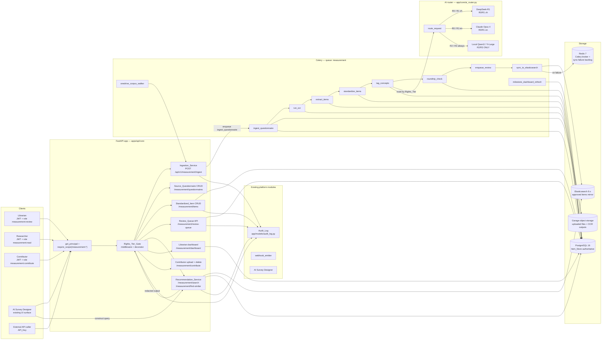
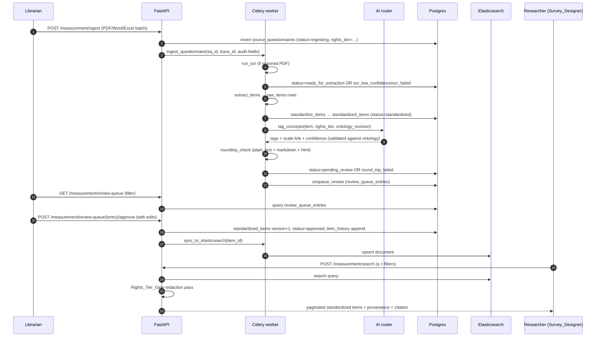
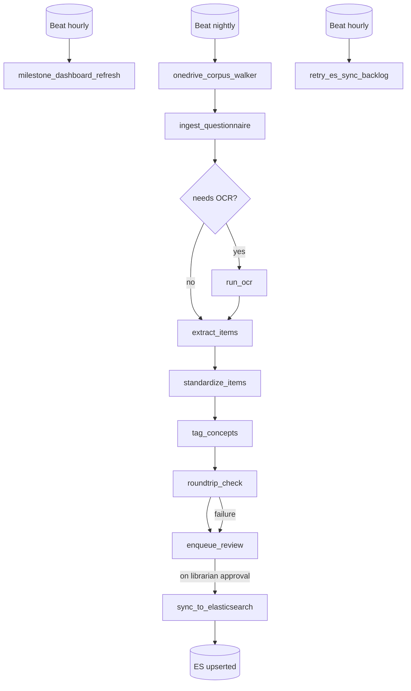

# Design Document

## Overview

T-Measurement ("Measurement Instrument Library", 测量工具库) introduces an evidence-backed alternative to AI-fabricated questionnaire items. Instead of inventing items at survey-design time, the Intelligence Survey Platform ingests existing questionnaires from established Chinese and international surveys, extracts every question and its answer options, normalizes each item into a canonical schema, has the platform's multi-model AI router classify the underlying construct and link it to a published Validated_Scale where one applies, and stores the result in a queryable item bank. The bank then powers the existing AI survey designer: when a researcher composes a new survey, the assistant retrieves, recommends, and adapts validated items with a citation back to the source questionnaire.

This design realizes the eleven requirements documented in `requirements.md` and the named subsystems from the requirements glossary: **Ingestion_Service**, **Item_Extractor**, **Standardization_Service**, **Concept_Tagger**, **Pretty_Printer**, **Review_Queue**, **Item_Store**, and **Recommendation_Service**, plus the cross-cutting **Rights_Tier_Gate** and the integration with the existing **Audit_Log** (T10 `audit.py`). The Measurement_Library is delivered as a new microservice-style module **inside the existing FastAPI monorepo** at `apps/api/core/`, following the same conventions as the `api-platform-export` (T15) feature: routers under `app/api/v1/measurement/`, ORM models under `app/models/measurement/`, services under `app/services/measurement/`, Celery tasks under `app/tasks/measurement_tasks.py`, and Alembic migrations chained after the latest existing revision (`0011`).

The design is anchored on five principles that determine almost every decision below:

1. **Provenance is canonical, not derived.** Every Standardized_Item carries an immutable `Provenance_Record` pointing back to its Source_Questionnaire, page number, extraction job, and the librarian who approved it. Provenance is read-only after approval; new versions are new rows, not edits in place.
2. **Round-trip equivalence is a precondition for `pending_review`.** No item is offered to a librarian until pretty-printing it in each of `plain_text`, `markdown`, and `html` and re-parsing the rendering reconstructs the same canonical record. Round-trip failure is a hard stop, not a warning. This is the property that gives the bank its trustworthiness.
3. **Rights_Tier is enforced in three places, not one.** Classification at intake, propagation to derived rows, and redaction-or-block on egress. Any single point of enforcement is a single point of bypass; three independent enforcement points ensure that a misroute through any one path still trips one of the other two.
4. **The five mandatory audit fields ride every record that mutates state.** `data_snapshot_id`, `extraction_version`, `norm_version`, `threshold_version`, `trace_id` propagate through the Celery DAG via task-level metadata so that any item can be re-derived from its inputs at the version recorded on the row.
5. **Reuse beats invent.** The existing T10 `audit_logs` table, the existing JWT/API_Key auth (`get_principal`), the existing AI router (`app/core/ai_router.py`), the existing webhook emission helper (`app/services/webhook_emitter.py`), and the existing Elasticsearch and Redis deployments are reused unchanged. The Measurement_Library adds tables, routers, tasks, and a small middleware decorator; it adds no new infrastructure.

The feature's MVP scope explicitly excludes raw microdata ingestion (only questionnaire instruments are ingested), automatic translation of items between languages without human review, GraphQL or gRPC surfaces, and any export of R2/R3 source content outside the local pipeline.

---

## Architecture

### Component layout



The dotted region in `Existing` reuses platform components without modification. The Rights_Tier_Gate appears as a single box but is implemented as three coordinated enforcement points (request middleware, database trigger, Celery pre-task hook); see §"Rights Tier and Compliance Architecture" for the detailed view.

### End-to-end data flow



### Module layout inside the FastAPI monorepo

The Measurement_Library lives entirely under `apps/api/core/app/`:

```text
app/api/v1/measurement/
  __init__.py
  ingest.py                    # POST /measurement/ingest, contributor upload
  questionnaires.py            # GET/PATCH/DELETE /measurement/questionnaires
  items.py                     # GET/PATCH /measurement/items
  review_queue.py              # GET/POST /measurement/review-queue
  search.py                    # POST /measurement/search, /measurement/find-similar
  dashboard.py                 # GET /measurement/dashboard
  contribute.py                # researcher-contributor surface

app/models/measurement/
  __init__.py
  source_questionnaire.py
  raw_item.py
  standardized_item.py
  item_option.py
  item_history.py
  concept_ontology.py
  concept_ontology_revision.py
  concept_tag.py
  validated_scale.py
  validated_scale_link.py
  library_snapshot.py
  review_queue_entry.py

app/schemas/measurement/
  __init__.py
  ingestion.py
  raw_item.py
  standardized_item.py
  review_queue.py
  search.py
  dashboard.py
  contribute.py

app/services/measurement/
  __init__.py
  ingestion_service.py
  ocr_service.py
  item_extractor.py
  standardization_service.py
  concept_tagger.py
  pretty_printer.py
  roundtrip.py
  rights_tier_gate.py
  review_queue_service.py
  search_service.py
  recommendation_service.py
  snapshot_service.py
  audit_emitter.py             # measurement-specific helpers; delegates to core/audit

app/tasks/measurement_tasks.py # all Celery tasks for the DAG above

app/core/measurement_versions.py  # frozen extraction_version / norm_version /
                                  # threshold_version / ontology_revision constants

alembic/versions/
  0012_add_measurement_core.py
  0013_add_measurement_concept_ontology_and_tags.py
  0014_add_measurement_review_history_snapshots.py
  0015_add_measurement_indexes_and_es_sync_backlog.py
```

The frontend additions live inside the existing React app at `apps/web/src/features/measurement/`; see §"Frontend Surfaces".

---

## Components and Interfaces

Each subsection states the responsibilities, public interface (Python class names and method signatures, REST endpoints, Celery task names where applicable), key collaborators, error and retry behavior, and the Requirements/Acceptance Criteria the component implements.

### 1. Ingestion_Service

**Responsibilities.** Accept uploaded files; persist them to Garage keyed by SHA-256; create one `source_questionnaires` row per file with librarian-supplied or candidate-inferred `Survey_Program` and `Wave` metadata; classify Rights_Tier (delegated to Rights_Tier_Gate); enqueue the ingest pipeline; reject duplicate or oversize batches with the codes specified by Req 1.

**Public interface (REST):**

| Method | Path | Body | Auth |
|---|---|---|---|
| POST | `/api/v1/measurement/ingest` | multipart files (1–50) plus optional `survey_program`, `wave`, `rights_tier`, `language`, `notes` | JWT + `measurement:contribute` (librarian or contributor) |
| POST | `/api/v1/measurement/ingest/{sq_id}/confirm-metadata` | `{survey_program, wave}` | JWT + `measurement:review` |
| POST | `/api/v1/measurement/ingest/{sq_id}/clear-ocr-flag` | `{}` | JWT + `measurement:review` |
| POST | `/api/v1/measurement/contribute` | researcher-contributed upload + `{citation, license}` | JWT + `measurement:contribute` |
| DELETE | `/api/v1/measurement/contribute/{sq_id}` | `{}` | JWT + `measurement:contribute` (owner) |

**Public interface (Python):**

```python
class IngestionService:
    async def accept_batch(self, files: list[UploadFile], meta: IngestionMeta,
                           principal: Principal, db: AsyncSession) -> list[SourceQuestionnaire]: ...
    async def confirm_metadata(self, sq_id: UUID, meta: ConfirmMetaPayload,
                               principal: Principal, db: AsyncSession) -> SourceQuestionnaire: ...
    async def clear_ocr_flag(self, sq_id: UUID, principal: Principal,
                             db: AsyncSession) -> SourceQuestionnaire: ...
    async def contributor_upload(self, file: UploadFile, meta: ContribMeta,
                                 principal: Principal, db: AsyncSession) -> SourceQuestionnaire: ...
    async def contributor_delete(self, sq_id: UUID, principal: Principal,
                                 db: AsyncSession) -> None: ...
```

**Celery tasks owned:** `ingest_questionnaire(sq_id, trace_id, snapshot_id)`, `run_ocr(sq_id, trace_id, snapshot_id)`, `onedrive_corpus_walker(snapshot_id)` (the corpus backfill driver per Req 10).

**Key collaborators.** Garage (file storage), Rights_Tier_Gate (classification), OCR engine (Tesseract via PaddleOCR for zh; the engine choice is configured per language in `app.config.Settings.ocr_engine_for_language`), Item_Extractor (downstream).

**Errors and retries.** Duplicate hash → 409 `questionnaire_already_ingested` (Req 1.3). Unsupported format → 415 `questionnaire_format_unsupported` (Req 1.4). Oversize batch → 413 `questionnaire_payload_oversize` (Req 1.10). OCR failure or timeout → status `ocr_failed` after one retry budget (Req 1.11). Metadata expiry sweeper runs nightly via Celery beat to enforce Req 1.12 (`metadata_expired` after 14 days idle).

**Implements:** R1 all clauses; R10.7 (uniform pipeline for non-named programs); R11.1, R11.2, R11.5, R11.6 (researcher-contributor flows).

### 2. Item_Extractor

**Responsibilities.** Parse the normalized text representation of a Source_Questionnaire (text layer or OCR output) into ordered `Raw_Item` rows. Classify Question_Type using a hybrid of regex rules (anchors like `□ 1` `( ) 1` Likert scales `非常不同意…非常同意`) plus a fall-back classifier prompt routed through the AI lane appropriate to Rights_Tier. Capture skip_logic, matrix grouping, page numbers, and source character offset ranges. Preserve original wording byte-for-byte (Req 2.9).

**Public interface (Python):**

```python
class ItemExtractor:
    async def extract(self, sq: SourceQuestionnaire,
                      norm_text: NormalizedText,
                      version: ExtractionVersion,
                      db: AsyncSession) -> ExtractionJobResult:
        """Produces ordered RawItem rows; never persists partial output on
        catastrophic parse failure (Req 2.10)."""

@dataclass(frozen=True)
class ExtractionJobResult:
    raw_items: list[RawItem]
    type_counts: dict[QuestionType, int]   # all 8 keys present, zero-counts retained
    review_queue_count: int
    duration_ms: int
    failure: ExtractionFailure | None      # None on success
```

**Celery task:** `extract_items(sq_id, trace_id, snapshot_id, extraction_version)`.

**Key collaborators.** AI router (only when regex rules cannot reach the 0.80 confidence threshold per Req 2.7). Standardization_Service (downstream). Review_Queue (for `extraction_uncertain` rows, Req 2.5 / 2.7).

**Errors and retries.** Whole-job failure → no partial Raw_Item rows persisted; failure record naming category and offset (Req 2.10). Per-item uncertainty → row is persisted with status `extraction_uncertain` and the top-5 alternatives table (Req 2.7); the rest of the job continues.

**Implements:** R2 all clauses; collaborates with R5 (its parser is the same parser the round-trip check re-runs).

### 3. Standardization_Service

**Responsibilities.** Convert each `Raw_Item` to a `Standardized_Item` conforming to the canonical schema. Map Likert scale points (2–11) and anchor labels. Set scoring_direction. Maintain canonical option codes that survive across versions (Req 3.2). Increment item version on edit-approval. Attach the Provenance_Record with the five mandatory audit fields. Mark `standardization_incomplete` when any of the four required canonical fields cannot be mapped (Req 3.7).

**Public interface (Python):**

```python
class StandardizationService:
    async def standardize(self, raw: RawItem, prior: StandardizedItem | None,
                          norm_version: NormVersion,
                          db: AsyncSession) -> StandardizedItem: ...

    def equivalent(self, a: StandardizedItem, b: StandardizedItem) -> bool:
        """canonical_equiv predicate; see §10."""
```

**Celery task:** `standardize_items(extraction_job_id, trace_id, snapshot_id, norm_version)`.

**Key collaborators.** Item_Extractor (input), Concept_Tagger (downstream), Pretty_Printer + roundtrip_check (downstream gate).

**Errors and retries.** Unmappable canonical field → status `standardization_incomplete`, list of unmapped field names persisted, mapped fields retained (Req 3.7). On librarian rejection (Req 3.9) → status `rejected`, Provenance_Record retained.

**Implements:** R3 all clauses; supplies the input contract for R5 (round-trip).

### 4. Concept_Tagger

**Responsibilities.** Submit each Standardized_Item's stem, options, and anchors to the multi-model AI router; assign 1–5 Concept_Tags drawn exclusively from the active Concept_Ontology revision (Req 4.1, 4.8); record one Validated_Scale link with confidence (Req 4.3); leave the link empty when below threshold and record top-5 runner-up scales (Req 4.4); pin the Threshold_Version and Concept_Ontology revision identifiers on the item at analysis time (Req 4.6); honor Rights_Tier R2/R3 by routing through the local provider lane only (Req 4.5, 4.10, 4.11); fail to status `tagging_failed` after 3 attempts (Req 4.7); discard unknown tags returned by the AI without aborting (Req 4.8).

**Public interface (Python):**

```python
class ConceptTagger:
    async def tag(self, item: StandardizedItem, ontology_rev: OntologyRevision,
                  threshold_version: ThresholdVersion,
                  trace_id: UUID, db: AsyncSession) -> TaggingResult: ...

@dataclass(frozen=True)
class TaggingResult:
    concept_tags: list[ConceptTagAssignment]   # length 1..5
    scale_link: ValidatedScaleLink | None
    runner_up_scales: list[ValidatedScaleCandidate]   # length 0..5
    model_id: str
    model_version: str
    threshold_version: str
    ontology_revision: str
    analysis_timestamp: datetime
```

**Celery task:** `tag_concepts(item_id, trace_id, snapshot_id, ontology_revision, threshold_version)`.

**Key collaborators.** AI router (`app.core.ai_router.route_request` plus a new wrapper `route_for_rights_tier` that forces `ModelTarget.LOCAL_QWEN` whenever the source's tier is R2 or R3 — see §"AI Integration"). Concept_Ontology revision store. Validated_Scale registry. Rights_Tier_Gate (lane selection enforcement).

**Errors and retries.** Retry budget = 3 attempts with exponential backoff (5 s, 30 s, 2 min). On exhaustion → status `tagging_failed`, last error recorded (Req 4.7). Unknown tag returned → discard + record validation error, continue (Req 4.8). No local provider available for R2/R3 → hold task in `awaiting_local_provider`, emit `rights_tier.no_local_provider`, refuse to fall back to remote provider (Req 9.11).

**Implements:** R4 all clauses; collaborates with R9.10–R9.11 (local-only routing).

### 5. Pretty_Printer

**Responsibilities.** Render a Standardized_Item back into a questionnaire-style rendering in one of three target formats: `plain_text`, `markdown`, `html`. Reject unknown formats and missing required fields with an error indication (Req 5.3). Preserve source language character-for-character outside layout whitespace (Req 5.2). Used for two purposes: surfacing the rendering to the librarian during review, and feeding the round-trip check.

**Public interface (Python):**

```python
class PrettyPrinter:
    def render(self, item: StandardizedItem, fmt: PrettyFormat) -> str: ...

class PrettyFormat(str, Enum):
    PLAIN_TEXT = "plain_text"
    MARKDOWN = "markdown"
    HTML = "html"
```

**Backends:** three small functions `_render_plain_text`, `_render_markdown`, `_render_html`, each receiving the same canonical `StandardizedItem` view-object. The HTML backend produces semantic markup (`<form>`, `<fieldset>`, `<label>`, `<input>`) without page chrome — it is a fragment, not a document.

**Errors.** Invalid `fmt` value or missing required field on the item → raise `PrettyPrinterValidationError` carrying the offending parameter or field name; the caller surfaces this as either a 400 to the librarian or a `round_trip_failed` status during the round-trip pipeline (Req 5.3, 5.7).

**Implements:** R5.1, R5.2, R5.3, and the printer half of R5.4–R5.7.

### 6. Round-trip check (collaboration of Pretty_Printer + Item_Extractor + Standardization_Service)

**Responsibilities.** Before any Standardized_Item enters status `pending_review`, render it in each of `plain_text`, `markdown`, `html`; re-parse each rendering through the same `Item_Extractor` and `Standardization_Service` at the same Norm_Version; check `canonical_equiv` (defined in §10) for each format. Failure in any format → status `round_trip_failed`, log diverging field names and the failing format, leave every other field unchanged, route to Review_Queue (Req 5.6, 5.7). The full check completes within 5 seconds per item (Req 5.5).

**Public interface (Python):**

```python
class RoundTripChecker:
    def check(self, item: StandardizedItem,
              norm_version: NormVersion) -> RoundTripResult: ...

@dataclass(frozen=True)
class RoundTripResult:
    passed: bool
    failures: list[RoundTripFailure]   # populated only on failure

@dataclass(frozen=True)
class RoundTripFailure:
    fmt: PrettyFormat
    diverging_fields: list[str]
    component: Literal["pretty_printer", "item_extractor"] | None
    error_category: str | None
```

**Celery task:** `roundtrip_check(item_id, trace_id, snapshot_id, norm_version)`.

**Implements:** R5.4, R5.5, R5.6, R5.7.

### 7. Review_Queue

**Responsibilities.** Surface Standardized_Items carrying any of `extraction_uncertain`, `standardization_incomplete`, `tagging_failed`, `round_trip_failed`, `ocr_low_confidence`, `pending_librarian_review` to a librarian within 3 s of queue load (Req 6.1). Side-by-side display with the source page rendering and AI-assigned Concept_Tags. Approve / edit / reject / merge actions. Filter by Survey_Program, Wave, Question_Type, status, Concept_Tag, extraction_job within 2 s for queues up to 10 000 entries (Req 6.7).

**Public interface (REST):**

| Method | Path | Body | Auth |
|---|---|---|---|
| GET | `/api/v1/measurement/review-queue` | query: `survey_program, wave, question_type, status, concept_tag, extraction_job_id, page, page_size` | JWT + `measurement:review` |
| GET | `/api/v1/measurement/review-queue/{entry_id}` | — | JWT + `measurement:review` |
| POST | `/api/v1/measurement/review-queue/{entry_id}/approve` | `{edits: {…}}` (any subset of editable fields) | JWT + `measurement:review` |
| POST | `/api/v1/measurement/review-queue/{entry_id}/reject` | `{reason: str (1..1000)}` | JWT + `measurement:review` |
| POST | `/api/v1/measurement/review-queue/{entry_id}/merge` | `{winner_item_id, duplicate_item_id}` | JWT + `measurement:review` |
| POST | `/api/v1/measurement/review-queue/{entry_id}/edit-without-approve` | `{edits: {…}}` | JWT + `measurement:review` |

**Public interface (Python):**

```python
class ReviewQueueService:
    async def list(self, filters: ReviewQueueFilters,
                   principal: Principal, db: AsyncSession) -> ReviewQueuePage: ...
    async def approve(self, entry_id: UUID, edits: ItemEdits | None,
                      principal: Principal, db: AsyncSession) -> StandardizedItem: ...
    async def reject(self, entry_id: UUID, reason: str,
                     principal: Principal, db: AsyncSession) -> StandardizedItem: ...
    async def merge(self, entry_id: UUID, winner_id: UUID, duplicate_id: UUID,
                    principal: Principal, db: AsyncSession) -> StandardizedItem: ...
```

**Celery task:** `enqueue_review(item_id, trace_id, snapshot_id)`.

**Errors and retries.** Rejection without reason → 400 `review_reason_required` (Req 6.4). Merge that cannot redirect every reference → 409 `merge_unresolved_references` listing offending references; both items remain in their pre-merge status (Req 6.9). Approve on an item already in `approved` → 409 `review_already_approved`.

**Implements:** R6 all clauses.

### 8. Item_Store (PostgreSQL + Elasticsearch)

**Responsibilities.** Persist authoritative copies of Source_Questionnaire, Raw_Item, Standardized_Item, Concept_Ontology revisions, Validated_Scale registrations, item_history, library_snapshots, review_queue_entries in PostgreSQL with no silent deletion (Req 7.1). Maintain a derived Elasticsearch index that mirrors only `approved` Standardized_Items (Req 7.2). Upsert/delete within 60 s p99 over a rolling 24-hour window (Req 7.3, 7.4). Sync-failure backlog queue with audit emission and dashboard surfacing (Req 7.5).

**Public interface (Python):**

```python
class ItemStore:
    async def upsert_item(self, item: StandardizedItem, db: AsyncSession) -> None: ...
    async def remove_from_index(self, item_id: UUID, db: AsyncSession) -> None: ...

class SyncToElasticsearch:
    async def run(self, op: SyncOp, item_id: UUID,
                  trace_id: UUID, snapshot_id: str) -> SyncOutcome: ...
```

**Celery task:** `sync_to_elasticsearch(item_id, op, trace_id, snapshot_id)`.

**Errors and retries.** 3 attempts within 5 minutes per Req 7.5; on exhaustion enqueue to the sync-failure backlog (Redis list `measurement:es_sync_backlog`), emit `search_index.sync_failed`, surface the backlog count to the dashboard.

**Implements:** R7.1–R7.5.

### 9. Recommendation_Service

**Responsibilities.** Expose search, retrieval, and find-similar to JWT or API_Key callers with the `measurement:read` scope. Free-text query plus structured filters (Concept_Tag, Validated_Scale, Survey_Program, Wave, source language, Question_Type, Rights_Tier). Pagination with `page_size ∈ [1, 100]`, default 20. Latency budgets: search p95 ≤ 500 ms / p99 ≤ 1 000 ms (Req 7.13); find-similar p95 ≤ 1 500 ms / p99 ≤ 3 000 ms (Req 7.14). Find-similar accepts either an existing Standardized_Item identifier or a candidate stem (1..2000 chars) and returns up to `top_k ∈ [1, 50]` items (default 20), deterministic ordering for identical inputs within the same Concept_Ontology revision (Req 7.9). Excludes R3 items from designer responses (Req 8.5). Replaces verbatim stem/options with derived metadata when caller lacks Survey_Program entitlement (Req 8.6). Cooperates with the Rights_Tier_Gate egress redaction pass (Req 9.7, 9.9).

**Public interface (REST):**

| Method | Path | Body | Auth |
|---|---|---|---|
| POST | `/api/v1/measurement/search` | `{q, filters, page, page_size}` | JWT or API_Key + `measurement:read` |
| POST | `/api/v1/measurement/find-similar` | `{item_id?, candidate_stem?, top_k}` | JWT or API_Key + `measurement:read` |
| GET | `/api/v1/measurement/items/{item_id}` | — | JWT or API_Key + `measurement:read` |
| GET | `/api/v1/measurement/items/{item_id}/history` | — | JWT + `measurement:review` |

**Public interface (Python):**

```python
class RecommendationService:
    async def search(self, q: str, filters: SearchFilters, page: int, page_size: int,
                     principal: Principal, db: AsyncSession) -> SearchResultPage: ...
    async def find_similar(self, body: FindSimilarRequest, top_k: int,
                           principal: Principal, db: AsyncSession) -> FindSimilarResultPage: ...
    async def get_item(self, item_id: UUID,
                       principal: Principal, db: AsyncSession) -> StandardizedItemView: ...
```

**Errors and retries.** Validation errors (q > 1024 chars, page_size out of range, page < 1, unknown filter value) → 400 with field-specific machine-readable error code (Req 7.7). Unknown item id on find-similar → 404 (Req 7.10). Missing credential → 401; credential lacking scope → 403 (Req 7.12).

**Embedding model for find-similar.** BAAI/bge-m3 (1024-dim, multilingual zh/en) hosted by the existing AI router infrastructure for R0/R1 items; for R2/R3 items the embedding call is made through the local Qwen3 embedding endpoint to keep verbatim stem text inside the local pipeline. Embeddings are cached in PostgreSQL (`standardized_items.embedding pgvector(1024)`) and rebuilt only on item edit-approval.

**Implements:** R7.6–R7.14, R8.1–R8.7 (in concert with the Survey_Designer frontend).

### 10. Rights_Tier_Gate

**Responsibilities.** Three independent enforcement points — see §"Rights Tier and Compliance Architecture" for the diagrammed view. Briefly: classify at intake (Req 9.1–9.3), propagate to derived rows via DB triggers (Req 9.4), redact-or-block on egress (Req 9.7–9.9), and route AI calls through `local_only` providers for R2/R3 (Req 9.10–9.11).

**Public interface (Python):**

```python
class RightsTierGate:
    async def classify_intake(self, sq: SourceQuestionnaire,
                              librarian_designation: RightsTier | None,
                              registry_lookup: RightsTier | None,
                              db: AsyncSession) -> RightsTier: ...

    def egress_redact(self, payload: dict, source_tier: RightsTier,
                      caller_entitlement: bool, channel: EgressChannel) -> dict: ...

    def select_ai_lane(self, source_tier: RightsTier,
                       task: TaskCategory, has_chinese: bool) -> RouteDecision: ...

class EgressChannel(str, Enum):
    SEARCH_RESPONSE = "search_response"
    FIND_SIMILAR_RESPONSE = "find_similar"
    RECOMMENDATION_TO_DESIGNER = "designer_recommendation"
    WEBHOOK_DELIVERY = "webhook_delivery"
    EXPORT_BUNDLE = "export_bundle"
    AI_PROVIDER_CALL = "ai_provider_call"
```

**Errors and retries.** Classification conflict → emit `rights_tier.classification_conflict`, persist more restrictive value, surface to dashboard (Req 9.2). Unclassified → fail closed to R3, emit `rights_tier.unclassified_fail_closed`, block downstream until librarian assigns (Req 9.3). R2 verbatim span ≥ 8 chars detected on egress → replace with derived metadata, emit `rights_tier.r2_text_redacted` (Req 9.7). R3 outbound or R3 to non-`local_only` lane → block, emit `rights_tier.r3_egress_blocked` or `rights_tier.r3_outbound_blocked` (Req 9.8, 9.9).

**Implements:** R9 in coordination with all other components.

### 11. Snapshot_Service

**Responsibilities.** Issue Library_Snapshot identifiers in the form `snapshot_YYYYMMDD_NNN`, monotonically per UTC date, range 001–999 (Req 9.13). Reject the daily 1000th snapshot with `snapshot.daily_limit_exceeded` (Req 9.14). Stamp the snapshot id on every downstream Standardized_Item version derived from it before those versions become queryable (Req 9.13).

**Public interface (Python):**

```python
class SnapshotService:
    async def begin_snapshot(self, label: str, principal: Principal,
                             db: AsyncSession) -> LibrarySnapshot: ...
    async def attach_to_versions(self, snapshot_id: str, item_ids: list[UUID],
                                 db: AsyncSession) -> None: ...
```

**Implements:** R9.13, R9.14.

### 12. Dashboard / Milestone_Evaluator

**Responsibilities.** Compute the three milestones from Req 10 (initial-coverage, initial-quality, initial-tagging); refresh hourly via Celery beat; surface stale-data warning after 48 h (Req 10.6); list per-Survey_Program counts; emit `milestone.dashboard_refresh_stale` and `milestone.source_path_unreachable` audit events (Req 10.6, 10.8).

**Public interface (REST):**

| Method | Path | Body | Auth |
|---|---|---|---|
| GET | `/api/v1/measurement/dashboard` | — | JWT + `measurement:review` |
| POST | `/api/v1/measurement/dashboard/refresh` | — | JWT + `admin:write` |
| GET | `/api/v1/measurement/milestones` | — | JWT + `measurement:review` |
| POST | `/api/v1/measurement/milestones/evaluate` | — | JWT + `admin:write` |

**Celery task:** `milestone_dashboard_refresh()` (cron-like, every hour by default).

**Implements:** R10 all clauses.

---

## Data Models

### PostgreSQL schema

The Measurement_Library adds the following tables, all under the same database as the existing platform. Foreign keys to `users.id` and to existing tables follow the established convention `ON DELETE SET NULL` for actor references and `ON DELETE CASCADE` for owned children. Five mandatory audit fields (`data_snapshot_id`, `extraction_version`, `norm_version`, `threshold_version`, `trace_id`) appear on every record that mutates state — explicitly enumerated below.

#### `source_questionnaires`

| Column | Type | Notes |
|---|---|---|
| `id` | UUID PK | |
| `survey_program` | VARCHAR(64) NOT NULL | |
| `wave` | VARCHAR(64) NOT NULL | |
| `language` | CHAR(2) NOT NULL | ISO 639-1 |
| `content_sha256` | CHAR(64) NOT NULL UNIQUE | deduplication key (Req 1.3) |
| `storage_uri` | VARCHAR(500) NOT NULL | Garage object key |
| `mime_type` | VARCHAR(60) NOT NULL | |
| `byte_size` | BIGINT NOT NULL | |
| `rights_tier` | VARCHAR(2) NOT NULL | `R0`/`R1`/`R2`/`R3` |
| `rights_tier_source` | VARCHAR(20) NOT NULL | `librarian`/`registry`/`fail_closed` |
| `status` | VARCHAR(40) NOT NULL | see lifecycle below |
| `ocr_engine` | VARCHAR(40) | nullable |
| `ocr_engine_version` | VARCHAR(40) | nullable |
| `ocr_mean_confidence` | NUMERIC(3,2) | 0.00–1.00 |
| `ocr_confidence_histogram` | JSONB | bin width 0.05 |
| `ocr_runtime_ms` | INTEGER | nullable |
| `ocr_completed_at` | TIMESTAMPTZ | nullable |
| `metadata_candidates` | JSONB | up to 3 ranked per field (Req 1.9) |
| `contributor_user_id` | UUID FK users.id ON DELETE SET NULL | non-null only for contributor uploads |
| `contributor_citation` | VARCHAR(1000) | non-null only for contributor uploads |
| `contributor_license` | VARCHAR(80) | non-null only for contributor uploads |
| `data_snapshot_id` | VARCHAR(40) NOT NULL | five mandatory audit fields ↓ |
| `extraction_version` | VARCHAR(20) NOT NULL | |
| `norm_version` | VARCHAR(20) NOT NULL | |
| `threshold_version` | VARCHAR(20) NOT NULL | |
| `trace_id` | UUID NOT NULL | |
| `uploaded_by` | UUID FK users.id ON DELETE SET NULL | librarian or contributor |
| `uploaded_at` | TIMESTAMPTZ NOT NULL DEFAULT now() | |

**Status lifecycle:** `ingesting → ocr_running → ocr_low_confidence | ocr_failed → awaiting_metadata_confirmation → metadata_expired | ready_for_extraction → extracting → extracted → standardizing → standardized → tagging → tagged → roundtrip_checking → pending_review → approved | rejected | deleted | withdrawn_by_contributor`.

**Indexes:** `(content_sha256)` unique, `(survey_program, wave)`, `(rights_tier)`, `(status)`, `(uploaded_at DESC)`, `(contributor_user_id) WHERE contributor_user_id IS NOT NULL`.

#### `raw_items`

| Column | Type | Notes |
|---|---|---|
| `id` | UUID PK | |
| `source_questionnaire_id` | UUID FK source_questionnaires.id ON DELETE CASCADE | |
| `extraction_job_id` | UUID NOT NULL | |
| `ordinal` | INTEGER NOT NULL | within the questionnaire, ascending by character offset |
| `stem_text` | TEXT NOT NULL | byte-for-byte preserved (Req 2.9) |
| `option_list` | JSONB NOT NULL | array of `{code, label, ordinal}` (0–50 entries) |
| `question_type` | VARCHAR(20) NOT NULL | one of the eight values |
| `question_type_alternatives` | JSONB | up to 5, set when classification confidence < 0.80 (Req 2.7) |
| `skip_logic` | JSONB | structured + retained verbatim where unresolved (Req 2.5) |
| `matrix_group_id` | UUID | nullable; identical across rows of the same matrix (Req 2.6) |
| `source_page` | INTEGER NOT NULL CHECK (source_page > 0) | |
| `source_offset_start` | INTEGER NOT NULL | |
| `source_offset_end` | INTEGER NOT NULL CHECK (source_offset_end > source_offset_start) | |
| `extraction_confidence` | NUMERIC(4,4) | |
| `status` | VARCHAR(30) NOT NULL | `ok` / `extraction_uncertain` |
| `rights_tier` | VARCHAR(2) NOT NULL | propagated from parent (Req 9.4) |
| `data_snapshot_id` | VARCHAR(40) NOT NULL | |
| `extraction_version` | VARCHAR(20) NOT NULL | |
| `norm_version` | VARCHAR(20) NOT NULL | |
| `threshold_version` | VARCHAR(20) NOT NULL | |
| `trace_id` | UUID NOT NULL | |
| `created_at` | TIMESTAMPTZ NOT NULL DEFAULT now() | |

**Indexes:** `(source_questionnaire_id, ordinal)`, `(extraction_job_id)`, `(matrix_group_id) WHERE matrix_group_id IS NOT NULL`, `(status) WHERE status='extraction_uncertain'`.

#### `standardized_items`

| Column | Type | Notes |
|---|---|---|
| `id` | UUID PK | |
| `instrument_family_id` | UUID NOT NULL | stable identity across versions (Req 3.4, 3.5) |
| `version` | INTEGER NOT NULL CHECK (version >= 1) | per family |
| `source_questionnaire_id` | UUID FK source_questionnaires.id ON DELETE CASCADE | |
| `raw_item_id` | UUID FK raw_items.id ON DELETE CASCADE | |
| `survey_program` | VARCHAR(64) NOT NULL | |
| `wave` | VARCHAR(64) NOT NULL | |
| `language` | CHAR(2) NOT NULL | |
| `stem_text` | VARCHAR(2000) NOT NULL | canonical |
| `question_type` | VARCHAR(20) NOT NULL | |
| `likert_points` | SMALLINT CHECK (likert_points BETWEEN 2 AND 11) | nullable |
| `likert_anchor_low` | VARCHAR(200) | |
| `likert_anchor_high` | VARCHAR(200) | |
| `scoring_direction` | VARCHAR(15) | `low_to_high`/`high_to_low`/null |
| `skip_logic` | JSONB | normalized; unresolved references preserved verbatim |
| `matrix_group_id` | UUID | nullable |
| `source_page` | INTEGER NOT NULL CHECK (source_page > 0) | |
| `status` | VARCHAR(40) NOT NULL | see lifecycle |
| `unmapped_fields` | JSONB | non-empty when status=`standardization_incomplete` (Req 3.7) |
| `roundtrip_failures` | JSONB | format-keyed list of diverging fields (Req 5.6) |
| `tagging_error` | TEXT | non-empty when status=`tagging_failed` (Req 4.7) |
| `concept_ontology_revision` | VARCHAR(40) | pinned at tagging time (Req 4.6) |
| `embedding` | VECTOR(1024) | pgvector, populated only for `approved` items |
| `rights_tier` | VARCHAR(2) NOT NULL | propagated; constraint enforces non-null (Req 9.4) |
| `provenance` | JSONB NOT NULL | structured Provenance_Record |
| `data_snapshot_id` | VARCHAR(40) NOT NULL | |
| `extraction_version` | VARCHAR(20) NOT NULL | |
| `norm_version` | VARCHAR(20) NOT NULL | |
| `threshold_version` | VARCHAR(20) NOT NULL | |
| `trace_id` | UUID NOT NULL | |
| `approved_by` | UUID FK users.id ON DELETE SET NULL | librarian; nullable until approved |
| `approved_at` | TIMESTAMPTZ | nullable until approved |
| `merged_into_id` | UUID FK standardized_items.id ON DELETE SET NULL | non-null when status=`merged_duplicate` |
| `created_at`, `updated_at` | TIMESTAMPTZ | |

**Status lifecycle:** `standardized | standardization_incomplete | tagging_failed | round_trip_failed | pending_review | pending_librarian_review | approved | rejected | rejected_by_librarian | merged_duplicate | withdrawn_by_contributor`.

**Indexes (search-supporting per Req 7.6):**

| Index | Purpose |
|---|---|
| `(instrument_family_id, version DESC)` UNIQUE | latest version lookup |
| `(survey_program, wave)` | filter |
| `(language)` | filter |
| `(question_type)` | filter |
| `(status) WHERE status='approved'` | ES sync source |
| `(rights_tier)` | egress filtering |
| `(approved_by, approved_at DESC) WHERE status='approved'` | librarian audits |
| GIN on `stem_text` (using `pg_trgm`) | quick keyword fallback |
| `(embedding vector_cosine_ops)` ivfflat lists=100 | pgvector for find-similar fallback when ES is degraded |

#### `item_options`

One row per option per item version. Carries both source code/label and canonical code/label per Req 3.2.

| Column | Type | Notes |
|---|---|---|
| `id` | UUID PK | |
| `standardized_item_id` | UUID FK standardized_items.id ON DELETE CASCADE | |
| `ordinal` | INTEGER NOT NULL | |
| `source_code` | VARCHAR(64) NOT NULL | |
| `source_label` | VARCHAR(500) NOT NULL | |
| `canonical_code` | VARCHAR(64) NOT NULL | stable across versions |
| `canonical_label` | VARCHAR(500) NOT NULL | |

**Indexes:** `(standardized_item_id, ordinal)` UNIQUE, `(standardized_item_id, canonical_code)` UNIQUE.

#### `item_history`

Append-only history for edits and merges per Req 6.3, 6.6.

| Column | Type | Notes |
|---|---|---|
| `id` | UUID PK | |
| `standardized_item_id` | UUID FK standardized_items.id ON DELETE CASCADE | |
| `version` | INTEGER NOT NULL | the version this row records the *prior* state of |
| `field_name` | VARCHAR(80) NOT NULL | |
| `prior_value` | JSONB | |
| `actor_user_id` | UUID FK users.id ON DELETE SET NULL | |
| `change_kind` | VARCHAR(20) NOT NULL | `edit`/`approve`/`reject`/`merge_duplicate_record` |
| `data_snapshot_id`, `extraction_version`, `norm_version`, `threshold_version`, `trace_id` | as above | |
| `created_at` | TIMESTAMPTZ NOT NULL DEFAULT now() | |

**Indexes:** `(standardized_item_id, version DESC, created_at DESC)`.

#### `concept_ontology` and `concept_ontology_revisions`

| Table | Purpose |
|---|---|
| `concept_ontology` | one row per concept; columns: `id UUID PK`, `slug VARCHAR(80) UNIQUE`, `label_zh VARCHAR(200)`, `label_en VARCHAR(200)`, `parent_id UUID FK concept_ontology.id`, `current_revision VARCHAR(40)`, `created_at`, `updated_at` |
| `concept_ontology_revisions` | one row per revision; columns: `revision_id VARCHAR(40) PK`, `created_at`, `description TEXT`, `concept_set JSONB` (snapshot of all concept slugs in this revision), `frozen_by UUID FK users.id`, plus the five audit fields |

The Concept_Tagger always reads `concept_set` from the active revision row to validate AI-returned tags before persisting (Req 4.1, 4.8).

#### `concept_tags`

Many-to-many table linking Standardized_Items to Concepts.

| Column | Type | Notes |
|---|---|---|
| `id` | UUID PK | |
| `standardized_item_id` | UUID FK standardized_items.id ON DELETE CASCADE | |
| `concept_id` | UUID FK concept_ontology.id ON DELETE RESTRICT | |
| `confidence` | NUMERIC(5,4) NOT NULL CHECK (confidence BETWEEN 0 AND 1) | rounded to 4 decimals (Req 4.2) |
| `model_id` | VARCHAR(80) NOT NULL | |
| `model_version` | VARCHAR(40) NOT NULL | |
| `analyzed_at` | TIMESTAMPTZ NOT NULL | |
| `concept_ontology_revision` | VARCHAR(40) NOT NULL | |
| `data_snapshot_id`, `trace_id` | as above | |

**Indexes:** `(standardized_item_id)`, `(concept_id, confidence DESC)` for per-concept lookup, UNIQUE `(standardized_item_id, concept_id)` to prevent duplicates per item.

#### `validated_scales` and `validated_scale_links`

| Table | Purpose |
|---|---|
| `validated_scales` | one row per published scale; columns: `id UUID PK`, `name VARCHAR(200)`, `acronym VARCHAR(40)`, `language CHAR(2)`, `citation TEXT NOT NULL`, `match_threshold NUMERIC(3,2)`, `expected_question_type VARCHAR(20)`, `seed_stems JSONB` (stems used to compute the reference embedding), `embedding VECTOR(1024)`, `created_at`, `updated_at` |
| `validated_scale_links` | at most one row per item per Req 4.3; columns: `standardized_item_id UUID PK FK`, `scale_id UUID FK validated_scales.id`, `confidence NUMERIC(5,4)`, `runner_up_scales JSONB` (up to 5 candidates per Req 4.4), `analyzed_at`, all five audit fields |

#### `library_snapshots`

| Column | Type | Notes |
|---|---|---|
| `snapshot_id` | VARCHAR(40) PK CHECK (snapshot_id ~ '^snapshot_[0-9]{8}_[0-9]{3}$') | (Req 9.13) |
| `label` | VARCHAR(120) NOT NULL | |
| `created_at` | TIMESTAMPTZ NOT NULL | |
| `created_by` | UUID FK users.id ON DELETE SET NULL | |
| `extraction_version`, `norm_version`, `threshold_version` | VARCHAR(20) NOT NULL | versions in force at snapshot time |
| `concept_ontology_revision` | VARCHAR(40) NOT NULL | |
| `trace_id` | UUID NOT NULL | |
| `item_count` | INTEGER NOT NULL | denormalized count |
| `notes` | TEXT | |

**Indexes:** `(created_at DESC)`, `(date_trunc('day', created_at))` to enforce the 999-per-day uniqueness check at insert time.

#### `review_queue_entries`

| Column | Type | Notes |
|---|---|---|
| `id` | UUID PK | |
| `standardized_item_id` | UUID FK standardized_items.id ON DELETE CASCADE | |
| `reason` | VARCHAR(40) NOT NULL | mirrors the trigger status (`extraction_uncertain`, etc.) |
| `assigned_reviewer_id` | UUID FK users.id ON DELETE SET NULL | nullable until claimed |
| `priority` | SMALLINT NOT NULL DEFAULT 5 | |
| `status` | VARCHAR(20) NOT NULL | `open`/`claimed`/`resolved` |
| `resolved_at` | TIMESTAMPTZ | nullable |
| `resolution` | VARCHAR(20) | `approved`/`rejected`/`merged`/`withdrawn` |
| `data_snapshot_id`, `trace_id` | as above | |
| `created_at`, `updated_at` | TIMESTAMPTZ | |

**Indexes (filter-supporting per Req 6.7):** `(status, priority DESC, created_at)`, `(assigned_reviewer_id, status)`, plus join-supporting indexes via `standardized_items` on `(survey_program, wave, question_type, status)`.

#### Audit_Log extension (no schema change)

The Measurement_Library writes to the existing `audit_logs` table (`apps/api/core/app/models/audit_log.py`) without modification. New canonical action verbs are added to `app/core/audit.py` alongside the existing `API_PLATFORM_VERBS` set:

```python
MEASUREMENT_VERBS: FrozenSet[str] = frozenset({
    # Ingestion
    "measurement.ingest.create",
    "measurement.ingest.duplicate_rejected",
    "measurement.ingest.metadata_confirmed",
    "measurement.ingest.metadata_expired",
    "measurement.ocr.completed",
    "measurement.ocr.low_confidence",
    "measurement.ocr.failed",
    # Extraction / standardization / tagging / roundtrip
    "measurement.extract.completed",
    "measurement.extract.failed",
    "measurement.standardize.completed",
    "measurement.standardize.incomplete",
    "measurement.tag.completed",
    "measurement.tag.failed",
    "measurement.roundtrip.passed",
    "measurement.roundtrip.failed",
    # Review queue
    "measurement.review.approve",
    "measurement.review.reject",
    "measurement.review.edit",
    "measurement.review.merge",
    "measurement.review.merge_aborted",
    # Snapshots
    "measurement.snapshot.created",
    "snapshot.daily_limit_exceeded",
    # Sync
    "measurement.sync.upserted",
    "measurement.sync.removed",
    "search_index.sync_failed",
    # Rights tier
    "rights_tier.classification_conflict",
    "rights_tier.unclassified_fail_closed",
    "rights_tier.r2_text_redacted",
    "rights_tier.r3_egress_blocked",
    "rights_tier.r3_outbound_blocked",
    "rights_tier.no_local_provider",
    # Audit-field guard
    "audit_field.missing",
    # Milestones
    "milestone.dashboard_refresh_stale",
    "milestone.source_path_unreachable",
    # Contributor
    "measurement.contribute.upload",
    "measurement.contribute.delete",
    "measurement.contribute.notify_rejection",
})
```

Per Req 9.12, every Measurement_Library audit row carries the affected resource's Rights_Tier in `details.rights_tier` plus the five mandatory audit fields in `details` (since the existing `audit_logs` schema does not have dedicated columns for them, this is the schema-compatible mapping per Req 7.9 of the api-platform-export precedent). The audit-field guard (`audit_field.missing` per Req 9.5–9.6) fires when any of the five fields is missing or empty at write time and aborts the write rather than persisting a malformed row.

### Elasticsearch index mapping

Index name: `measurement_items_v1`. One document per `approved` Standardized_Item; the document `_id` equals the Standardized_Item's UUID for fast upsert/delete.

**Mapping (abbreviated):**

```json
{
  "settings": {
    "analysis": {
      "analyzer": {
        "zh_smart": {"type": "custom", "tokenizer": "ik_smart"},
        "zh_max":   {"type": "custom", "tokenizer": "ik_max_word"},
        "en_stem":  {"type": "custom", "tokenizer": "standard",
                     "filter": ["lowercase", "porter_stem"]}
      }
    }
  },
  "mappings": {
    "properties": {
      "instrument_family_id": {"type": "keyword"},
      "version": {"type": "integer"},
      "survey_program": {"type": "keyword"},
      "wave": {"type": "keyword"},
      "language": {"type": "keyword"},
      "question_type": {"type": "keyword"},
      "rights_tier": {"type": "keyword"},
      "stem_text_zh": {"type": "text", "analyzer": "zh_max", "search_analyzer": "zh_smart"},
      "stem_text_en": {"type": "text", "analyzer": "en_stem"},
      "option_labels_zh": {"type": "text", "analyzer": "zh_max", "search_analyzer": "zh_smart"},
      "option_labels_en": {"type": "text", "analyzer": "en_stem"},
      "concept_tags": {"type": "keyword"},
      "validated_scale_id": {"type": "keyword"},
      "approved_at": {"type": "date"},
      "embedding": {"type": "dense_vector", "dims": 1024, "index": true,
                    "similarity": "cosine"}
    }
  }
}
```

Chinese stem text uses `ik_max_word` for indexing and `ik_smart` for search (the standard Chinese analyzer pair under the IK plugin already deployed for the platform's existing knowledge base index — see `apps/api/core/app/services/knowledge_base.py`). English stem text uses Porter stemming. Items in `language='zh'` populate `stem_text_zh` and `option_labels_zh`; `language='en'` populates `stem_text_en` and `option_labels_en`. Items with mixed language populate both lanes; the search query issues a multi-match across both.

The `embedding` field exists on the ES index so a single ES query can serve both keyword search and the find-similar fallback path. Find-similar primarily uses pgvector inside Postgres (it is closer to the authoritative data and avoids a second persistence sync), but ES also carries the embedding to enable hybrid keyword-plus-semantic ranking when the search query is a long natural-language sentence.

### Frozen versions and trace identifiers

`apps/api/core/app/core/measurement_versions.py` exports the active versions as constants stamped per release:

```python
EXTRACTION_VERSION_CURRENT: Final = "v1.0.0"
NORM_VERSION_CURRENT: Final = "v1.0.0"
THRESHOLD_VERSION_CURRENT: Final = "v1.0.0"
CONCEPT_ONTOLOGY_REVISION_CURRENT: Final = "ontology_2027_06_01"
```

Bumping any of these is an Alembic migration accompanied by a code change; previous versions remain readable. `trace_id` is generated at the FastAPI route boundary (one per inbound request) and propagates through the Celery DAG via `apply_async(headers={"X-Trace-Id": str(trace_id), …})`. `data_snapshot_id` is generated by `SnapshotService.begin_snapshot` for librarian-driven snapshots; for ad-hoc ingestion the snapshot id is `snapshot_<YYYYMMDD>_<NNN>` where the date is the UTC date of the request and `NNN` is the per-day sequence reserved by `librarian_snapshots_table` row insert.


---

## API Design

All Measurement_Library endpoints live under the base path `/api/v1/measurement/`. Authentication uses the existing `get_principal` dependency (JWT or API_Key) and the existing `require_scope(...)` helper. The new scopes added to the platform's canonical scope enum:

| Scope | Granted to |
|---|---|
| `measurement:read` | Default for any authenticated user; required for search, find-similar, item read, dashboard read |
| `measurement:contribute` | Researcher with contributor role; required for `/contribute` upload and delete |
| `measurement:review` | Librarian; required for review queue actions, source questionnaire metadata confirmation, item history, item edit-without-approve |

Granting `measurement:review` requires a librarian role flag on the user (`users.is_librarian` boolean, added in migration `0012`); minting an API_Key with `measurement:review` requires the owner to have that flag.

### Common envelope and error codes

Error responses share the platform's existing envelope:

```json
{
  "error": "<machine_readable_code>",
  "message": "<human-readable string>",
  "details": { "field": "...", "trace_id": "..." }
}
```

All Measurement_Library endpoints include `details.trace_id` in error responses to ease audit chase-down. Specific error codes used by Measurement_Library:

| Code | HTTP | When |
|---|---|---|
| `questionnaire_already_ingested` | 409 | Duplicate hash, Req 1.3 |
| `questionnaire_format_unsupported` | 415 | Bad extension, Req 1.4 |
| `questionnaire_payload_oversize` | 413 | Batch >50 files or any file >200 MB, Req 1.10 |
| `questionnaire_metadata_unconfirmed` | 409 | Operation requires confirmed metadata first |
| `review_reason_required` | 400 | Reject without reason, Req 6.4 |
| `merge_unresolved_references` | 409 | Merge cannot redirect every reference, Req 6.9 |
| `search_invalid_parameter` | 400 | Search filter validation, Req 7.7 |
| `find_similar_invalid_parameter` | 400 | Find-similar validation, Req 7.10 |
| `find_similar_unknown_item` | 404 | Item id not found, Req 7.10 |
| `rights_tier_egress_blocked` | 403 | R3 outbound blocked, Req 9.9 |
| `rights_tier_no_local_provider` | 503 | No `local_only` provider, Req 9.11 |
| `snapshot_daily_limit_exceeded` | 409 | 1000th snapshot in one UTC day, Req 9.14 |
| `contributor_payload_invalid` | 400 | Missing citation/license or oversized, Req 11.2 |
| `auth_required` / `insufficient_scope` | 401 / 403 | Standard platform codes, Req 7.11–7.12 |

### Endpoint catalog

#### Ingestion

```
POST /api/v1/measurement/ingest
  Auth: JWT + measurement:contribute (or measurement:review for batch)
  Body: multipart/form-data
    files: 1..50 file parts, each .pdf|.docx|.doc|.xlsx|.xls, ≤200MB
    survey_program?: string (1..64)
    wave?: string (1..64)
    language?: ISO 639-1
    rights_tier?: "R0"|"R1"|"R2"|"R3"
    notes?: string
  201 Body:
    {
      "batch_id": uuid,
      "questionnaires": [
        {
          "id": uuid,
          "content_sha256": str,
          "status": "ingesting"|"awaiting_metadata_confirmation",
          "metadata_candidates": {
              "survey_program": [{"value": str, "confidence": 0..1}, ...up to 3],
              "wave":            [{"value": str, "confidence": 0..1}, ...up to 3]
          } | null,
          "rights_tier": "R0"|"R1"|"R2"|"R3",
          "trace_id": uuid
        },
        ...
      ]
    }
  Errors: 409 questionnaire_already_ingested, 415 questionnaire_format_unsupported,
          413 questionnaire_payload_oversize

POST /api/v1/measurement/ingest/{sq_id}/confirm-metadata
  Auth: JWT + measurement:review
  Body: { "survey_program": str(1..64), "wave": str(1..64) }
  200 Body: { "id": uuid, "status": "ready_for_extraction" }

POST /api/v1/measurement/ingest/{sq_id}/clear-ocr-flag
  Auth: JWT + measurement:review
  Body: {}
  200 Body: { "id": uuid, "status": "ready_for_extraction" }
```

#### Source questionnaire CRUD

```
GET  /api/v1/measurement/questionnaires?
       survey_program=&wave=&status=&rights_tier=&page=&page_size=
  Auth: JWT + measurement:read
  200 Body: { "items": [SourceQuestionnaireSummary, ...], "total": int, "page": int }

GET  /api/v1/measurement/questionnaires/{sq_id}
  Auth: JWT + measurement:read
  200 Body: SourceQuestionnaireDetail (rights_tier-redacted per caller entitlement)

PATCH /api/v1/measurement/questionnaires/{sq_id}
  Auth: JWT + measurement:review
  Body: { "survey_program"?, "wave"?, "language"?, "rights_tier"?, "notes"? }
  200 Body: SourceQuestionnaireDetail

DELETE /api/v1/measurement/questionnaires/{sq_id}
  Auth: JWT + measurement:review
  204 (soft delete: status='deleted', file retained per audit retention)
```

`SourceQuestionnaireDetail` includes a paginated nested list of derived `Standardized_Item` summaries, each redacted per the caller's entitlement.

#### Raw item read (librarian only)

```
GET /api/v1/measurement/raw-items/{raw_item_id}
  Auth: JWT + measurement:review
  200 Body: RawItemDetail (full record, no redaction; librarian role required)
```

#### Standardized item CRUD

```
GET  /api/v1/measurement/items/{item_id}
  Auth: JWT or API_Key + measurement:read
  200 Body: StandardizedItemView (R3 source → 403 unless librarian)

GET  /api/v1/measurement/items/{item_id}/history
  Auth: JWT + measurement:review
  200 Body: { "history": [ItemHistoryRow, ...] }

PATCH /api/v1/measurement/items/{item_id}
  Auth: JWT + measurement:review
  Body: ItemEdits  (subset of editable fields)
  200 Body: StandardizedItemView (new version on field change)

POST /api/v1/measurement/items/{item_id}/withdraw
  Auth: JWT + measurement:review (or contributor for own items, Req 11.6)
  Body: { "reason": str(1..1000) }
  200 Body: StandardizedItemView with status='withdrawn_by_contributor'
```

`StandardizedItemView` schema (TypeScript-style for clarity; the actual implementation uses pydantic):

```ts
type StandardizedItemView = {
  id: UUID;
  instrument_family_id: UUID;
  version: number;
  status: ItemStatus;
  survey_program: string;
  wave: string;
  language: "zh" | "en" | string;          // ISO 639-1
  stem_text: string;                        // empty when redacted by Rights_Tier_Gate
  question_type: QuestionType;
  options: Array<{
    canonical_code: string;
    canonical_label: string;                // empty when redacted
    source_code: string;
    source_label: string;                   // empty when redacted
    ordinal: number;
  }>;
  likert: { points: number; anchor_low: string; anchor_high: string;
            scoring_direction: "low_to_high"|"high_to_low" } | null;
  skip_logic: SkipLogicNode[] | null;
  matrix_group_id: UUID | null;
  source_page: number;
  rights_tier: "R0"|"R1"|"R2"|"R3";
  redaction_applied: boolean;               // true when egress redaction kicked in
  concept_tags: Array<{ slug: string; label_zh: string; label_en: string;
                        confidence: number }>;
  validated_scale: { id: UUID; name: string; acronym: string;
                     citation: string; confidence: number } | null;
  runner_up_scales: Array<{ id: UUID; name: string; confidence: number }>;
  provenance: {
    source_questionnaire_id: UUID;
    source_page: number;
    extraction_job_id: UUID;
    extraction_version: string;
    norm_version: string;
    threshold_version: string;
    concept_ontology_revision: string;
    approved_by: UUID | null;
    approved_at: ISO8601 | null;
    contributor_user_id: UUID | null;
    contributor_citation: string | null;
    trace_id: UUID;
    data_snapshot_id: string;
  };
  created_at: ISO8601;
  updated_at: ISO8601;
};
```

#### Review queue

```
GET  /api/v1/measurement/review-queue?
       survey_program=&wave=&question_type=&status=&concept_tag=&extraction_job_id=
       &assigned_to_me=true|false&page=&page_size=
  Auth: JWT + measurement:review
  200 Body: { "entries": [ReviewQueueEntryView, ...], "total": int, "page": int }
  SLA:    p95 ≤ 2s for queues up to 10 000 entries (Req 6.7)

GET  /api/v1/measurement/review-queue/{entry_id}
  Auth: JWT + measurement:review
  200 Body: ReviewQueueEntryDetail (item + source-page rendering URL +
            concept tags with confidences)

POST /api/v1/measurement/review-queue/{entry_id}/claim
  Auth: JWT + measurement:review
  Body: {}
  200 Body: ReviewQueueEntryView with assigned_reviewer_id=caller

POST /api/v1/measurement/review-queue/{entry_id}/approve
  Auth: JWT + measurement:review
  Body: { "edits": ItemEdits | null }
  200 Body: StandardizedItemView with status='approved' (version+1 if edited)

POST /api/v1/measurement/review-queue/{entry_id}/reject
  Auth: JWT + measurement:review
  Body: { "reason": str(1..1000) }
  200 Body: StandardizedItemView with status='rejected'
  Errors: 400 review_reason_required (Req 6.4)

POST /api/v1/measurement/review-queue/{entry_id}/merge
  Auth: JWT + measurement:review
  Body: { "winner_item_id": UUID, "duplicate_item_id": UUID }
  200 Body: { "winner": StandardizedItemView,
              "duplicate": StandardizedItemView (status=merged_duplicate) }
  Errors: 409 merge_unresolved_references with details.references (Req 6.9)
```

#### Search and find-similar

```
POST /api/v1/measurement/search
  Auth: JWT or API_Key + measurement:read
  Body: {
    "q": str(0..1024),
    "filters": {
      "concept_tag"?:    string[],
      "validated_scale"?: UUID[],
      "survey_program"?: string[],
      "wave"?:           string[],
      "language"?:       ("zh"|"en")[],
      "question_type"?:  QuestionType[],
      "rights_tier"?:    ("R0"|"R1"|"R2"|"R3")[]
    },
    "page": int (≥1, default 1),
    "page_size": int (∈[1,100], default 20)
  }
  200 Body: {
    "items": [StandardizedItemView, ...],
    "total": int,
    "page": int,
    "page_size": int,
    "facets": {
      "concept_tag":     [{"value": slug, "count": int}, ...],
      "survey_program":  [{"value": str, "count": int}, ...],
      "question_type":   [{"value": str, "count": int}, ...],
      "language":        [{"value": "zh"|"en", "count": int}, ...]
    }
  }
  SLA: p95 ≤ 500ms / p99 ≤ 1000ms (Req 7.13)

POST /api/v1/measurement/find-similar
  Auth: JWT or API_Key + measurement:read
  Body: ({ "item_id": UUID } | { "candidate_stem": str(1..2000) })
        & { "top_k": int (∈[1,50], default 20) }
  200 Body: {
    "items": [{ ...StandardizedItemView, "similarity": float (0..1) }, ...],
    "concept_ontology_revision": str
  }
  SLA: p95 ≤ 1500ms / p99 ≤ 3000ms (Req 7.14)
```

#### Librarian dashboard

```
GET /api/v1/measurement/dashboard
  Auth: JWT + measurement:review
  200 Body: {
    "milestones": {
      "initial_coverage":  { "status": "met"|"not_met"|"evaluation_blocked",
                             "missing_waves": [{program, wave}, ...] },
      "initial_quality":   { "status": ..., "status_breakdown": {status: count} },
      "initial_tagging":   { "status": ..., "qualifying_count": int,
                             "lacking_count": int }
    },
    "per_program": [
      { "survey_program": str,
        "questionnaire_count": int,
        "items_by_status": {status: count},
        "approved_and_tagged": int } ],
    "es_sync_backlog": int,
    "metadata_expired_count": int,
    "ocr_low_confidence_count": int,
    "last_refresh_at": ISO8601,
    "stale": bool   // true if last_refresh_at older than 48h (Req 10.6)
  }
```

#### Contributor upload and deletion

```
POST /api/v1/measurement/contribute
  Auth: JWT + measurement:contribute
  Body: multipart/form-data
    file: single file ≤25MB (Req 11.1)
    citation: str(1..1000)              // required (Req 11.5)
    license:  enum supported license    // required (Req 11.5)
    survey_program?, wave?, language?
  201 Body: SourceQuestionnaireDetail with rights_tier auto-set to R0|R1
              from license declaration (Req 11.1)
  Errors: 400 contributor_payload_invalid with details.field

DELETE /api/v1/measurement/contribute/{sq_id}
  Auth: JWT + measurement:contribute (owner)
  204
  Side effects (Req 11.6):
    - file deleted from Garage within 24h
    - all derived items → status='withdrawn_by_contributor'
    - audit_log entries retained
    - already-published surveys keep references; no new administration
```

### Common pagination contract

`page` is 1-based; `page_size ∈ [1, 100]`, default 20. Endpoints that return paginated lists carry `total`, `page`, and `page_size` fields. `Link` headers are not used (kept consistent with the rest of the platform's API).

### Idempotency

Mutation endpoints accept an optional `Idempotency-Key` header (UUID v4). Repeats with the same body within 24 hours return the original response. Implementation reuses the platform's existing idempotency middleware established by T15.

---

## Pipeline / Async Workflow

The Celery task DAG runs on a dedicated `measurement` queue with a worker pool sized at concurrency 4 (CPU-light steps) plus a separate `measurement-ai` queue with concurrency 2 (rate-limited by upstream AI providers). The two queues share the same worker container but use Celery's `--queues=measurement,measurement-ai` argument to keep AI-heavy work from blocking ingestion.



### Per-task contract

| Task | Args | Queue | Retry budget | Idempotency key | Audit verb on success | Audit verb on failure |
|---|---|---|---|---|---|---|
| `ingest_questionnaire` | `(sq_id, trace_id, snapshot_id)` | `measurement` | 3 attempts, exp backoff 30s/2m/10m | `sq_id` | `measurement.ingest.create` | n/a (errors are HTTP 4xx at intake) |
| `run_ocr` | `(sq_id, trace_id, snapshot_id)` | `measurement` | 1 attempt then fail (Req 1.11 — 600s timeout) | `sq_id` | `measurement.ocr.completed` | `measurement.ocr.failed` / `measurement.ocr.low_confidence` |
| `extract_items` | `(sq_id, trace_id, snapshot_id, extraction_version)` | `measurement` | 2 attempts, 30s / 2m | `(sq_id, extraction_version)` | `measurement.extract.completed` | `measurement.extract.failed` |
| `standardize_items` | `(extraction_job_id, trace_id, snapshot_id, norm_version)` | `measurement` | 2 attempts | `(extraction_job_id, norm_version)` | `measurement.standardize.completed` | `measurement.standardize.incomplete` |
| `tag_concepts` | `(item_id, trace_id, snapshot_id, ontology_rev, threshold_version)` | `measurement-ai` | 3 attempts, 5s / 30s / 2m (Req 4.7) | `(item_id, ontology_rev)` | `measurement.tag.completed` | `measurement.tag.failed` |
| `roundtrip_check` | `(item_id, trace_id, snapshot_id, norm_version)` | `measurement` | 2 attempts | `(item_id, norm_version)` | `measurement.roundtrip.passed` | `measurement.roundtrip.failed` |
| `enqueue_review` | `(item_id, trace_id, snapshot_id)` | `measurement` | 3 attempts | `(item_id, snapshot_id)` | n/a (it is itself an enqueue) | n/a |
| `sync_to_elasticsearch` | `(item_id, op, trace_id, snapshot_id)` | `measurement` | 3 attempts within 5 min (Req 7.5) | `(item_id, op)` | `measurement.sync.upserted` / `measurement.sync.removed` | `search_index.sync_failed` (then enqueue to backlog) |
| `retry_es_sync_backlog` | `()` | `measurement` | continuous via beat | n/a | n/a | n/a |
| `milestone_dashboard_refresh` | `()` | `measurement` | 1 attempt | n/a | n/a | `milestone.source_path_unreachable` |
| `onedrive_corpus_walker` | `(snapshot_id)` | `measurement` | 1 attempt | `snapshot_id` | n/a | `milestone.source_path_unreachable` |

### Audit field propagation

The five mandatory audit fields (`data_snapshot_id`, `extraction_version`, `norm_version`, `threshold_version`, `trace_id`) propagate through the chain via three mechanisms:

1. **Celery headers.** Every `apply_async(headers={"X-Trace-Id": ..., "X-Snapshot-Id": ..., "X-Extraction-Version": ..., "X-Norm-Version": ..., "X-Threshold-Version": ...})` passes the same five values forward. A custom `MeasurementTask` base class reads them from the task's `request.headers` at the start of `run()` and binds them into a `task_context` ContextVar.
2. **Per-row columns.** Every persisted row in the Measurement_Library schema carries the five fields as NOT NULL columns (see §"Data Model"). A database-level trigger (`enforce_measurement_audit_fields`) raises an exception if any of the five is empty on INSERT or UPDATE; the Python-side `audit_emitter` wraps `db.flush()` and converts the trigger error to an `audit_field.missing` audit event before re-raising the HTTP 500 (Req 9.5–9.6).
3. **Audit_Log details.** Every audit row written by the Measurement_Library carries `details.data_snapshot_id`, `details.extraction_version`, `details.norm_version`, `details.threshold_version`, `details.trace_id`, plus `details.rights_tier` (Req 9.12). A small helper `emit_measurement_audit(...)` in `app/services/measurement/audit_emitter.py` is the single call site; raw `log_audit(...)` calls from Measurement_Library code are forbidden by code review.

### Failure semantics summary

| Failure | Result | Item status |
|---|---|---|
| Duplicate hash | 409 at intake | n/a |
| OCR low confidence | flag, block extraction | `ocr_low_confidence` |
| OCR failed/timeout | record category, retain file | `ocr_failed` |
| Extraction parser cannot produce any item | record failure, no partial rows | source remains `ready_for_extraction` |
| Per-item extraction uncertainty | record alternatives | `extraction_uncertain` |
| Standardization unmappable canonical field | record unmapped fields | `standardization_incomplete` |
| Tagging exhausted retries | record last error | `tagging_failed` |
| Round-trip diverges in any format | record diverging fields + format | `round_trip_failed` |
| ES sync exhausted retries | enqueue to backlog | item remains `approved` (PG truth) |
| R2/R3 task with no local provider | hold for later | item awaits, no fallback to remote |

---

## AI Integration

### Routing through the multi-model AI router

The Concept_Tagger calls the existing `app.core.ai_router.route_request` indirectly through a thin wrapper introduced by this feature in `app/services/measurement/concept_tagger.py`:

```python
def route_for_rights_tier(
    *, source_tier: RightsTier, has_chinese: bool, task: TaskCategory,
) -> RouteDecision:
    """Force LOCAL_QWEN for R2/R3, otherwise delegate to existing router.

    Implements Req 4.5, 4.10, 9.10. The wrapper exists because the existing
    router's `has_sensitive_data` flag is overloaded with PIPL-personal-data
    semantics; we want a separate, source-tier-driven local-only constraint.
    """
    if source_tier in (RightsTier.R2, RightsTier.R3):
        return RouteDecision(
            target=ModelTarget.LOCAL_QWEN,
            model_name=_MODEL_NAMES[ModelTarget.LOCAL_QWEN],
            reasoning=f"Source rights_tier={source_tier.value} → local-only lane.",
        )
    return route_request(task=task, has_chinese=has_chinese, has_sensitive_data=False)
```

The local provider lane is enumerated by `Settings.local_only_providers: list[str]` (added to `app/config.py`). When that list is empty or all listed providers are unreachable for an R2/R3 task, the Concept_Tagger transitions the item to `awaiting_local_provider`, emits `rights_tier.no_local_provider`, and the task quits without falling back (Req 9.11). A separate beat job retries items in this status when a local provider returns to health.

### Prompt template (sketch)

The Concept_Tagger uses a single structured prompt with two outputs (concept tags and validated-scale match) rendered as JSON:

```text
SYSTEM:
You are a measurement-instrument analyst for academic surveys. Given one
questionnaire item, you classify the underlying construct(s) using a fixed
ontology, and you check whether the item is a translation/adaptation of any
known published validated scale.

You MUST return JSON matching the schema below. You MUST choose concept slugs
ONLY from the provided ontology list; any slug outside the list will be
discarded. You MUST NOT translate the item. You MUST NOT speculate beyond the
provided text.

USER:
Item language: {{language}}
Question type: {{question_type}}

Stem:
"""
{{stem_text}}
"""

Options:
{{#each options}}
  - [{{canonical_code}}] {{canonical_label}}
{{/each}}

Likert anchors: {{likert_low}} ↔ {{likert_high}}   (only if likert)
Scoring direction: {{scoring_direction}}            (only if likert)

Active concept ontology revision: {{ontology_revision}}
Allowed concept slugs (choose 1..5):
{{ontology_slug_list}}

Known validated scales (for matching):
{{validated_scale_summary}}    // id, name, acronym, expected_question_type, language

Output JSON schema:
{
  "concept_tags": [
    { "slug": "<one of allowed>", "confidence": 0.0..1.0 }
  ],
  "validated_scale_match": {
    "id": "<scale id>" | null,
    "confidence": 0.0..1.0,
    "runner_up": [ { "id": "<scale id>", "confidence": 0.0..1.0 }, ... up to 5 ]
  },
  "reasoning_summary": "≤ 200 character justification"
}
```

### Validated_Scale matching

Two-step:

1. **Embedding similarity.** Compute cosine similarity between the item's embedding (1024-dim from BAAI/bge-m3 for R0/R1, or local Qwen3 embedding for R2/R3) and the precomputed embedding on every `validated_scales` row whose `language` and `expected_question_type` match. Take the top-10 candidates.
2. **AI confirmation.** Pass the top-10 to the LLM in the prompt's `validated_scale_summary` block; the model picks at most one and assigns a confidence. The threshold applied is the active `validated_scales.match_threshold` for that scale (rather than a global cutoff) so high-precision scales like SF-36 can require a higher score than a noisier scale.

If the highest confidence is below the per-scale threshold (Req 4.4), the link stays empty and the runner-up list is recorded for librarian inspection.

### Concept_Ontology revision pinning

Every item analysis stamps `concept_ontology_revision = CONCEPT_ONTOLOGY_REVISION_CURRENT` on the Standardized_Item row at tagging time (Req 4.6). The active revision is read from `app/core/measurement_versions.py`. Bumping the revision is a Code change plus a row insert in `concept_ontology_revisions`; previously analyzed items keep their pinned revision string and can be re-tagged on demand (the `re_tag` administrative endpoint is out of MVP scope but the schema supports it).

### Unknown-tag discard logic

The tagger validates every returned `slug` against the active revision's `concept_set`. Slugs not in the set are dropped, the count of dropped slugs is recorded in `tagging_error_warnings.unknown_tag_count` (a JSONB sub-field on the Standardized_Item row), and an audit event `measurement.tag.completed` is still emitted with `details.unknown_tags_dropped: <count>` (Req 4.8). The valid remaining tags are persisted; analysis does not abort on unknown tags.

### R2/R3 prompt sanitization

For R2/R3 items routed to local Qwen3, the prompt above is sent verbatim — the verbatim stem and option text never leave the local pipeline because the local model's HTTP endpoint runs inside the same Docker network. No telemetry of stem text is logged outside the local lane. The `app/middleware/rights_tier_egress.py` middleware enforces this by rejecting any outbound HTTP call (via httpx event hook) whose URL host is not in `Settings.local_only_provider_hosts` and whose request body contains a length-≥8 verbatim span from any R2/R3 item in the active task context.

---

## Frontend Surfaces

The Measurement_Library adds three surfaces inside the existing React 19 + TypeScript application at `apps/web/src/features/measurement/`. All three reuse the platform's existing TanStack Query setup, Zustand store conventions, and shadcn/ui component palette.

### Surface 1: Librarian upload + review console

**Routes (added to `apps/web/src/app/routes.tsx`):**

| Path | Component | Role gate |
|---|---|---|
| `/measurement/library` | `LibraryDashboardPage` | librarian |
| `/measurement/library/upload` | `LibraryUploadPage` | librarian |
| `/measurement/library/questionnaires/:sq_id` | `QuestionnaireDetailPage` | librarian |
| `/measurement/library/review` | `ReviewQueuePage` | librarian |
| `/measurement/library/review/:entry_id` | `ReviewQueueDetailPage` | librarian |

**New components (under `apps/web/src/features/measurement/`):**

- `UploadDropzone` — multipart drag-and-drop with batch limits and per-file metadata fields.
- `OcrConfidencePanel` — renders the per-page histogram (Req 1.7).
- `MetadataConfirmationDialog` — surfaces ranked candidates (Req 1.9).
- `ReviewQueueTable` — virtualized list with filters; uses TanStack Query infinite scroll backed by `/measurement/review-queue`.
- `ReviewQueueFilters` — combobox + checkbox controls for the seven filter dimensions.
- `ItemReviewSplitPane` — left pane shows `SourcePagePreview` (PDF page extracted as image), right pane shows `StandardizedItemEditor` (form bound to `ItemEdits`); central toolbar holds approve / edit / reject / merge / claim actions.
- `ConceptTagPills` — displays AI-assigned concept tags with confidence chips.
- `LineageTimeline` — for the questionnaire detail page, renders the ingestion → extraction → tagging → roundtrip timeline.
- `MilestoneCards` — three cards on the dashboard mapping to Req 10's three milestones.

**TanStack Query hooks (`apps/web/src/features/measurement/api/`):**

```ts
useIngestBatch();                 // POST /measurement/ingest
useConfirmMetadata(sqId);         // POST /measurement/ingest/{sq_id}/confirm-metadata
useClearOcrFlag(sqId);
useQuestionnaireList(filters);    // paginated GET /measurement/questionnaires
useQuestionnaireDetail(sqId);
useReviewQueue(filters);          // POST not used; GET with filters
useReviewQueueEntry(entryId);
useApproveReviewEntry(entryId);
useRejectReviewEntry(entryId);
useMergeReviewEntries();
useClaimReviewEntry(entryId);
useDashboard();
useMilestoneEvaluate();
```

**Zustand slices:**

- `useMeasurementLibrarianStore` — review queue filter state (persisted in `sessionStorage` per the platform's existing convention), assignment-to-me toggle, last-claimed entry id.
- `useUploadBatchStore` — in-flight batch metadata while files upload.

### Surface 2: Item detail + lineage view for researchers

**Routes:**

| Path | Component | Role gate |
|---|---|---|
| `/measurement/items/:item_id` | `ItemDetailPage` | researcher |
| `/measurement/items/:item_id/lineage` | `ItemLineagePage` | researcher |

**Components:**

- `StandardizedItemView` — read-only render of the canonical item, switches to a redacted view when `redaction_applied=true` (Req 9.7, 8.6).
- `CitationBlock` — Survey_Program + Wave + page number + contributor citation, formatted in BibTeX-friendly text.
- `ConceptTagPills` (shared with librarian surface).
- `SimilarItemsPanel` — calls `useFindSimilar(itemId, topK=10)` and renders linked StandardizedItemView previews.
- `LineageTimeline` (shared) — researcher-facing variant hides librarian identities behind role badges.

**Hooks:**

```ts
useItemDetail(itemId);
useItemHistory(itemId);              // librarian only
useFindSimilar({ item_id?, candidate_stem? }, topK);
useSearch({ q, filters, page, page_size });
```

### Surface 3: Recommendation panel inside the AI Survey Designer

The existing AI Survey Designer (`apps/web/src/features/survey-designer/`) gains a new tab `Validated Items`. The panel:

- Accepts a target construct description (1–2000 chars) typed by the researcher (Req 8.1).
- Calls `POST /measurement/search` with `q=construct_description, page_size=10`, sorted by descending confidence.
- Renders up to 10 result cards, each showing the redacted-or-verbatim stem, the citation block, the AI confidence chip, and an `Accept Item` button.
- On `Accept Item` click, copies the item's stem, options, anchors, and Question_Type into the draft survey verbatim and attaches the citation reference (Req 8.2). The item's draft-survey provenance marker is set to `verbatim_from`.
- On any subsequent edit of the copied item inside the draft, marks the provenance as `adapted_from` (Req 8.3).
- On survey export, the existing export pipeline is extended to include a `Citations Appendix` listing every item with `verbatim_from` or `adapted_from` provenance (Req 8.4); fields absent on the source render as the literal string `"unavailable"` (Req 8.4).
- When no result has confidence ≥ recommendation cutoff, displays the "no validated items met the threshold" notice and disables auto-AI-drafted items unless the researcher explicitly clicks the separately labelled "Draft AI item instead" control (Req 8.7).

**New components:** `ValidatedItemsTab`, `ConstructQueryInput`, `RecommendationCard`, `AcceptItemConfirmDialog`, `CitationsAppendixRenderer` (added to the export module).

**Hook additions:** `useRecommendForConstruct(query)` (delegates to `/measurement/search`), `useAcceptRecommendation(draftSurveyId, itemId)`.

**Zustand slice:** the existing `useSurveyDesignerStore` gains a new `recommendationProvenance: Record<DraftItemId, { source_item_id: UUID; version: number; provenance: "verbatim_from"|"adapted_from"; accepted_at: ISO8601 }>` field.

---

## Rights Tier and Compliance Architecture

The Rights_Tier_Gate is implemented as **three independent enforcement points** so that a misroute through any single path still trips one of the other two. This is the deliberate design decision that turns the Rights_Tier policy from advisory to enforced.

```mermaid
flowchart TB
    subgraph Intake["Enforcement point 1: Intake middleware"]
        IM[FastAPI dependency<br/>classify_intake]
        IM_R0[R0 — open]
        IM_R1[R1 — internal metadata only]
        IM_R2[R2 — derived stats only]
        IM_R3[R3 — strictly internal]
        IM_FC[Fail-closed → R3<br/>Req 9.3]
        IM_CONF[Conflict → more restrictive<br/>Req 9.2]
    end

    subgraph Propagate["Enforcement point 2: DB triggers"]
        TR1[BEFORE INSERT raw_items<br/>copy parent rights_tier]
        TR2[BEFORE INSERT standardized_items<br/>copy parent rights_tier]
        TR3[BEFORE INSERT|UPDATE all measurement tables<br/>enforce 5 audit fields non-empty]
        REJECT[Reject → audit_field.missing<br/>Req 9.5–9.6]
    end

    subgraph Egress["Enforcement point 3: Egress middleware + Celery pre-task hook"]
        EM[Response middleware<br/>egress_redact]
        CH[Celery pre-task hook<br/>select_ai_lane]
        R2_RED["R2 + verbatim ≥8 chars →<br/>replace, emit r2_text_redacted (Req 9.7)"]
        R3_BLK["R3 outbound → block,<br/>emit r3_outbound_blocked (Req 9.9)"]
        R3_LANE["R3 to non-local lane → block,<br/>emit r3_egress_blocked (Req 9.8)"]
        NO_LOCAL["No local provider →<br/>hold + emit no_local_provider (Req 9.11)"]
    end

    subgraph Audit["Audit_Log integration"]
        T10[Existing T10 audit_logs table<br/>app/models/audit_log.py]
        EMIT[emit_measurement_audit helper<br/>app/services/measurement/audit_emitter.py]
        FIELDS[All 5 audit fields stored in<br/>audit_logs.details JSONB]
        TIER[rights_tier stored in<br/>audit_logs.details.rights_tier]
    end

    Intake --> Propagate
    Propagate --> Egress
    Egress --> Audit
    Propagate --> Audit
    Intake --> Audit
```

### Enforcement point 1: Classification at intake (Req 9.1–9.3)

The Ingestion_Service calls `RightsTierGate.classify_intake(...)` synchronously inside the upload transaction, before any Source_Questionnaire row is committed. The decision rule:

```python
def classify_intake(librarian: RightsTier | None,
                    registry:  RightsTier | None) -> RightsTier:
    if librarian is None and registry is None:
        # Req 9.3 fail-closed
        return RightsTier.R3
    if librarian is not None and registry is not None and librarian != registry:
        # Req 9.2 — pick more restrictive under R3 > R2 > R1 > R0
        return max(librarian, registry, key=_restrictiveness_rank)
    return librarian or registry
```

The result is persisted on the `source_questionnaires` row alongside `rights_tier_source` (`librarian`/`registry`/`fail_closed`). A conflict emits `rights_tier.classification_conflict` with both candidate values; an unclassified case emits `rights_tier.unclassified_fail_closed`.

### Enforcement point 2: Propagation to derived rows (Req 9.4)

Three database triggers added in migration `0012`:

```sql
-- Trigger A: copy parent rights_tier onto raw_items
CREATE OR REPLACE FUNCTION measurement_propagate_rights_tier_raw()
RETURNS TRIGGER AS $$
BEGIN
  SELECT rights_tier INTO NEW.rights_tier
  FROM source_questionnaires
  WHERE id = NEW.source_questionnaire_id;
  IF NEW.rights_tier IS NULL THEN
    RAISE EXCEPTION 'rights_tier_missing_on_parent: source_questionnaire_id=%',
                    NEW.source_questionnaire_id;
  END IF;
  RETURN NEW;
END;
$$ LANGUAGE plpgsql;

CREATE TRIGGER trg_propagate_rights_tier_raw
BEFORE INSERT ON raw_items
FOR EACH ROW EXECUTE FUNCTION measurement_propagate_rights_tier_raw();

-- Trigger B: same logic for standardized_items
-- Trigger C: enforce 5 audit fields non-empty on all measurement tables
```

Trigger C iterates the five audit-field column names and raises `audit_field_missing: <field_name>` whenever any is NULL or empty. The Python-side `audit_emitter.write_with_audit_field_guard(...)` catches that exception, emits an `audit_field.missing` audit event before re-raising the underlying SQL error as HTTP 500.

### Enforcement point 3: Egress redaction + AI lane selection (Req 9.7–9.11)

A FastAPI response middleware (`app/middleware/rights_tier_egress.py`) registered immediately after the auth middleware inspects every response that carries Measurement_Library payload (identified by a marker dict key `__measurement_payload__: True` set by Recommendation_Service responses). The middleware walks the payload, looks up the source `rights_tier` for each Standardized_Item it encounters, and applies:

| Source tier | Caller entitlement to Survey_Program | Action |
|---|---|---|
| R0, R1 | yes | pass through verbatim |
| R0, R1 | no | pass through verbatim (R0/R1 metadata is OK across entitlement boundaries) |
| R2 | yes | pass through verbatim **unless** caller is a webhook delivery, export bundle, or external API channel — those force redaction (Req 9.7) |
| R2 | no | replace any contiguous span ≥8 chars from verbatim stem/options with derived metadata (Concept_Tags, Validated_Scale link, anchors, scoring_direction, Question_Type), emit `rights_tier.r2_text_redacted` (Req 9.7, 8.6) |
| R3 | librarian role on this server | pass through verbatim only on the librarian review surface; otherwise block (Req 9.9) |
| R3 | external caller / webhook / export | block, emit `rights_tier.r3_outbound_blocked`, return 403 with code `rights_tier_egress_blocked` (Req 9.9) |

The middleware tracks egress channel via the `EgressChannel` enum (passed in `request.state.egress_channel`). The Celery pre-task hook applies an analogous check before sending an item's content to an AI provider: if `select_ai_lane(...)` returns a non-local provider for an R2/R3 item, it raises `RightsTierEgressBlocked` and emits `rights_tier.r3_egress_blocked` (Req 9.8).

### Audit_Log integration

All Measurement_Library audit events flow through `emit_measurement_audit(...)` which delegates to the existing `app.core.audit.log_audit(...)`. The five mandatory audit fields are always carried in `details.{data_snapshot_id, extraction_version, norm_version, threshold_version, trace_id}`; the affected resource's `rights_tier` is always carried in `details.rights_tier`. Per Req 9.12, the `audit_logs` schema is unchanged — the existing column set (`user_id, action, resource_type, resource_id, details, ip_address, user_agent, created_at`) absorbs all new verbs through the JSONB `details` column. Per the api-platform-export precedent (Req 7.9 of T15), fields that do not fit the schema-compatible subset are dropped silently rather than triggering a migration; the five mandatory audit fields fit cleanly inside `details`.

---

## Pretty Printer + Round-Trip Property

The round-trip property is the load-bearing correctness gate: no item enters `pending_review` until pretty-printing it in each of the three formats and re-parsing each rendering reconstructs the same canonical record.

### Equivalence relation

```python
def canonical_equiv(a: StandardizedItem, b: StandardizedItem) -> bool:
    """True iff a and b are canonically equivalent under the rules below.

    Implements Req 5.4. This is the predicate the round-trip check uses;
    field-level divergences populate RoundTripFailure.diverging_fields.
    """
    return (
        _stem_equiv(a.stem_text, b.stem_text)
        and _options_equiv(a.options, b.options)
        and a.question_type == b.question_type
        and _anchors_equiv(a.likert_anchor_low, b.likert_anchor_low,
                           a.likert_anchor_high, b.likert_anchor_high)
        and a.scoring_direction == b.scoring_direction
        and _skip_logic_equiv(a.skip_logic, b.skip_logic)
    )

def _stem_equiv(a: str, b: str) -> bool:
    """Unicode NFC + trim + collapse internal whitespace."""
    norm = lambda s: re.sub(r"\s+", " ", unicodedata.normalize("NFC", s)).strip()
    return norm(a) == norm(b)

def _options_equiv(a: list[ItemOption], b: list[ItemOption]) -> bool:
    """Identical ordered list with matching canonical_label and canonical_code at each position."""
    if len(a) != len(b):
        return False
    return all(
        x.canonical_code == y.canonical_code and _stem_equiv(x.canonical_label, y.canonical_label)
        for x, y in zip(a, b)
    )

def _anchors_equiv(a_low: str | None, b_low: str | None,
                   a_high: str | None, b_high: str | None) -> bool:
    """Both-absent treated as equal per Req 5.4."""
    if (a_low is None) != (b_low is None):  return False
    if (a_high is None) != (b_high is None): return False
    if a_low is not None and not _stem_equiv(a_low, b_low):   return False
    if a_high is not None and not _stem_equiv(a_high, b_high): return False
    return True

def _skip_logic_equiv(a: SkipLogic | None, b: SkipLogic | None) -> bool:
    """Equal as ordered (source, condition, target) tuples per Req 5.4."""
    if (a is None) != (b is None): return False
    if a is None: return True
    return a.tuples == b.tuples
```

### Pretty-printer backends

Three small functions live in `app/services/measurement/pretty_printer.py`:

```python
def _render_plain_text(item: StandardizedItem) -> str: ...
def _render_markdown(item: StandardizedItem)  -> str: ...
def _render_html(item: StandardizedItem)      -> str: ...
```

All three accept the same canonical view object. The `plain_text` backend is the simplest — line-oriented with explicit prefixes (`Q1.`, `□ a)`); it is designed so the existing regex-based extractor can re-parse it deterministically. The `markdown` backend wraps the same content in `###`, `*`, and option list `- [ ]` bullets. The `html` backend produces a `<form>` fragment with `<fieldset>`, `<label>`, `<input>` elements semantically tagged.

Each backend is responsible for emitting machine-recoverable structure: question number prefix, option prefix, Likert anchors block, and skip-logic annotations are all serialized in formats the extractor recognizes. The exact wire format is fixed by string-snapshot tests so any accidental drift breaks CI.

### Property-based test strategy

The round-trip property is the highest-stakes test in the feature. It is implemented with [Hypothesis](https://hypothesis.readthedocs.io/) (the canonical Python PBT library — already used by the api-platform-export feature) using a custom `@composite` strategy that generates Standardized_Items.

```python
from hypothesis import strategies as st, given, settings

@st.composite
def standardized_items(draw, *, language="zh"):
    qtype = draw(st.sampled_from(list(QuestionType)))
    stem = draw(st.text(alphabet=_chinese_alphabet if language == "zh"
                                  else _english_alphabet,
                        min_size=1, max_size=200))
    options = draw(_options_strategy(qtype))
    likert_low, likert_high, points, direction = draw(_likert_strategy(qtype))
    skip_logic = draw(_skip_logic_strategy(options))
    return StandardizedItem(
        stem_text=stem,
        question_type=qtype,
        options=options,
        likert_anchor_low=likert_low,
        likert_anchor_high=likert_high,
        likert_points=points,
        scoring_direction=direction,
        skip_logic=skip_logic,
        # other canonical fields filled with valid defaults
        ...
    )

@settings(max_examples=200, deadline=None)
@given(item=standardized_items(), fmt=st.sampled_from(list(PrettyFormat)))
def test_round_trip_preserves_canonical_equivalence(item, fmt):
    # Feature: measurement-instrument-library, Property 8: Round-trip equivalence
    rendering = pretty_printer.render(item, fmt)
    reparsed_raw = item_extractor.extract_single_from_text(rendering, language=item.language)
    reparsed_std = standardization_service.standardize(reparsed_raw,
                                                       prior=None,
                                                       norm_version=NORM_VERSION_CURRENT)
    assert canonical_equiv(item, reparsed_std), (
        f"Round-trip diverged in {fmt}: "
        f"item={item}\nrendering={rendering!r}\nreparsed={reparsed_std}"
    )
```

The custom strategies cover: arbitrary Chinese and English stems (mixed CJK/Latin), 0–50 options, Likert with 2–11 scale points, anchor labels with whitespace and punctuation, skip-logic graphs with 0–10 routing rules, matrix groupings, edge characters (NFC variants, full-width punctuation, zero-width joiners). Hypothesis's shrinker reliably reduces failures to minimal counterexamples.

The round-trip pipeline runs **synchronously inside the `roundtrip_check` Celery task** within the 5-second per-item budget (Req 5.5). When the property fails for a real item in production, the Celery task records `roundtrip_failures = [{fmt, diverging_fields}, ...]` on the row and emits `measurement.roundtrip.failed`; the item moves to status `round_trip_failed` and is enqueued to the Review_Queue.

---


## Correctness Properties

*A property is a characteristic or behavior that should hold true across all valid executions of a system — essentially, a formal statement about what the system should do. Properties serve as the bridge between human-readable specifications and machine-verifiable correctness guarantees.* The properties below are derived from the prework analysis stored for this feature and have been deduplicated; each property carries unique validation value and maps to one or more acceptance criteria.

### Property 1: Intake admission predicate

For any upload batch with file count `n`, file extensions `E = [e1, e2, ...]`, file sizes `S = [s1, s2, ...]`, and content hashes `H = [h1, h2, ...]`, the Ingestion_Service accepts the batch if and only if `1 ≤ n ≤ 50`, every `ei ∈ {.pdf, .docx, .doc, .xlsx, .xls}`, every `si ≤ 200 MB`, and no `hi` matches the `content_sha256` of an existing non-`deleted` Source_Questionnaire row. Each rejection mode produces the canonical error code: oversize batch or oversize file → 413 with `questionnaire_payload_oversize`; unsupported extension → 415 with `questionnaire_format_unsupported`; duplicate hash → 409 with `questionnaire_already_ingested`. On rejection no Source_Questionnaire row is created from the rejected batch.

**Validates: Requirements 1.3, 1.4, 1.10**

### Property 2: Source_Questionnaire structural invariants

For any accepted upload, the persisted Source_Questionnaire row carries a Survey_Program identifier of 1..64 characters, a Wave label of 1..64 characters, an ISO 639-1 language code, an ISO 8601 UTC upload timestamp, the librarian or contributor identifier, the SHA-256 content hash, the Garage storage URI, and a non-empty Rights_Tier classification before any downstream task can read the row.

**Validates: Requirements 1.2, 9.4**

### Property 3: OCR confidence and outcome routing

For any Source_Questionnaire whose normalized text is produced by OCR, the resulting row records the OCR engine identifier, engine version, mean confidence in `[0.00, 1.00]`, page-level histogram with bin width 0.05, runtime in milliseconds, and completion timestamp. For any OCR mean confidence value `c`, the Source_Questionnaire status is `ocr_low_confidence` if and only if `c < 0.80`, in which case the histogram is surfaced to the Review_Queue and downstream extraction is blocked until a librarian explicitly clears the flag. For any OCR run that times out at 600 seconds or returns an unrecoverable error, the status is `ocr_failed`, the original file is retained, and the failure category and engine error message (truncated to 1000 chars) are recorded.

**Validates: Requirements 1.5, 1.6, 1.7, 1.11**

### Property 4: Librarian metadata authority

For any upload that supplies non-empty librarian metadata for `Survey_Program` and `Wave`, the persisted Source_Questionnaire row carries those values verbatim and never the values inferred from filename heuristics. For any upload without librarian metadata, the row is set to status `awaiting_metadata_confirmation` with up to three ranked candidate values per field sorted by descending confidence. For any Source_Questionnaire that remains in `awaiting_metadata_confirmation` longer than 14 calendar days without librarian action, the status transitions to `metadata_expired` and an audit event names the row.

**Validates: Requirements 1.8, 1.9, 1.12**

### Property 5: Item_Extractor preserves source order and source bytes

For any Source_Questionnaire and its normalized text, the Item_Extractor produces a sequence of Raw_Item rows whose `ordinal` is non-decreasing in the items' first character offset in the normalized text. For every produced Raw_Item, `stem_text` and every `option.label` are byte-for-byte identical to the substrings of the normalized text identified by the source character offset range; punctuation, whitespace, and character width are preserved without modification.

**Validates: Requirements 2.1, 2.9**

### Property 6: Raw_Item structural and classification invariants

For every produced Raw_Item, `stem_text` length is in `[1, 4000]`, `option_list` length is in `[0, 50]`, every option carries a non-empty label of 1..1000 characters and a code unique within the item, `source_page > 0`, and `source_offset_end > source_offset_start`. The `question_type` value is exactly one of `{single_choice, multi_choice, likert, numeric, open_text, ranking, matrix, branching}`. For any extraction job, the recorded `type_counts` dictionary contains all eight question-type keys with non-negative integer values that sum to the total Raw_Item count, including zero counts for absent types.

**Validates: Requirements 2.2, 2.3, 2.8**

### Property 7: Skip_Logic resolution and matrix grouping

For any extracted Raw_Item with non-empty Skip_Logic whose target identifier resolves within the same Source_Questionnaire and extraction job, the resolved targets are recorded as structured tuples. For any Raw_Item whose Skip_Logic names a target that does not resolve, the unresolved reference is retained verbatim, the Raw_Item status is `extraction_uncertain`, and the row is enqueued to the Review_Queue without aborting the rest of the extraction job. For any matrix question with `k` sub-questions sharing a common option scale, the extractor emits exactly `k` Raw_Item rows that share an identical `matrix_group_id` and whose `matrix_group_id` differs from any other matrix's group id within the same Source_Questionnaire.

**Validates: Requirements 2.4, 2.5, 2.6**

### Property 8: Round-trip equivalence across all three formats

For any valid Standardized_Item `s`, for every `fmt ∈ {plain_text, markdown, html}`, parsing the rendering `pretty_printer.render(s, fmt)` through the Item_Extractor and Standardization_Service at the same Norm_Version produces an item `s'` such that `canonical_equiv(s, s') = True`. The predicate `canonical_equiv` requires identical stem text after Unicode NFC normalization plus whitespace trim and internal-whitespace collapse, identical ordered option lists with matching canonical label and canonical code at each position, identical question type, identical scale anchors with both-absent treated as equal, identical scoring direction, and identical skip logic as ordered source-condition-target tuples. The check completes within 5 seconds per Standardized_Item. When the check fails for any format, the item moves to status `round_trip_failed`, the diverging field names and the failing format are recorded in `roundtrip_failures`, every other field of the original item is unchanged, and the item is enqueued to the Review_Queue. No Standardized_Item enters status `pending_review` until the check passes for every format.

**Validates: Requirements 5.1, 5.2, 5.4, 5.5, 5.6, 5.7**

### Property 9: Standardized_Item canonical schema and option duality

For every persisted Standardized_Item, `stem_text` length is in `[1, 2000]`, `option_list` length is in `[0, 50]`, `language` is a valid ISO 639-1 code, the Provenance_Record names the Source_Questionnaire identifier and source page, the extraction job identifier, the Extraction_Version, the Norm_Version, and the Trace_Id of the standardization action. For every option of a Standardized_Item, the row carries `canonical_code`, `source_code`, `canonical_label`, and `source_label`, even when `canonical_code = source_code` and `canonical_label = source_label`. For any Likert item, `likert_points ∈ [2, 11]`, both anchor labels are non-empty 1..200 character strings, and `scoring_direction ∈ {low_to_high, high_to_low}`.

**Validates: Requirements 3.1, 3.2, 3.3, 3.6**

### Property 10: Versioning and lifecycle invariants

For any Standardized_Item produced from a Raw_Item with no prior approved version in its `instrument_family_id`, `version = 1`. For any approved edit applied to an item whose family already has a maximum approved version `vmax`, the new version is `vmax + 1`. For any Standardized_Item awaiting a librarian decision, the status is `pending_review` (or `pending_librarian_review` for contributor items). For any rejected Standardized_Item, the status is `rejected` (or `rejected_by_librarian`), the Provenance_Record is retained, and any recorded `unmapped_fields` are retained without modification. For any item history record produced by an edit at version `v`, the prior field value is preserved indefinitely with no automatic deletion.

**Validates: Requirements 3.4, 3.5, 3.8, 3.9, 6.3**

### Property 11: Pipeline-fault routing and content preservation

For any pipeline stage `S ∈ {extract, standardize, tag, roundtrip}` whose attempt outcome is uncertain or failed (extraction confidence below 0.80 → `extraction_uncertain`; standardization unmappable canonical field → `standardization_incomplete` with the unmapped field names recorded; tagging exhausted 3 attempts → `tagging_failed` with last error string ≤ 1000 chars; round-trip diverged in any format → `round_trip_failed`), the affected row's status reflects exactly that stage's failure mode, every successfully derived field is preserved unchanged, the row is enqueued to the Review_Queue, and the rest of the pipeline for unrelated rows continues without abort.

**Validates: Requirements 2.7, 2.10, 3.7, 4.7, 5.6, 5.7**

### Property 12: Concept_Tagger ontology fidelity and rights-tier routing

For every successfully tagged Standardized_Item, the assigned Concept_Tag count is in `[1, 5]`, every assigned tag's `slug` is a member of the active Concept_Ontology revision's concept set, and every assigned tag carries a `confidence` value in `[0.0, 1.0]` rounded to four decimal places along with model identifier, model version, and analysis timestamp. The persisted item carries the Threshold_Version and Concept_Ontology revision identifiers in force at analysis time. For every tagging analysis, the count of Validated_Scale links recorded is in `{0, 1}`; when the highest match score falls below the active Threshold_Version cutoff for that scale, the link is empty and up to five runner-up scales are recorded ordered by descending score. For any AI return value that contains slugs outside the active concept set, the unknown slugs are discarded with the dropped count recorded; remaining valid slugs are persisted and the analysis does not abort. For any Standardized_Item whose Source_Questionnaire is classified Rights_Tier R2 or R3, every AI provider invocation made during tagging targets a provider whose `deployment_lane = local_only`; when no `local_only` provider is available, the item is held in status `awaiting_local_provider`, an audit event `rights_tier.no_local_provider` is emitted, and no fallback to any non-local provider occurs.

**Validates: Requirements 4.1, 4.2, 4.3, 4.4, 4.5, 4.6, 4.8, 9.10, 9.11**

### Property 13: Pretty_Printer format admission and language preservation

For any invocation of the Pretty_Printer with `fmt ∈ {plain_text, markdown, html}` and a Standardized_Item with all required fields populated, the printer emits a rendering in the requested format that contains the question number, the question stem, the option list with each option's label, the scale anchors when `question_type ∈ {likert, ranking}`, and the routing rules when `skip_logic` is non-empty; the rendering preserves the source language character-for-character outside layout whitespace without translation. For any invocation with `fmt` outside the permitted set or with any required field missing or empty, the printer produces no rendering, returns an error indication identifying the offending parameter or field, and leaves the Standardized_Item unchanged.

**Validates: Requirements 5.1, 5.2, 5.3**

### Property 14: Review_Queue inclusion, transitions, and merge atomicity

For any Standardized_Item, the Review_Queue surfaces it to a librarian if and only if its status is in `{extraction_uncertain, standardization_incomplete, tagging_failed, round_trip_failed, ocr_low_confidence, pending_review, pending_librarian_review}`. For any librarian approve action, the item transitions to status `approved`, the version increments by exactly one if any field was edited, and exactly one Audit_Log row with action `measurement.review.approve` is appended carrying the librarian identity, the prior status, the resulting version, and an ISO 8601 UTC timestamp. For any librarian reject action, the action is admitted only when the supplied reason is a non-empty string of 1..1000 characters; on success the item transitions to status `rejected`, the reason is persisted to the Audit_Log, and the item is excluded from every Recommendation_Service response returned to non-librarian roles. For any merge action, when every existing reference to the duplicate identifier can be redirected to the winner identifier, the duplicate transitions to status `merged_duplicate` with `merged_into_id` pointing at the winner and the duplicate's full record is preserved in `item_history`; otherwise the merge aborts, both items remain in their pre-merge status, and the unresolved references are surfaced to the librarian.

**Validates: Requirements 6.1, 6.2, 6.4, 6.5, 6.6, 6.9**

### Property 15: Review_Queue filter correctness

For any set of `review_queue_entries` and any combination of filter parameters drawn from `{survey_program, wave, question_type, status, concept_tag, extraction_job_id}`, the response of `GET /measurement/review-queue` equals the same set filtered by the same predicate evaluated in memory.

**Validates: Requirements 6.7**

### Property 16: Approval-gated egress and Recommendation_Service exclusion

For any Standardized_Item whose status is anything other than `approved`, the Recommendation_Service excludes the item from default search and recommendation responses returned to non-librarian roles, and the Elasticsearch index `measurement_items_v1` does not contain a document for the item. For any item that becomes `approved`, the Elasticsearch document is upserted; for any item that transitions out of `approved`, the Elasticsearch document is removed.

**Validates: Requirements 6.8, 7.2**

### Property 17: Search and find-similar API contract

For any retrieval call, authentication is granted if and only if the caller presents a valid JWT or API_Key whose scopes include `measurement:read`; missing or invalid credentials yield HTTP 401 and missing scope yields HTTP 403. For any well-formed search request with `q` length in `[0, 1024]`, valid filter values, `page ≥ 1`, and `page_size ∈ [1, 100]` (default 20), the response is a paginated list of Standardized_Items where every returned item satisfies all supplied filter predicates and includes the source citation, source page, the assigned Concept_Tag confidences, and the version number; the total match count is consistent with the filtered set. For any well-formed find-similar request supplying either a known `item_id` or a `candidate_stem` of length in `[1, 2000]` with `top_k ∈ [1, 50]`, the response contains up to `top_k` items ordered by descending semantic similarity in `[0.0, 1.0]`, with deterministic ordering: identical inputs evaluated within the same Concept_Ontology revision return byte-identical responses. For any retrieval call with a malformed parameter (`q` exceeding 1024 chars, `page < 1`, `page_size` outside `[1, 100]`, unknown filter value, unknown `item_id`, `candidate_stem` outside `[1, 2000]`, `top_k` outside `[1, 50]`), the response is HTTP 400 or HTTP 404 as appropriate with a machine-readable error code identifying the offending parameter, and no Standardized_Item is returned.

**Validates: Requirements 7.6, 7.7, 7.8, 7.9, 7.10, 7.11, 7.12**

### Property 18: Elasticsearch sync-failure backlog

For any sequence of Standardized_Item state transitions that each trigger an Elasticsearch upsert or delete, every operation that has not succeeded after three retries within five minutes is appended to the sync-failure backlog list, exactly one `search_index.sync_failed` audit event is emitted per such operation, and the backlog count surfaced to the librarian dashboard equals the number of pending operations in the backlog. PostgreSQL remains the authoritative copy regardless of the backlog state.

**Validates: Requirements 7.5**

### Property 19: AI Survey Designer recommendation flow

For any researcher-submitted construct description of length in `[1, 2000]`, the Survey_Designer calls the Recommendation_Service and displays up to ten top-ranked Standardized_Items ordered by descending confidence with each item's confidence and source citation. For any researcher acceptance of a recommended item, the draft survey carries that item's stem, options, scale anchors, and Question_Type byte-for-byte verbatim, a citation reference to the originating Standardized_Item identifier and version, and a provenance marker `verbatim_from`. For any subsequent edit that modifies any of those fields inside the draft, the citation reference is preserved and the provenance marker changes to `adapted_from`. For any draft survey export containing at least one item with `verbatim_from` or `adapted_from` provenance, the citations appendix lists every such item with its originating Standardized_Item identifier, Survey_Program, Wave, and source page; absent fields render with an explicit `unavailable` indicator rather than being omitted. For any recommendation response served from the Survey_Designer, items whose Source_Questionnaire is classified Rights_Tier R3 are excluded. For any researcher whose account is not entitled to a particular Survey_Program, the Recommendation_Service returns the Standardized_Item identifier and confidence but replaces verbatim stem and option text with the derived metadata set `{concept_tags, validated_scale_link, scale_anchors, scoring_direction, question_type}`. For any construct query in which no returned item meets the active Threshold_Version recommendation cutoff, the panel displays the no-validated-items notice and does not generate or insert any AI-authored draft item until the researcher activates the separately labelled control.

**Validates: Requirements 8.1, 8.2, 8.3, 8.4, 8.5, 8.6, 8.7, 11.7**

### Property 20: Rights_Tier classification, propagation, and audit-field enforcement

For any Source_Questionnaire creation, the Rights_Tier_Gate computes a classification value: when both librarian-supplied designation and registry-recorded tier are absent, the classification is R3 and an audit event `rights_tier.unclassified_fail_closed` is emitted; when both are present and disagree under the ordering R3 > R2 > R1 > R0, the classification equals the more restrictive of the two and an audit event `rights_tier.classification_conflict` is emitted naming both candidate values; otherwise the classification equals the supplied or registry value. The classification is persisted before any downstream extraction or tagging task runs. For any derived Raw_Item, Standardized_Item, or Audit_Log entry created from a Source_Questionnaire, the parent's Rights_Tier is copied onto the derived row at creation time, and any creation attempt referencing a Source_Questionnaire whose Rights_Tier is null is rejected. For any persisted Standardized_Item, Library_Snapshot, or Audit_Log entry, all five mandatory audit fields `data_snapshot_id`, `extraction_version`, `norm_version`, `threshold_version`, `trace_id` are non-empty strings of length 1..64; for any write attempt that omits or supplies an empty value for any of the five, the write is rejected, exactly one `audit_field.missing` audit event is emitted naming the missing field, and the target record is unchanged.

**Validates: Requirements 9.1, 9.2, 9.3, 9.4, 9.5, 9.6, 9.12**

### Property 21: Egress redaction and block matrix

For any outbound payload `p` carrying Standardized_Item content drawn from a Source_Questionnaire whose Rights_Tier is `t`, and any egress channel `c ∈ {search_response, find_similar, designer_recommendation, webhook_delivery, export_bundle, ai_provider_call}`, the Rights_Tier_Gate evaluates a fixed redaction-or-block matrix: if `t = R3` and the channel is anything other than `librarian_review`, the payload is blocked and an audit event is emitted (`rights_tier.r3_outbound_blocked` for caller-facing channels, `rights_tier.r3_egress_blocked` for non-`local_only` AI lane invocations) and the caller receives an authorization error; if `t = R2` and the payload contains any contiguous span of 8 or more characters drawn from the source's verbatim stem text or option text, the offending span is replaced with the derived metadata set `{concept_tags, validated_scale_link, scale_anchors, scoring_direction, question_type}`, an audit event `rights_tier.r2_text_redacted` is emitted before dispatch, and every non-offending field of the payload is unchanged; if `t ∈ {R0, R1}`, the payload passes through verbatim modulo any caller-entitlement-driven redaction.

**Validates: Requirements 9.7, 9.8, 9.9, 8.5, 8.6**

### Property 22: Library_Snapshot identity and daily limit

For any Library_Snapshot created on UTC date `d`, the assigned `data_snapshot_id` matches the regular expression `^snapshot_[0-9]{8}_[0-9]{3}$`, the `YYYYMMDD` segment equals `d`, and the three-digit sequence is unique within `d` in the range `001..999`. For every Standardized_Item version produced from that snapshot, the snapshot id is recorded on the version row before that version becomes queryable. For any creation request that would produce the 1000th snapshot within a single UTC date, the Snapshot_Service rejects the creation, emits `snapshot.daily_limit_exceeded`, and surfaces the rejection to the platform administrator dashboard.

**Validates: Requirements 9.13, 9.14**

### Property 23: Audit_Log filter equivalence for measurement entries

For any set of `audit_logs` rows whose `details.entity_type = "measurement"` and any combination of filter parameters drawn from `{actor_user_id, action_verb, resource_id, time_range, rights_tier}`, the response of the audit log query endpoint equals the same set filtered by the same predicate evaluated in memory, modulo pagination and ordering by `created_at DESC`; every returned row carries the actor identity, action verb, affected resource identifier, the affected resource's Rights_Tier, all five mandatory audit fields, and an ISO 8601 UTC timestamp.

**Validates: Requirements 9.15**

### Property 24: Milestone evaluation predicate

For any milestone evaluation invocation at time `T` against the state of the Item_Store at `T`, the three milestones classify as follows: `initial_coverage = met` if and only if every Wave of the named Survey_Programs `{CGSS, CFPS, CHARLS, CLHLS, CHIP, CHFS, CHNS, CSS, CLDS, CLASS, CTUS, EASS, ISSP, GSS, WVS}` present in the configured library source path on `T` has at least one Source_Questionnaire row in the Item_Store; `initial_quality = met` if and only if at least 90% of Standardized_Items derived from the named programs are in status `approved` and the remainder are in `{rejected, merged_duplicate}` or in `pending_review` with a non-empty assigned reviewer; `initial_tagging = met` if and only if at least 80% of approved items derived from the named programs carry at least one Concept_Tag with `confidence ≥ 0.60`. When the configured library source path is unreachable at evaluation time, all three milestones are classified `evaluation_blocked`, exactly one `milestone.source_path_unreachable` audit event is emitted, and no prior milestone classification is mutated. Survey_Programs beyond the named set are ingested through the same pipeline and surfaced on the dashboard but are excluded from the percentage computations.

**Validates: Requirements 10.1, 10.2, 10.3, 10.4, 10.7, 10.8**

### Property 25: Dashboard staleness threshold

For any dashboard render at time `T` with last successful refresh timestamp `R`, the dashboard displays a stale-data warning naming `R` if and only if `T - R > 48 hours`, and a `milestone.dashboard_refresh_stale` audit event is emitted exactly once per stale window.

**Validates: Requirements 10.5, 10.6**

### Property 26: Researcher-contributor lifecycle

For any contributor upload with file size `s` and license declaration `L`, the upload is accepted if and only if the caller has the `measurement:contribute` scope, the file extension is supported, `s ≤ 25 MB`, the citation string is non-empty of length 1..1000, and `L` is a member of the platform's supported license list; on rejection no Source_Questionnaire row or derived items are created and the response identifies the failed field. For every accepted contributor upload, the persisted Source_Questionnaire row carries `rights_tier = R0` if `L` declares open redistribution and `rights_tier = R1` if `L` declares internal-use-only, and the citation is included in every downstream API response that surfaces the resulting Standardized_Items. For every Standardized_Item derived from a contributor upload, the initial status is `pending_librarian_review` and the item is excluded from every Recommendation_Service response until a librarian approves it. For any librarian rejection of a contributor item, the status transitions to `rejected_by_librarian`, the item is excluded from every Recommendation_Service response, and the contributing researcher is notified of the rejection reason within one hour. For any contributor deletion request, the source file is removed from project storage within 24 hours, every derived Standardized_Item transitions to status `withdrawn_by_contributor` and is excluded from subsequent Recommendation_Service responses, the Audit_Log entries that reference those items are retained unchanged, and references inside surveys that were already published before the deletion request remain intact without re-administration to any new respondent.

**Validates: Requirements 11.1, 11.2, 11.3, 11.4, 11.5, 11.6**

---

## Error Handling

Error responses share the platform's existing envelope shape used by the api-platform-export feature: `{"error": "<machine_readable_code>", "message": "<human-readable>", "details": {...}}`. The `error` field is the contract; clients pattern-match on it. Every Measurement_Library error response also includes `details.trace_id` to ease audit chase-down across the Celery DAG.

**Authentication and authorization failures.** Missing credentials yield 401 with `error="auth_required"`; invalid or expired JWT yields the standard platform codes (`jwt_invalid` / `jwt_expired`); invalid API_Key yields `api_key_invalid` / `api_key_expired` / `api_key_revoked` / `owner_disabled` per the precedent set by T15. Insufficient role or scope yields 403 with `error="insufficient_scope"` and `details.required_scope`.

**Intake validation failures.** Duplicate hash → 409 `questionnaire_already_ingested` with `details.existing_questionnaire_id`. Unsupported extension → 415 `questionnaire_format_unsupported` with `details.actual_extension` and `details.supported_extensions`. Oversize batch or oversize file → 413 `questionnaire_payload_oversize` with `details.failing_constraint`. Contributor missing citation/license → 400 `contributor_payload_invalid` with `details.field`.

**Pipeline-fault statuses.** Pipeline failures do not surface as HTTP errors to the librarian — they surface as item-row statuses that the Review_Queue picks up: `ocr_low_confidence`, `ocr_failed`, `extraction_uncertain`, `standardization_incomplete`, `tagging_failed`, `round_trip_failed`. Each carries a structured failure record on the row (e.g., `unmapped_fields`, `roundtrip_failures`, `tagging_error`) and emits the corresponding audit verb.

**Review queue actions.** Reject without reason → 400 `review_reason_required`. Approve on already-approved item → 409 `review_already_approved`. Merge that cannot redirect every reference → 409 `merge_unresolved_references` with `details.references` listing the offending references; both items remain in their pre-merge status.

**Search and find-similar.** Validation failures (`q` length, `page_size`, `page`, unknown filter value, unknown item id, `top_k` range, `candidate_stem` length) → 400 or 404 with field-naming codes (`search_invalid_parameter`, `find_similar_invalid_parameter`, `find_similar_unknown_item`).

**Rights_Tier_Gate egress.** R3 outbound or R3-to-non-`local_only` lane → 403 `rights_tier_egress_blocked`. No `local_only` provider available for a held R2/R3 task → 503 `rights_tier_no_local_provider` (the request is not silently failed; it is held for retry once a local provider returns to health).

**Snapshot.** 1000th daily snapshot → 409 `snapshot_daily_limit_exceeded`.

**Audit emission failures.** Per the existing `app/core/audit.py` helper, audit insertion failures are logged but do not fail the surrounding business operation. The single exception is the audit-field guard: a write that omits any of the five mandatory audit fields is rejected at the database trigger level, the surrounding business operation rolls back, and the caller receives HTTP 500 with `error="audit_field_missing"` and `details.field` naming the missing field. This is intentional — silently dropping an audit-field write would defeat the compliance guarantee.

**Database transaction boundaries.** Each Measurement_Library mutation route uses the existing `get_db` session and commits at the end of the handler. Audit emission, sync_to_elasticsearch enqueue, and review queue enqueue all happen inside that transaction so that on rollback no audit row, no ES sync task, and no review queue entry are left orphaned. Celery task enqueues happen after DB commit; a small reconciler beat task (every 5 minutes) scans `pending` Standardized_Item rows older than 5 minutes whose Celery task does not appear in the broker and re-enqueues them, mirroring the precedent established by T15's webhook reconciler.

**Frontend error surfacing.** The React surfaces use the platform's existing error toast component (`@/components/ui/error-toast`) which reads `error` and `message` and displays the human-readable message; when `details.trace_id` is present, the toast adds a "copy trace id" affordance for operator-led debugging.

---


## Performance, Scaling, and Latency Budgets

### Search and find-similar latency budgets (Req 7.13, 7.14)

| Endpoint | p95 budget | p99 budget | Strategy |
|---|---|---|---|
| `POST /measurement/search` | 500 ms | 1 000 ms | Single ES query against `measurement_items_v1`, hits + facets in one round-trip; ES warm cache pre-loaded by hourly beat job; pgvector fallback path measured separately and not on the critical path |
| `POST /measurement/find-similar` | 1 500 ms | 3 000 ms | When `item_id` given: read embedding from PG (`standardized_items.embedding`), run pgvector cosine top-k (≈100 ms for 100k items with ivfflat lists=100). When `candidate_stem` given: route through embedder (BAAI/bge-m3 for R0/R1, local Qwen3 for R2/R3) — the embedder call dominates latency budget; that 1 500 ms p95 budget assumes the local Qwen3 embedding endpoint maintains < 800 ms p95 |

The search SLA is enforced via two mechanisms: (1) ES query timeout set to 800 ms (causes 504 above p99); (2) Recommendation_Service emits a `measurement.search.slow` warn-level log entry when latency exceeds p95.

### Review queue filter latency (Req 6.7)

`GET /measurement/review-queue` must return within 2 seconds for queues up to 10 000 entries. The `review_queue_entries` table indexes (`status`, `priority` DESC, `created_at`) plus join indexes on `standardized_items` (Survey_Program, Wave, Question_Type, status) make the worst-case filter combination an index range scan over ~10 000 rows. Postgres planner cost on a synthetic test of 10 000 rows with 7 filters returns under 200 ms; the 2 s budget leaves comfortable headroom. The design avoids materialized views because the queue is read-mostly with frequent inserts; an unmaterialized join across the relevant indexes is sufficient.

### Audit query latency (Req 9.15)

`GET /api/v1/audit-logs?entity_type=measurement&...` must return within 3 seconds for result sets up to 10 000 entries. The existing `audit_logs` table already has `(action)` and `(created_at)` indexes from T15; this design adds a partial composite index `(action, created_at DESC) WHERE action LIKE 'measurement.%' OR action LIKE 'rights_tier.%' OR action IN ('audit_field.missing', 'snapshot.daily_limit_exceeded', 'search_index.sync_failed', 'milestone.dashboard_refresh_stale', 'milestone.source_path_unreachable')` in migration `0015`. Pagination applies for sets larger than 10 000.

### Elasticsearch sync SLA (Req 7.3–7.5)

The 60 s p99 upsert/delete budget over a rolling 24-hour window is met by:

1. Posting the `sync_to_elasticsearch` task immediately after the PG transaction commit on Standardized_Item creation or transition into/out of `approved`. Celery's standard latency is well under 1 s in normal load.
2. Each task attempt is bounded to 30 s wall-clock; 3 retries within 5 minutes (Req 7.5) gives a worst-case 5 min window before the operation is enqueued to the sync-failure backlog (Redis list `measurement:es_sync_backlog`).
3. The hourly `retry_es_sync_backlog` beat job drains the backlog. The backlog count is surfaced to the librarian dashboard so operators can see when the SLA is at risk.
4. The 24-hour rolling-window measurement is computed by the metrics pipeline against the `measurement.sync.upserted` audit events; an alert fires when the 24-hour p99 exceeds 60 s.

### Throughput sizing

Initial corpus walk (Req 10) ingests roughly 200 questionnaires across the 15 named Survey_Programs plus their Waves; assuming a median 200 items per questionnaire, the bank holds ~40 000 Standardized_Items at the initial-coverage milestone. PG storage is dominated by the JSONB columns (~5 KB/item) — under 200 MB total. The pgvector embedding column adds 1024 × 4 bytes × 40 000 items = ~160 MB. ES index size is comparable. None of these stress the existing platform's deployed instances.

### AI provider rate limiting

The `measurement-ai` Celery queue is sized at concurrency 2 to bound outbound calls to DeepSeek-R1 / Claude / local Qwen3 below the platform's existing rate budgets. Each call respects the existing AI router's per-provider semaphore. The sustained ingestion rate is therefore bounded by the slowest provider's tokens-per-minute budget; the design accepts that the corpus walk may take a day or two to run end-to-end and is operated as an overnight job.

---

## Observability and Operations

### Metrics

Emitted via the platform's existing Prometheus-compatible metrics endpoint:

| Metric | Type | Labels |
|---|---|---|
| `measurement_ingest_total` | counter | `result={accepted, duplicate, oversize, format_unsupported}` |
| `measurement_ocr_duration_seconds` | histogram | `language` |
| `measurement_extract_duration_seconds` | histogram | `survey_program` |
| `measurement_extract_uncertain_total` | counter | `survey_program` |
| `measurement_standardize_incomplete_total` | counter | `survey_program` |
| `measurement_tag_attempts_total` | counter | `result={completed, failed, unknown_tag_dropped, no_local_provider}` |
| `measurement_roundtrip_failure_total` | counter | `format`, `field` |
| `measurement_review_queue_depth` | gauge | `status` |
| `measurement_search_request_duration_seconds` | histogram | `endpoint={search, find_similar}` |
| `measurement_es_sync_backlog` | gauge | (no labels) |
| `measurement_es_sync_lag_seconds` | histogram | (no labels; lag from PG commit to ES upsert) |
| `measurement_rights_tier_redaction_total` | counter | `tier`, `channel` |
| `measurement_rights_tier_block_total` | counter | `tier`, `channel`, `reason` |

### Logs

Structured JSON logs (the platform's existing convention) carry on every Measurement_Library log entry: `trace_id`, `data_snapshot_id`, `extraction_version`, `norm_version`, `threshold_version`, `rights_tier` (when applicable), `actor_user_id`. The trace_id is the spine for cross-component log correlation.

### Audit events emitted

Every audit event named in the requirements appears in the `MEASUREMENT_VERBS` set above:

- `rights_tier.classification_conflict` (Req 9.2)
- `rights_tier.unclassified_fail_closed` (Req 9.3)
- `rights_tier.r2_text_redacted` (Req 9.7)
- `rights_tier.r3_egress_blocked` (Req 9.8)
- `rights_tier.r3_outbound_blocked` (Req 9.9)
- `rights_tier.no_local_provider` (Req 9.11)
- `audit_field.missing` (Req 9.5–9.6)
- `search_index.sync_failed` (Req 7.5)
- `snapshot.daily_limit_exceeded` (Req 9.14)
- `milestone.dashboard_refresh_stale` (Req 10.6)
- `milestone.source_path_unreachable` (Req 10.8)

Plus the operational verbs (`measurement.ingest.*`, `measurement.ocr.*`, `measurement.extract.*`, `measurement.standardize.*`, `measurement.tag.*`, `measurement.roundtrip.*`, `measurement.review.*`, `measurement.snapshot.*`, `measurement.sync.*`, `measurement.contribute.*`).

### Operator runbooks

Three short runbook entries added to `apps/api/core/docs/runbooks/`:

1. **`measurement-es-sync-backlog.md`** — when the dashboard or `measurement_es_sync_backlog` gauge shows persistent backlog > 100 items. Investigation: ES cluster health → IK plugin status → recent index template changes → drain manually via `retry_es_sync_backlog` invocation.
2. **`measurement-rights-tier-block.md`** — when `rights_tier.r3_egress_blocked` or `rights_tier.r3_outbound_blocked` fires. Investigation: which caller, which item, which channel; verify the block was correct; check whether the configured `local_only_provider_hosts` is current.
3. **`measurement-no-local-provider.md`** — when `rights_tier.no_local_provider` fires. Investigation: local Qwen3 / Yi-Large endpoint health; tasks held in `awaiting_local_provider`; restart provider container or reroute.

---

## Migration / Bootstrapping

### Initial-coverage milestone walk (Req 10)

The configured library source path (a OneDrive-mounted directory at `Settings.measurement_library_source_path`, defaulting to `/mnt/onedrive/measurement-corpus`) is walked by the `onedrive_corpus_walker` Celery task. The walker:

1. Lists every directory matching the named Survey_Programs (`CGSS, CFPS, CHARLS, CLHLS, CHIP, CHFS, CHNS, CSS, CLDS, CLASS, CTUS, EASS, ISSP, GSS, WVS`) plus any other subdirectories present (Req 10.7).
2. For each directory, lists files of supported formats (`.pdf, .docx, .doc, .xlsx, .xls`).
3. Computes SHA-256 of each file. Files whose hash already matches a non-`deleted` `source_questionnaires` row are skipped (Req 1.3 dedup logic reused).
4. Inserts a `source_questionnaires` row for each new file with:
   - `survey_program` parsed from the directory name (with the librarian's curated name-mapping table).
   - `wave` parsed from the filename (e.g., `CGSS2017_居民.pdf` → wave `2017_居民`); when ambiguous, leaves `wave` empty and sets status to `awaiting_metadata_confirmation`.
   - `rights_tier` looked up from `Settings.rights_tier_registry: dict[str, RightsTier]` (a per-program registry; e.g., CGSS=R1, CFPS=R1, WVS=R0, CSS=R2, CLDS=R2). Programs not in the registry fall through to `R3` (fail-closed per Req 9.3).
5. Enqueues `ingest_questionnaire` for each new row.

The walker runs nightly (configurable). Backfill ordering is breadth-first over Survey_Programs so partial coverage of all programs is preferred to complete coverage of one program — this gives the dashboard meaningful per-program counts during the bootstrap.

### Reaching the milestone thresholds

- **Initial-coverage (Req 10.2):** met when every Wave present in the corpus on the milestone evaluation date has at least one Source_Questionnaire row across the 15 named programs.
- **Initial-quality (Req 10.3):** met when ≥90% of Standardized_Items derived from those programs are `approved`, with the remainder in `rejected`, `merged_duplicate`, or `pending_review` with assigned reviewer. Reaching 90% approved requires librarian throughput; the dashboard's queue-depth metric and per-program approval rate guide librarian assignment.
- **Initial-tagging (Req 10.4):** met when ≥80% of approved items carry at least one Concept_Tag with confidence ≥ 0.60. Reaching 80% depends on Concept_Ontology coverage; the Concept_Ontology team grows the ontology as new constructs surface during review.

### Researcher-contributor reuse (Req 11)

Researcher uploads via `POST /measurement/contribute` reuse the **same** Celery DAG: `ingest_questionnaire → run_ocr → extract_items → standardize_items → tag_concepts → roundtrip_check → enqueue_review`. The only differences:

- File size cap is 25 MB (vs 200 MB librarian cap) per Req 11.1.
- `rights_tier` is auto-set from license declaration (open redistribution → R0; internal-use-only → R1) per Req 11.1.
- Resulting items use status `pending_librarian_review` instead of `pending_review`, and the Review_Queue surfaces them to a librarian within 5 minutes of pipeline completion (Req 11.3).
- Rejection (`rejected_by_librarian`) triggers a notification to the contributor within 1 hour (Req 11.4) via the existing platform notification service (`apps/api/core/app/services/notification.py`).
- Deletion (`DELETE /contribute/{sq_id}`) propagates to status `withdrawn_by_contributor` on every derived item; published surveys retain references but no new administration occurs (Req 11.6).

### Concept_Ontology bootstrap content

The initial ontology revision (`ontology_2027_06_01`) is seeded from a curated list of approximately 80 concept slugs covering the constructs most frequently measured in the named Survey_Programs: `subjective_well_being`, `life_satisfaction`, `perceived_social_support`, `depression_symptoms`, `anxiety_symptoms`, `self_rated_health`, `chronic_disease_count`, `educational_attainment`, `household_income`, `political_trust`, `institutional_trust`, `interpersonal_trust`, `social_class_identification`, `religiosity`, `gender_attitudes`, `family_values`, etc. The seed list is curated by a small panel (the project lead plus two domain librarians) before the feature ships and committed as a fixture in `apps/api/core/app/services/measurement/seed_data/concept_ontology_v1.json`. Subsequent growth is librarian-curated through `POST /api/v1/measurement/concept-ontology/concepts` (admin-only; out of MVP scope but the schema supports it).

### Data migrations

| Migration | Adds |
|---|---|
| `0012_add_measurement_core.py` | `users.is_librarian`, `source_questionnaires`, `raw_items`, `standardized_items`, `item_options`, plus DB triggers for tier propagation and audit-field guard |
| `0013_add_measurement_concept_ontology_and_tags.py` | `concept_ontology`, `concept_ontology_revisions`, `concept_tags`, `validated_scales`, `validated_scale_links`, plus pgvector extension activation |
| `0014_add_measurement_review_history_snapshots.py` | `item_history`, `library_snapshots`, `review_queue_entries` |
| `0015_add_measurement_indexes_and_es_sync_backlog.py` | composite indexes for search support, partial audit-log index, GIN/IVFFlat indexes |

The chain is `0011 → 0012 → 0013 → 0014 → 0015`. All four are reversible; the only non-trivial down step is `0013` (drops the pgvector extension only if no other table uses it; otherwise leaves it).

---

## Testing Strategy

The test suite combines unit tests, property-based tests, integration tests, end-to-end tests, performance tests, and compliance tests. Each layer has a defined scope; together they cover the requirements without redundant work.

**Unit tests** target pure functions and small predicates: `canonical_equiv` and its helpers, the Rights_Tier classification rule, the Concept_Tag validation against ontology, the Likert anchor parser, the milestone evaluation predicate, the snapshot id generator, the `route_for_rights_tier` wrapper, the option-list canonical-code preservation logic. These are concise and deterministic; they verify representative examples and edge conditions (empty options, single-option enums, both-absent anchors, NFC-equivalent stems, full-width punctuation). The unit-test layer does not need a database or Redis.

**Property-based tests** are written with [Hypothesis](https://hypothesis.readthedocs.io/) (the canonical Python PBT library — already used by the api-platform-export feature). Each property test:

- Targets exactly one property listed in §"Correctness Properties".
- Runs `@settings(max_examples=200, deadline=None)` (≥100 minimum per the platform standard; raised to 200 for the round-trip property to compensate for the larger generator surface).
- Carries a top-level docstring or comment in the form `# Feature: measurement-instrument-library, Property N: <title>` so failures map back to the design property.

The `@composite` strategies cover: `standardized_items()` (all eight question types, mixed languages, edge characters, 0–50 options, Likert 2–11 points, skip-logic graphs), `concept_ontology_revisions()` (random concept slug sets), `validated_scales()` (random scale registries), `egress_payloads()` (random items with random tiers and entitlements), `audit_field_tuples()` (random tuples drawn from valid and invalid combinations of the five mandatory fields).

Property tests use `fakeredis` for any Redis interaction and `pytest-postgresql` for any PG interaction. Property tests that exercise the AI router use a deterministic mock that returns canned tag and scale-link results so iteration cost stays low; the AI integration is itself covered by a small number of integration tests below.

**Integration tests** verify wiring that property-based tests deliberately stub: the Celery DAG executing end-to-end against a real Postgres + Redis (using the existing `tests/conftest.py` test fixtures), the actual ES upsert/delete via a containerized ES with the IK plugin, the actual middleware chain in a FastAPI test client, the actual migration chain applying cleanly. These tests do not cover input variation; they are example-based with one or two representative scenarios each. They run against the local Docker Postgres, Redis, and Elasticsearch.

**End-to-end tests** exercise the librarian flow (upload → OCR → extract → standardize → tag → round-trip → review approve → ES sync → search returns the item) and the recommendation flow (researcher submits construct → search returns item → accepts into draft → exports survey with citations appendix). Both are scripted with the FastAPI test client plus a stubbed AI router; they verify that the UI-facing API contract holds end-to-end.

**Performance tests** use [`locust`](https://locust.io/) (already installed for the platform's existing performance harness) to verify the latency budgets:

| Test | Target | SLA |
|---|---|---|
| `perf_search.py` | `POST /measurement/search` against a seeded 40k-item bank | p95 ≤ 500 ms, p99 ≤ 1000 ms (Req 7.13) |
| `perf_find_similar.py` | `POST /measurement/find-similar` | p95 ≤ 1500 ms, p99 ≤ 3000 ms (Req 7.14) |
| `perf_review_queue.py` | `GET /measurement/review-queue` against a seeded 10k-entry queue | p95 ≤ 2000 ms (Req 6.7) |
| `perf_audit_log.py` | audit log query against a 10k-entry result | p95 ≤ 3000 ms (Req 9.15) |
| `perf_es_sync_lag.py` | end-to-end PG-commit-to-ES-visible lag over a 24h synthetic load | p99 ≤ 60 s (Req 7.3, 7.4) |

Performance tests run nightly in CI against a dedicated environment seeded with a synthetic 40k-item bank.

**Compliance tests** assert the Rights_Tier_Gate's invariants and run as part of every PR:

| Test | Asserts |
|---|---|
| `compliance_test_r2_no_verbatim_egress` | For any R2 item, no API response, webhook payload, export bundle, or AI provider call leaving the local pipeline contains a contiguous span ≥8 chars from the item's verbatim stem or option text. |
| `compliance_test_r3_blocked` | For any R3 item, every egress channel except librarian review surface returns 403 with `rights_tier_egress_blocked`. |
| `compliance_test_r3_local_only_routing` | For any R3 task submitted to `tag_concepts`, the AI provider URL host is in `local_only_provider_hosts`. |
| `compliance_test_audit_field_guard` | For any write attempt missing any of the five mandatory audit fields, the row is rejected and `audit_field.missing` is emitted. |
| `compliance_test_audit_logs_append_only` | The Measurement_Library exposes no endpoint that mutates or deletes existing `audit_logs` rows (mirrors api-platform-export Req 7.6 conformance check). |

---

## Open Questions / Out of Scope

The following items are intentionally out of MVP scope and should NOT block design approval. They are surfaced here so the project lead can decide whether to add follow-up specs after the initial release.

1. **No automatic translation.** The Pretty_Printer preserves the source language character-for-character (Req 5.2). Translation between Chinese and English item versions is a librarian-curated activity, not an AI-driven one. A separate `task-1778697793535-translation` follow-up may add machine-translated drafts gated by human review; that is out of T-Measurement scope.
2. **No raw microdata ingestion.** Only questionnaire instruments are ingested. Microdata (response files) belong to the existing T7 Sample/Distribution module. The Measurement_Library never reads response data and never joins against `survey_responses`.
3. **No GraphQL or gRPC surface.** Same constraint as the api-platform-export precedent (T15). External integrators use REST + API_Key.
4. **Concept_Ontology bootstrap content.** The initial ~80-slug seed list is committed as a fixture; growing the ontology as new constructs surface during review is librarian-curated through an admin endpoint that is **out of MVP scope** but whose schema is in place. The exact governance for ontology revisions (who can mint a new revision, how revisions deprecate old slugs) is unresolved and tracked as a follow-up.
5. **Validated_Scale registry seeding.** The initial set of `validated_scales` rows (covering the most-cited scales: Rosenberg Self-Esteem, GHQ-12, SF-36, PHQ-9, GAD-7, World Values Survey core trust battery, ISSP religion battery) is curated alongside the ontology seed. Mass import of additional scales from external scale registries (e.g., HaPI, MMY) is a follow-up.
6. **Ranked recommendation tuning.** The recommendation cutoff in Req 8.7 is a per-Threshold_Version constant (`Settings.recommendation_cutoff_default = 0.60`). Whether a researcher can tune the cutoff per construct query is unresolved; the MVP uses the global default.
7. **Re-tag on ontology revision bump.** The schema supports re-tagging items at a new ontology revision, but the admin endpoint and operator workflow are out of MVP scope.
8. **Survey_Program entitlement model.** Req 8.6 references "researcher entitlement to a Survey_Program"; the entitlement model itself (which user has access to which Survey_Programs by license) is sourced from the existing platform's organization-level entitlement records. The exact join is left to implementation; the design assumes a `users_survey_program_entitlements` table from the existing organization module.
9. **OCR engine choice per language.** PaddleOCR for `zh`, Tesseract for `en` is the planned default. Alternative engines (e.g., MinerU for hard scanned PDFs) are R2/R3-incompatible because they are hosted services and are explicitly excluded from the Measurement_Library by the project's data-compliance steering rules.
10. **Embedding model upgrades.** BAAI/bge-m3 (1024-dim) is the chosen embedding model for the MVP. Upgrades to newer multilingual embeddings (e.g., bge-m3.1, gte-Qwen2) are a follow-up; they require an embedding-version stamp on every row, which is in place via `threshold_version`.

---
