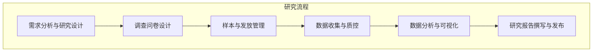
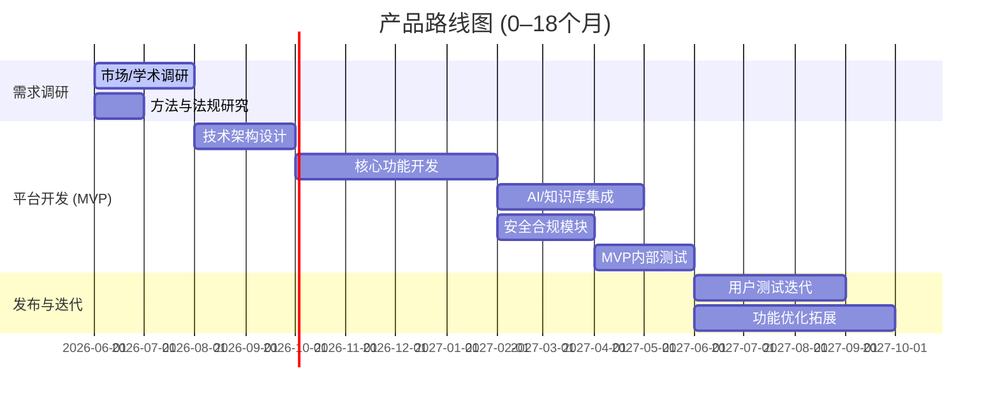

# 执行摘要  
本文从国内外现有在线调查平台出发，深入分析用户与学术研究过程中的需求与规范。首先对 SurveyMonkey、Qualtrics、LimeSurvey、SogoSurvey（Sogolytics）、腾讯问卷、问卷星、问卷网、问卷星学术版、Prolific、MTurk 等10余款竞品进行梳理，比较它们的定位、核心功能、AI/知识库能力、学术合规支持、优劣势、定价及目标用户（见下表）。接着，从学术研究者、政府/NGO、企业市场研究者、学生等多个角色出发，分析问卷研究的关键环节（样本设计、问卷编制、数据清洗、统计分析、可重复性、数据安全与隐私等）及合规伦理要求。基于竞品与需求，提出差异化的模块化产品设计方案，包括研究设计助手、测量工具箱、AI问卷设计器、样本与发放管理、数据收集与质控、分析与可视化、知识库与文献检索、伦理合规与风险提示、协作版本管理、API与导出等模块，并列出各模块功能清单、AI实现思路和学术规范落实要点。设计了自动化风险检测与提示机制，对测量偏差、样本偏倚、伦理问题、数据泄露、统计误用等常见风险进行识别，并给出基于文献的建议文本。最后提出技术架构和数据治理方案（前后端分层、AI服务、知识库、加密存储、审计日志等），商业模式与定价建议（SaaS订阅、按项目付费、学术/企业版等），以及0–18个月的产品路线图与MVP方案。全文引用官方文档、学术原始文献与隐私法规，力求专业严谨。

## 竞品调研（国内外）  
针对国内外主流在线调查与问卷平台，我们对比总结如下表（信息主要来源于各厂商官网及权威报道）：

| 竞品            | 定位                                           | 核心功能                                                   | AI/知识库能力                                    | 学术合规支持                                                 | 优势                                               | 劣势                                        | 定价 & 目标用户                         |
|---------------|----------------------------------------------|---------------------------------------------------------|-----------------------------------------------|----------------------------------------------------------|--------------------------------------------------|---------------------------------------------|------------------------------------------|
| **SurveyMonkey (美国)**  | 面向企业/市场/教育的通用在线问卷平台                        | 海量模板，30+题型，逻辑跳题、分支，问卷设计、分发(链接、邮件、小程序)、实时报告、多重分析。 | 支持AI问卷生成与分析：例如"根据需求描述，AI自动生成完整问卷草案"【10†L347-L354】，"实时预测最佳题型"等功能【10†L368-L374】。 | 支持匿名问卷、数据加密传输、遵循GDPR/CCPA等隐私法规【7†L675-L678】【7†L689-L693】；企业版还支持HIPAA合规。 | 易用性高、模板丰富、分析功能强；市场占有率高。            | 高级功能需付费；缺少针对学术研究的专用模块。             | 基本版免费（限25条/问卷），团队版约$30/用户·月【14†L318-L322】，企业版定制；目标用户为中小企业、市场调研机构、教育科研等。 |
| **Qualtrics Research Core (美国)** | 企业级全功能调研平台，广泛应用于学术和企业研究 | 23+题型，复杂逻辑(分层样本、配额)、协作编辑、多渠道分发(邮件、面板)。高级分析与报告(30+图表)。 | 内置智能辅助：提供基于生成式AI的视频反馈摘要、多维交叉表、自动方法学审查等，能"自动检查问卷设计是否符合最佳实践、响应质量及政策合规"【25†L109-L114】。 | 数据安全合规：通过ISO 27001、SOC等认证，支持加密存储；具备方法学审核、质量控制功能【25†L109-L114】。 | 功能最全面，支持高级统计和复杂实验设计；学术界采用率高(用户超2万机构)【22†L251-L257】。 | 成本高昂，学习曲线陡峭；对小团队和预算有限的用户不友好。 | 学术/企业版，起步价约$420/月【82†L259-L264】（按响应计费），高端定制；用户以大型企业、科研机构和高校为主。 |
| **LimeSurvey (德国/开源)** | 开源免费问卷工具，适合科研与教育用途                         | 开源自托管或云托管；支持800+模板、30多种题型、跳题逻辑、多语种，界面基本。 | AI功能有限：提供AI辅助翻译（80+语言）【29†L469-L474】，未来计划更多AI扩展。 | 强调隐私：满足GDPR要求，可自选数据中心(欧盟/美加等)，支持匿名投票【29†L475-L482】【36†L425-L429】；教育版提供教师/学生优惠(教师30%、学生50%)【36†L490-L493】。 | 免费且开源，数据可控度高；功能灵活且支持多语言；学术友好优惠政策。 | 界面和体验较旧；需自建服务器或付费租用云；无商业化支持。 | 社区版永久免费；云托管版提供基础免费，进阶套餐年费几百美元；主要用户为高校、研究机构、中小企业及技术团队。 |
| **SogoSurvey (Sogolytics, 美国)** | 提供免费/企业级在线调研平台（含CX/EX企业产品）                | 一站式问卷创建(拖拽式设计)、分发、实时报告；100+专业模板；内置2500+科研报告指标。 | 强调AI：支持"从想法到问卷数秒完成"的AI创建功能【40†L142-L149】；SogoAI可智能撰写和优化问题。 | 安全合规：通过GDPR、ISO 27001、PCI DSS认证【45†L340-L347】，企业版支持更高级别安全；提供研究面板(130+国)和质量控制。 | 免费版功能齐全(所有付费功能均可用，仅响应量受限)、AI生成强大、全球面板支持。 | 免费版响应数量有限；深入分析和定制需付费；界面略复杂。 | 免费版不限功能(限年响应数200条)【45†L158-L166】；Pro版$66/月（年付，~¥520/月）【45†L189-L197】起；面向个人、团队及企业用户。 |
| **腾讯问卷 (中国)**    | 腾讯生态下的轻量级在线问卷工具                         | 支持20+题型(单多选、矩阵、打分、填空等)，问卷逻辑跳转；问卷链接可一键分享到微信朋友圈/群。 | 提供AI助力：输入主题（如"员工满意度"），AI能"10秒内自动生成结构完整的问卷"【47†L68-L72】。 | 数据安全：依托腾讯云加密传输与存储体系；符合国内数据安全标准。 | 操作极简，基础功能免费；与微信生态无缝结合(可短信/微信推送)，拥有千万级实名样本库精确分发【47†L70-L74】。 | 功能较简单，对大规模复杂调研支持不足；缺少学术研究专用功能（如严格配额、多轮设计）。 | 个人和教育用户免费，企业版可购买增值服务；主要用户是企业内部或社团进行快速调研，适合海量分发和轻量研究场景。 |
| **问卷星 (中国)**      | 国内领先商业调研平台，市场占有率60%以上【47†L84-L90】          | 支持30+题型(单/多选、矩阵、量表、表格、文件上传等)，强大的逻辑跳转、随机抽题；模板库丰富；多用户协同。 | 近期推出"问问AI"智能助手，能在问卷创建和答题过程中提供帮助，但主要功能依旧以传统为主。 | 符合数据安全标准：通过国家等保三级和ISO27001认证【47†L88-L90】；支持数据导出以供再验证。 | 功能最全面、适用复杂专业调研；支持多维交叉分析和可视化【47†L88-L91】；安全与隐私保护体系成熟。 | 免费版功能受限，高级功能需订阅；界面较为传统，海外化程度低。 | 提供免费版（适合学生和个人）和专业版/企业版【51†L61-L64】；专业版年费约￥2499起，企业版更高；目标用户为企业、政府、头部高校和专业研究机构【47†L90-L94】。 |
| **问卷网 (wenjuan.com, 中国)** | 国内在线问卷/考试/表单平台                             | 提供调查问卷、满意度调查、考试测评、报名表等多种应用场景；题型丰富（单/多选、上传、打分等）；支持海量模板。 | 内置"问问AI"聊天助手，可帮助构建和完善问卷，但自动生成能力一般。 | 安全合规未显性宣称，提供微信/邮件/短信分发接口。 | 使用简单，模板多；支持在线考试与评分等功能；适合基础调查和培训评估。 | 高级功能深度一般，缺乏复杂统计分析工具；隐私保护主要依赖平台政策。 | 免费版基础功能无限制；高级版约￥2499/年，企业版￥5499/年起【49†L59-L67】；面向个人、教育以及小微企业用户。 |
| **问卷星学术版 (中国)**   | 问卷星针对学术研究者的优惠版本                         | 功能同问卷星专业版，适用于论文调研和学术课程调查；提供海量学术调查模板。 | 无额外AI功能，与商用版功能一致。                  | 针对学生和教师提供优惠：学生可享半价，教师可享七折【36†L490-L493】；适用学术伦理指导。 | 专为学术场景定制优惠，降低使用门槛；享有问卷星强大功能和支持。         | 功能与商用版无差异，依然需要付费订阅；缺少专门的学术研究指导模块。      | 注册并实名认证后可申请学术折扣（学生50%、教师30%）【36†L490-L493】；主要用户为高校师生、科研人员。 |
| **Prolific (英国)**      | 专注学术研究的在线受试者招募平台                        | 允许研究人员链接外部问卷，提供100+筛选条件（如年龄、民族、兴趣）；支持代表性样本抽样。 | 无AI功能；提供参考文献库和支持材料指导。              | 强调研究质量：参与者均为人工注册且经身份验证；符合心理学等研究伦理要求。 | 响应速度快（平均2小时完成）【54†L74-L83】、参与者质量高、透明付费；适合行为科学、市场等实验。 | 样本量有限于平台注册用户；成本较高(按人次付费)。           | 无月费，仅按参与者付费+平台费(学术用户费率33.3%)【54†L201-L204】；目标用户为高校研究者、学术实验者。 |
| **MTurk (美国)**       | 亚马逊旗下众包劳动力平台                                | 研究人员发布HIT(任务)，可用于收集问卷数据或完成任务；全球大量在线工人参与。 | 无AI功能，基本任务执行平台。                         | 参与者身份多为化名，无强认证；平台本身不对研究合规性负责。  | 成本低廉（基础付费+20%平台费【56†L33-L40】）、响应速度快；适合进行大规模初步实验或测试。 | 样本代表性差，可能存在低质量回答；缺乏专业问卷构建或合规工具。    | 无月费，按完成任务付费(工人奖励+20%佣金【56†L33-L40】)；主要面向有一定预算的研究者或企业用户。 |

## 用户与学术需求分析  
目标用户包括：**学术研究者**（科研机构、高校师生等），**政府/NGO**（需要公共政策与社会调查）、**企业市场研究部**，以及**学生/个人研究者**等。它们在调研过程中都需经过**样本设计–问卷设计–发放收集–数据清洗–统计分析–结果报告**等关键流程，每个环节均有严格规范要求。如样本设计需保证**代表性**（随机/分层抽样），并控制非响应偏差；测量工具（问卷）需要**信度和效度**检验，题目须简明无歧义、单概念且避免导向性用语【75†L269-L278】；若进行跨文化研究，需支持**问卷翻译校对**。数据收集后要进行**数据清洗**（去除无效答卷如极端速度作答、多选题异常等），统计分析则需依据研究设计选择合适方法（量表信度检验、显著性检验及多变量分析等），并避免统计误用（如不正当的多重检验）。学术领域特别强调**可重复性**：平台应支持导出原始数据，保证**分析过程可复现**；报告中需说明样本来源和方法，以符合学术出版规范【75†L155-L163】。合规和伦理方面，需符合**伦理审查**要求（如问卷中敏感信息处理需获得IRB批准），并遵守数据保护法规：在欧盟国家应满足**GDPR**规定，中国则遵守《个人信息保护法》等要求，如收集个人信息前需明示告知、可用**数据匿名化处理**降低风险【77†L40-L47】【36†L425-L429】。总之，平台设计必须兼顾用户友好和研究严谨性，引导使用者遵循问卷设计与数据处理最佳实践【75†L155-L163】【75†L269-L278】。

## 差异化功能与模块化产品设计  
基于竞品和用户需求，我们设计以下关键模块，并在每模块内实现 AI 智能与学术规范功能：

- **研究设计助手**：功能包括调查目的模板、假设库、研究方法建议等；AI通过自然语言解析研究需求，推荐研究设计方案；学术上需强调研究问题可行性和样本量估算（基于统计学公式）。优先级高，复杂度中等。
- **测量工具箱**：内置常用量表、可信度检验、效度分析等工具；AI可推荐量表（如Lickert量表）和信效度报告。符合学术规范：支持Cronbach α等指标计算，提供同行评审的量表示例。优先级中，高复杂度。
- **AI问卷设计器**：基于竞品SurveyMonkey和SogoSurvey经验，用户输入研究目的或主题，AI生成题目和逻辑流程【10†L347-L354】【40†L142-L149】；提供题目重写、润色建议（避免偏见词【75†L269-L278】）；接入在线知识库检索学术问卷案例。优先级高，开发难度大。
- **样本与发放管理**：包括样本分层/匹配、配额控制、面板对接（如国内第三方样本库），支持生成邮件/短信/微信邀请；AI可辅助规划抽样方案（如建议随机种子量）；学术要求满足统计代表性，提供样本与总体对比报告以评估偏倚。优先级高，中等复杂度。
- **数据收集与质量控制**：实时监控答题速度、完整度，自动剔除异常答卷（低质答题如快填、多选全选等）【16†L470-L478】；AI可检测回复模式，提示可能的无效答卷；实施数据加密存储和访问权限控制，符合隐私法规【36†L425-L429】。优先级高，中高复杂度。
- **分析与可视化**：提供统计检验、可视化图表、交叉分析和报告生成工具；AI助手可回答"如何理解结果"或生成摘要；支持导出SPSS/R/Stata等格式【36†L436-L440】。学术要求详细报告方法并可复现，需记录分析步骤日志。优先级高，高复杂度。
- **知识库与文献检索**：集成学术资源库（如PubMed、CNKI）查询相关研究；AI可根据用户关键词推荐文献、方法论、测量工具引用；确保用户设计问卷时参考领域前沿。优先级中，复杂度高（涉及学术资源对接）。
- **伦理合规与风险提示**：内置伦理提示引擎，根据问卷内容自动识别敏感题目、可能的伦理冲突（如未成年人调查需额外同意），并提示所需流程；根据任务和样本自动检查GDPR/PIPL合规要点（如匿名化建议）；统计使用方面，根据统计误用常见问题提示警告（例如防止p值滥用）。建议文本引用APA/AAPOR等标准【75†L155-L163】【75†L269-L278】作为依据。优先级中，复杂度高。
- **协作与版本管理**：支持多人协同编辑、版本控制与审批流程；每次修改均可跟踪日志，便于团队协作和项目管理。学术团队需求强，需保证变更可追溯。优先级中，复杂度中等。
- **API与导出**：提供与第三方工具（CRM、Statistical软件）的接口，实现数据双向流动；可导出标准格式数据、报告或将调查嵌入他处。满足开发者和专业用户需求。优先级中，复杂度中。

## 风险提示与专业建议机制  
针对调查中的常见风险，我们设计以下自动化检测规则，并提供证据支撑的建议文本模板：  
- **测量偏差**：检测题目是否**双概念**或**引导性**（如包含"你是否同意……"等），如发现提示修改；建议参考问卷设计最佳实践，例如"AAPOR建议每题只测一个概念、避免导向性用语"【75†L269-L278】。  
- **样本偏倚**：分析样本分布与目标总体特征差异（性别、年龄等），若偏离过大提示注意；建议使用分层抽样或加权调整。  
- **伦理问题**：自动识别敏感话题（健康、隐私、财务等），如果问卷涉及需额外说明告知；提示用户进行**伦理审查**并取得被试同意。  
- **数据泄露风险**：检查是否收集超出研究需要的**个人身份信息**，如联系电话、姓名等；建议采用匿名化或加密存储，符合GDPR/PIPL规定【77†L40-L47】【36†L425-L429】。  
- **统计误用**：例如发现大量显著性测试、忽视效应量，提示谨慎解读P值（参考美国统计协会警告）。  
- **答题质量**：检测快填（极短用时）、直选（全选同一选项）等模式【16†L470-L478】；建议剔除无效答卷以保证研究质量。  

每种检测给出**建议性说明**并引用权威来源。例如，对快填答卷的警告可说明"根据SurveyMonkey资料，应移除低质答卷如快填或乱码"【16†L470-L478】；对问卷设计缺陷的提示可引用AAPOR原则【75†L269-L278】。这些提示在用户界面中以可编辑的建议文本形式呈现，帮助用户即时改进设计。

## 技术架构与数据治理  
平台采用**前后端分离+微服务**架构：前端Web应用和移动端负责用户交互，后端采用Node.js/Python等语言提供问卷设计、分发、分析功能；AI服务如问卷生成和自然语言处理部署在专用服务器或云端GPU实例，调用大模型（可以接入OpenAI等API或自行训练模型）处理问卷文本；知识库模块接入文献检索API。数据存储方面，采用分层存储：结构化问卷数据和用户信息使用关系型数据库（如MySQL），分析结果及日志数据可用NoSQL存储（如ElasticSearch）；所有个人数据在传输和存储时加密，敏感信息使用哈希或匿名化处理，满足GDPR/PIPL等法规要求【77†L40-L47】【36†L425-L429】。系统记录详细审计日志，便于合规审计。技术栈可选React/Vue前端，SpringBoot/Express后端，Python进行数据处理；推荐容器化部署（Docker/Kubernetes）以支持多租户及横向扩展。总体架构需保证**高可用性和可扩展性**，能支持千万级用户和响应量，并提供多租户隔离和安全域。

## 商业模式与定价建议  
可考虑多元商业模式：**SaaS订阅**（按用户或响应量计费）、**按项目付费**、**学术免费/付费混合**以及**企业版定制**等。目标市场包括国内外高校与科研机构、政府/非营利组织、企业市场研究部门及教育培训市场。推广策略可结合学术合作（如与高校科研院所合作，提供教育许可）、线上研讨会、行业会议及合作伙伴渠道。初步定价建议：学术用户基础功能免费或低价（如每年几千元折扣订阅），企业用户分档收费（基础版数千元/年起，高级版数万元/年）；同时可提供按调查规模计费的增值服务（如样本配额、定制分析）。结合市场规模和使用频率，可估算订阅费区间及年度营收模型，保守估计数百万元起步。

## 路线图与MVP建议  
0–6个月：完成市场与学术需求调研、平台技术设计。开发基础功能：问卷设计器、样本管理和基本分析模块；构建数据安全与用户权限机制。  
6–12个月：集成AI问卷生成和知识库检索；完善数据质量控制、伦理提示模块；进行内部测试和用户访谈。  
12–18个月：优化分析可视化工具，丰富API/导出功能；进行小范围Beta测试，收集反馈，迭代优化。最终形成可投入市场的MVP，并组织目标用户（如高校研究团队）进行试点验收。  
研发过程中持续关注用户体验和学术严谨度，在关键节点进行学术和法规评审，确保产品符合伦理和隐私要求。  

**注：**以上内容依托官方文档及学术资源【7†L675-L678】【10†L347-L354】【36†L425-L434】【75†L155-L163】【75†L269-L278】【77†L40-L47】撰写，以保证技术方案和合规要求的准确性与可靠性。
