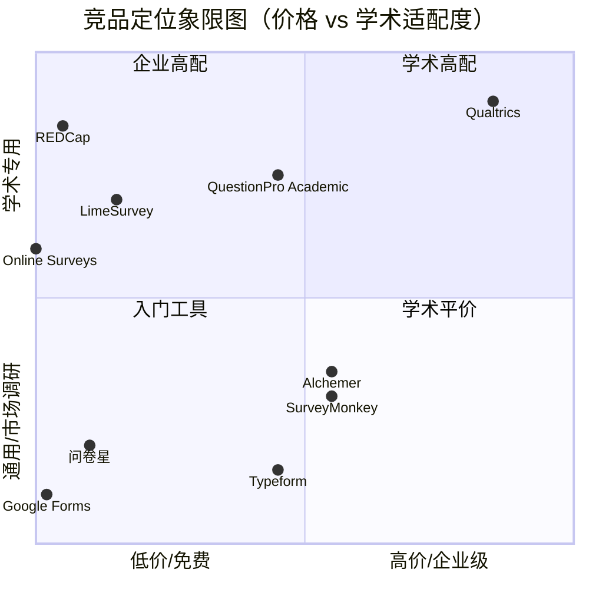
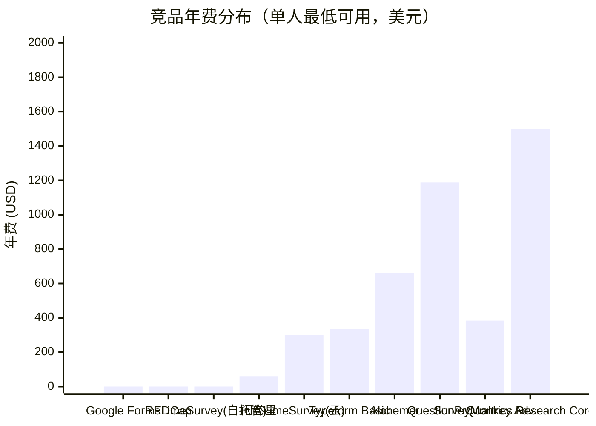
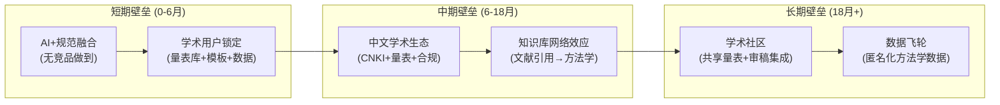

# 竞品功能详细拆解与差距分析 v1.0

> **任务**: Phase 1 第二项 — 竞品功能详细拆解与差距分析 (task-1778697793535-y07ngw)
> **产出日期**: 2026-05-14
> **方法**: 多源网络检索（Trustpilot / G2 / Capterra / 各平台官方文档 / 学术评测）
> **范围**: 9 大竞品，5 维度 47 项功能，定价分级，差距矩阵

---

## 目录

一、竞品全景概览
二、平台逐个深度拆解
三、学术专用功能对比矩阵
四、AI 功能对比
五、定价与商业模式对比
六、差距分析：市场空白与产品机会
七、差异化战略建议

---

## 一、竞品全景概览

### 1.1 竞品分类



### 1.2 竞品概览表

| 竞品 | 类型 | 核心定位 | 月费起点 | 学术版 | AI 功能 |
|------|------|---------|---------|--------|---------|
| **Qualtrics** | 企业 XM 平台 | 体验管理全栈 | ~$125/用户（学术） | ✅ 2,500+高校合作 | ✅ 全面（生成+分析+跟进） |
| **SurveyMonkey** | SaaS 调查 | 通用在线调查 | $25/月（个人Advantage年付） | ❌ 无专用学术版 | ✅ 创建+分析 |
| **LimeSurvey** | 开源+云端 | 学术/企业调查 | 自托管免费/云端~€25/月 | ✅ 学术用户活跃 | ⚠️ 有限（AI辅助创建） |
| **问卷星 (WJX)** | 中文SaaS | 中国市场全场景 | ~¥299/年（企业基础版） | ❌ 无学术引导 | ⚠️ 轻量（AI创建+DeepSeek） |
| **QuestionPro** | SaaS 调查 | 研究+企业双轨 | $99/月 | ✅ 学术许可 | ✅ AI情感分析 |
| **Alchemer** | SaaS 调查 | 企业反馈管理 | $55/月（Collaborator） | ❌ 无专用版 | ✅ AI跟进提问 |
| **Typeform** | SaaS 表单 | 对话式调查 | $28/月（年付Basic） | ❌ 无专用版 | ✅ AI表单生成 |
| **Google Forms** | 免费工具 | 基础表单 | 免费 | ❌ | ❌ |
| **REDCap** | 开源（学术联盟） | 临床/学术数据采集 | 免费（需加入联盟） | ✅ 核心用户 | ❌ |

---

## 二、平台逐个深度拆解

### 2.1 Qualtrics — 学界金标准（也是最贵的）

**定位**: 体验管理（XM）平台，从调查工具演变为全栈 CX/EX/Research 平台。

**市场表现**:
- 20,000+ 品牌使用，年处理 13 亿+ 问卷
- 2,500+ 高校通过合作计划提供免费/折扣访问
- Trustpilot 评分仅 2.5/5（"功能强但贵且难用"是普遍共识）

**学术功能优势**:
- ✅ **Survey Checker** — 内置问卷质量检查（引导性偏差、双重否定、歧义检测）
- ✅ **ExpertReview** — AI 驱动的问卷设计建议（基于方法论最佳实践）
- ✅ **Certified Questions Library** — 经过学术认证的预制题库
- ✅ **Survey Methodology & Compliance Best Practices** — 内置方法论指南
- ✅ **Advanced Randomization** — 区块/问题/选项三级随机化
- ✅ **Stats iQ** — 内置统计分析（含回归、相关、交叉表）
- ✅ **Pre-composed R Scripts** — 预置 R 脚本（EFA、CFA等）
- ✅ **SPSS/Stata/R 导出** — 标准学术格式

**AI 功能**:
- ✅ **AI Survey Builder** — 自然语言描述生成问卷
- ✅ **Conversational Feedback** — AI 跟进追问（回答不深时自动追问"为什么"）
- ✅ **AI-Powered Analytics** — 自动识别关键洞察、情感分析
- ✅ **AI Recommendations** — 仪表盘中的 AI 行动建议

**关键短板**:
- ❌ 定价不透明，学术界个人研究者若无机构合作则无法承受（$1,500+/年/用户起）
- ❌ 学习曲线极陡（"创建最基础的问卷都要好久"是用户高频投诉）
- ❌ 无中文优先支持（界面和 AI 以英文为主）
- ❌ 无 PIPL 合规内置
- ❌ 无系统化信效度检验流程引导（Stats iQ 有统计能力，但不引导学术规范流程）

### 2.2 SurveyMonkey — 最流行但学术最弱

**定位**: 全球最大在线调查平台（1999年创立），面向 SMB 和中级市场。

**市场表现**:
- 个人版: Standard ($99/月或 $39/月年付)、Advantage ($32/月年付)、Premier ($92/月年付)
- 团队版: Team Advantage ($30/用户/月)、Team Premier ($63/用户/月)
- 企业版: 定制报价
- 免费版限制: 10 题/问卷，40 份回复

**AI 功能**:
- ✅ **AI Survey Builder** — 自然语言提示生成问卷
- ✅ **AI-Powered Survey Import** — 导入外部问卷自动结构化
- ✅ **AI Text Analysis** — 开放题自动情感分析和主题提取
- ✅ **AI-Generated Reports** — 自动生成摘要报告
- ❌ **无 AI 跟进追问** — 调查过程中不能 AI 追问

**学术功能**:
- ✅ SPSS 导出（Advantage 以上）
- ⚠️ 有问卷模板，但无学术专用模板
- ❌ 无信效度分析工具
- ❌ 无伦理合规引导
- ❌ 无方法论建议

**关键短板**:
- ❌ 免费版限制极严（10题40回复）
- ❌ 学术功能几乎为零
- ❌ 无 AI 跟进追问
- ❌ 额外回复按 $0.15/条计费（10,000 条 = $1,500）
- ❌ Audience 样本服务单独计费

### 2.3 LimeSurvey — 开源学术之选

**定位**: 开源在线调查平台，学术用户和自托管需求者的首选。

**市场表现**:
- 自托管版: 完全免费（需自行管理服务器/PHP/MySQL）
- 云端版: Expert (~€25/月)、Enterprise (定制)
- 学术社区活跃，大学和研究机构广泛使用

**学术功能优势**:
- ✅ **无限问卷** — 所有版本不限问卷数量和问题数
- ✅ **多语言支持** — 80+ 语言原生支持
- ✅ **高级逻辑** — 条件分支、配额管理、随机化
- ✅ **数据导出** — SPSS/R/Stata/Excel 多格式
- ✅ **用户权限管理** — 团队协作权限精细控制
- ✅ **白标** — 可去除平台品牌，自定义域名
- ✅ **GDPR 合规** — 数据存储位置可选

**AI 功能**:
- ⚠️ 近期加入 AI 辅助创建（但功能较基础）
- ❌ 无 AI 问卷质量检测
- ❌ 无 AI 数据分析
- ❌ 无 AI 跟进追问

**关键短板**:
- ❌ 界面陈旧（"像 2005 年的软件"——用户评价）
- ❌ 自托管需要技术能力（PHP/MySQL/服务器管理）
- ❌ AI 功能严重不足
- ❌ 无内置学术方法论引导
- ❌ 无信效度分析
- ❌ 无中文生态支持

### 2.4 问卷星 (WJX) — 中国市场霸主

**定位**: 中国最大在线问卷平台，覆盖全场景。

**市场表现**:
- 累计发布问卷 3.62 亿份，回收答卷 268.11 亿份
- 覆盖 90% 中国高校、300万+ 企业
- 市场份额约 60%+（中文问卷调查市场）
- 版本: 免费版 / 企业标准版 / 企业尊享版 / 企业旗舰版
- 2026年接入 DeepSeek R1，推出"AI创建问卷"

**功能特色**:
- ✅ 50+ 题型、复杂逻辑/跳题
- ✅ 样本服务 — 提供回收答卷样本
- ✅ SPSS 在线深度分析（付费版）
- ✅ 交叉分析、数据大屏
- ✅ MaxDiff、联合分析、KANO 模型
- ✅ 360 度评估、人才盘点
- ✅ 企业微信集成

**AI 功能（2026年新增）**:
- ⚠️ **AI 创建问卷** — 钩选即生成（接入 DeepSeek R1）
- ⚠️ 轻量化 AI 辅助，功能较基础
- ❌ 无 AI 数据质量检测
- ❌ 无 AI 跟进追问

**学术功能缺失**:
- ❌ **核心痛点**: 完全不内置学术规范引导
- ❌ 无信效度检验（Cronbach's α、EFA/CFA）
- ❌ 无方法论建议或偏差检测
- ❌ 无伦理合规提示（PIPL/知情同意/最小化检测）
- ❌ 无文献检索或知识库集成
- ❌ 无学术量表库
- ❌ 无 AAPOR/APA 标准响应率报告

**关键短板**:
- ❌ "功能全但无学术引导" — 学术用户全靠自己判断
- ❌ AI 功能偏市场调研场景，不覆盖学术需求
- ❌ 数据安全和隐私问题（云服务器存储）
- ❌ 学术导出需要付费版

### 2.5 QuestionPro — 学术平价替代

**定位**: 中端调查平台，主打"免费功能最多 + 学术专版"。

**市场表现**:
- 38+ 免费功能、350+ 模板
- 学术许可证: 专门的大学/教育机构许可计划
- 提供数据迁移服务和定期培训

**学术功能**:
- ✅ **Academic Solution** — 专为大学设计的许可计划
- ✅ 高级分析工具（交叉表、TURF、联合分析）
- ✅ AI 情感分析
- ✅ 多语言支持
- ✅ 面板管理和样本集成
- ❌ 无内置信效度分析
- ❌ 无伦理合规引导
- ❌ 无 AI 问卷生成（以分析 AI 为主）

**关键短板**:
- ❌ 用户界面"笨重"（Capterra 用户反馈）
- ❌ 定价预期与实际有落差
- ❌ AI 功能集中于分析端，创建端薄弱
- ❌ 无中文生态
- ❌ 品牌知名度低于 Qualtrics/SurveyMonkey

### 2.6 Alchemer — 灵活但非学术

**定位**: 企业反馈管理平台（原 SurveyGizmo），强调灵活性和集成。

**市场表现**:
- Collaborator: $55/用户/月（75,000 回复/账户）
- Professional: $165/用户/月（100,000 回复/账户）
- 7 天免费试用

**AI 功能**:
- ✅ **Ask AI Follow-Up** — OpenAI 驱动的个性化追问
- ✅ **AI-Powered Analytics** — 自动洞察发现
- ❌ 无 AI 问卷生成

**学术功能**:
- ✅ HIPAA 合规选项（BAA 签署、数据加密）
- ⚠️ 无学术专用版

**关键短板**:
- 企业定价，学术用户无优惠
- 缺少学术专用功能
- AI 主要用于分析和跟进，创建端弱

### 2.7 Typeform — 好看但贵

**定位**: 对话式调查/表单，极致用户体验。

**市场表现**:
- Basic: $28/月（年付）、Plus: $55/月、Business: $89/月
- 免费版: 10 回复/月（限制严重）
- 主打体验而非功能深度

**AI 功能**:
- ✅ AI 表单/调查生成
- ✅ AI 跟进提问
- ❌ 无 AI 高级分析

**学术适配度**: 极低。对话式一题一页的格式不适合复杂学术问卷。无信效度、无 SPSS 导出、无伦理合规。

### 2.8 Google Forms — 免费但仅基础

**定位**: 免费基础表单工具。

**学术适配度**: 极低。适合课堂小调查或内部表单，不适合正式学术研究。无高级逻辑、无随机化、无 SPSS 导出、无任何 AI 功能。

### 2.9 REDCap — 临床研究专用

**定位**: 学术联盟形式的临床/学术数据采集平台（Vanderbilt 大学开发）。

**市场表现**:
- 8,285 个活跃合作机构，遍布 166 个国家
- 完全免费（需加入 REDCap 联盟，仅限非营利机构）
- 专业领域: 临床试验、纵向研究、HIPAA 合规

**学术优势**:
- ✅ 随机化、分组（Arms/Events）
- ✅ 去标识化数据导出
- ✅ 数据质量规则（自动验证）
- ✅ 离线数据采集
- ✅ HIPAA/FISMA/GDPR 合规
- ✅ 审计日志完整

**关键短板**:
- ❌ **仅限非营利机构**（需加入联盟）
- ❌ 界面功能性强但用户体验差
- ❌ 移动端体验"功能可用但无吸引力"（用户评价）
- ❌ 分析能力弱（需导出到外部工具）
- ❌ 调查分发渠道有限
- ❌ AI 功能完全缺失

---

## 三、学术专用功能对比矩阵

### 3.1 核心学术功能对比

| 学术功能 | Qualtrics | SurveyMonkey | LimeSurvey | 问卷星 | QuestionPro | Alchemer | REDCap | **本平台目标** |
|---------|-----------|-------------|-----------|--------|------------|---------|--------|------------|
| **问卷设计** | | | | | | | | |
| 方法论内置建议 | ✅ ExpertReview | ❌ | ❌ | ❌ | ❌ | ❌ | ❌ | ✅ **核心差异** |
| 偏差自动检测 | ✅ Survey Checker | ❌ | ❌ | ❌ | ❌ | ❌ | ⚠️部分 | ✅ **核心差异** |
| 学术认证题库 | ✅ Certified Qs | ❌ | ❌ | ❌ | ❌ | ❌ | ❌ | ✅ |
| AAPOR 标准模板 | ❌ | ❌ | ❌ | ❌ | ❌ | ❌ | ❌ | ✅ **蓝海** |
| **信效度** | | | | | | | | |
| Cronbach's α 内置 | ❌(需R脚本) | ❌ | ❌ | ❌ | ❌ | ❌ | ❌ | ✅ **蓝海** |
| EFA/CFA 引导 | ❌(需R脚本) | ❌ | ❌ | ❌ | ❌ | ❌ | ❌ | ✅ **蓝海** |
| 量表库+信效度数据 | ❌ | ❌ | ❌ | ❌ | ❌ | ❌ | ❌ | ✅ **蓝海** |
| **伦理合规** | | | | | | | | |
| 知情同意模板 | ⚠️通用 | ❌ | ❌ | ❌ | ❌ | ❌ | ⚠️临床 | ✅ **核心差异** |
| IRB 合规引导 | ❌ | ❌ | ❌ | ❌ | ❌ | ❌ | ⚠️临床 | ✅ |
| GDPR 内置 | ✅ | ✅ | ✅ | ❌ | ✅ | ✅ | ✅ | ✅ |
| PIPL 内置 | ❌ | ❌ | ❌ | ❌ | ❌ | ❌ | ❌ | ✅ **独有** |
| 敏感信息检测 | ❌ | ❌ | ❌ | ❌ | ❌ | ❌ | ⚠️ | ✅ |
| **出口与分析** | | | | | | | | |
| SPSS 导出 | ✅ | ✅ | ✅ | ✅(付费) | ✅ | ✅ | ✅ | ✅ |
| R/Stata 导出 | ✅ | ✅ | ✅ | ❌ | ✅ | ✅ | ✅ | ✅ |
| 在线统计分析 | ✅ Stats iQ | ⚠️基础 | ⚠️基础 | ✅(付费) | ✅ | ⚠️基础 | ❌ | ✅ |
| 响应率标准报告 | ❌ | ❌ | ❌ | ❌ | ❌ | ❌ | ❌ | ✅ **蓝海** |

### 3.2 关键发现：学术蓝海功能

以下功能**所有竞品均未提供**，但学术用户有刚性需求：

1. **内置信效度检验流程** — 所有平台都依赖外部工具（SPSS/R）做 Cronbach's α、EFA/CFA
2. **AAPOR 标准响应率报告** — 无平台自动计算 RR1-RR6、合作率、拒绝率
3. **学术量表库** — 无平台提供附带信效度历史数据的学术量表模板
4. **PIPL 合规引导** — 无一平台内置中国个人信息保护法合规
5. **研究方法与方法论智能匹配** — 无平台根据研究设计推荐方法论
6. **文献检索+问卷生成联动** — 无平台将文献中的量表自动转化为问卷

---

## 四、AI 功能对比

### 4.1 AI 功能程度分级

| 等级 | AI 能力 | 代表平台 |
|------|--------|---------|
| **L3: AI 全流程** | 创建 + 分析 + 追问 + 报告 | Qualtrics |
| **L2: AI 创建+分析** | 问卷生成 + 文本分析 | SurveyMonkey, Typeform |
| **L1: AI 单点** | 仅创建 或 仅分析 | 问卷星(创建), QuestionPro(分析) |
| **L0: 无 AI** | 无 AI 功能 | Google Forms, REDCap |

### 4.2 AI 功能详细对比

| AI 功能 | Qualtrics | SurveyMonkey | LimeSurvey | 问卷星 | Alchemer | Typeform | **本平台目标** |
|---------|-----------|-------------|-----------|--------|---------|---------|------------|
| AI 问卷生成 (自然语言) | ✅ | ✅ | ⚠️基础 | ✅(DeepSeek) | ❌ | ✅ | ✅ |
| AI 跟进追问 (in-survey) | ✅ | ❌ | ❌ | ❌ | ✅(OpenAI) | ✅ | ✅ |
| AI 情感/主题分析 | ✅ | ✅ | ❌ | ❌ | ✅ | ❌ | ✅ |
| AI 问卷质量检测 | ✅ ExpertReview | ❌ | ❌ | ❌ | ❌ | ❌ | ✅ **核心差异** |
| AI 方法论建议 | ⚠️ 间接 | ❌ | ❌ | ❌ | ❌ | ❌ | ✅ **独有** |
| AI 文献→问卷转化 | ❌ | ❌ | ❌ | ❌ | ❌ | ❌ | ✅ **蓝海** |
| AI 报告生成 | ✅ | ✅ | ❌ | ❌ | ✅ | ❌ | ✅ |
| AI 样本质量监控 | ✅ | ❌ | ❌ | ❌ | ❌ | ❌ | ✅ |

### 4.3 关键发现：AI 与学术规范的断层

**所有竞品的 AI 功能都面向通用/市场调研场景**，无一将 AI 与学术方法论规范结合：

- Qualtrics ExpertReview 最接近"方法论AI"，但仍以商业调研最佳实践为基础，非学术标准
- 问卷星 AI 创建接入 DeepSeek，但生成的是营销导向的问卷，无学术规范约束
- 没有平台做"AI 问卷生成 + 信效度自动检验 + 偏差自动报告"的闭环

---

## 五、定价与商业模式对比

### 5.1 定价档位分布



### 5.2 学术用户可负担性

| 平台 | 学术最低价格 | 学术用户实际可负担性 |
|------|------------|------------------|
| Google Forms | 免费 | ✅✅✅ 完全可负担 |
| REDCap | 免费（需联盟成员） | ✅✅✅ 机构用户 |
| LimeSurvey (自托管) | 免费（需技术能力） | ✅✅ 有门槛 |
| 问卷星 | 免费（基础版）| ✅✅ 可负担但有广告 |
| SurveyMonkey | $32/月（Advantage 年付）| ✅ 可负担但功能有限 |
| Typeform | $28/月（Basic 年付）| ✅ 但不适合学术 |
| QuestionPro Academic | 机构定价（不公开）| ⚠️ 依赖机构 |
| Alchemer | $55/月 | ⚠️ 无学术优惠 |
| Qualtrics Academic | 依赖机构合作 | ⚠️ 无机构=无法使用 |

### 5.3 市场定价空白

**$10-30/月/人** 区间几乎无学术专用产品：
- SurveyMonkey $32/月 是通用型，无学术功能
- Typeform $28/月 是对话式，不适合学术
- 中国市场 ¥50-200/月 区间无学术专用 SaaS

这是一个明确的定价机会窗口。

---

## 六、差距分析：市场空白与产品机会

### 6.1 差距矩阵（Gap Matrix）

| 维度 | Qualtrics | SurveyMonkey | LimeSurvey | 问卷星 | **市场空白** |
|------|-----------|-------------|-----------|--------|------------|
| **学术方法论内置** | ⚠️ 部分（ExpertReview） | ❌ | ❌ | ❌ | 🔴 **巨大空白** |
| **AI + 学术规范融合** | ❌ | ❌ | ❌ | ❌ | 🔴 **核心差异点** |
| **信效度检验内置** | ❌ (需R脚本) | ❌ | ❌ | ❌ | 🔴 **独特价值** |
| **PIPL 合规** | ❌ | ❌ | ❌ | ❌ | 🔴 **中国独有优势** |
| **中文学术生态** | ❌ | ❌ | ❌ | ⚠️（仅工具，无学术） | 🟡 **显著空白** |
| **可负担性** | ❌（$1,500+/年） | ⚠️（$32/月基础） | ✅（自托管免费） | ✅（基础免费） | 🟡 **学术个人版空白** |
| **量表/题库** | ✅（商业） | ⚠️（通用模板） | ❌ | ⚠️（通用模板） | 🟡 **学术量表库空白** |
| **文献集成** | ❌ | ❌ | ❌ | ❌ | 🔴 **全新能力** |
| **研究方法匹配** | ❌ | ❌ | ❌ | ❌ | 🔴 **全新能力** |

### 6.2 五层差距模型

```
L5: 全流程学术 AI ———— [空白，任一竞品未触及]
    (文献→量表→问卷→检验→分析→报告)
L4: AI+学术规范融合 —— [空白]
    (AI生成受方法论约束 + 自动信效度 + 伦理提示)
L3: 学术规范内置 ——— [Qualtrics部分覆盖，但不完整]
    (偏差检测 + 方法论建议 + AAPOR报告)
L2: 高级调查功能 + AI — [SurveyMonkey/Typeform/问卷星]
    (AI创建 + AI分析 + 分发)
L1: 基础调查功能 ——— [Google Forms]
    (创建 + 分发 + 基础统计)
```

**我们的定位: 从 L4 切入，目标 L5**。这意味着我们不是在 L2/L3 层面与竞品展开功能数量竞赛，而是在更高的抽象层创造新品类。

### 6.3 竞品弱点汇总与我们的机会

| 竞品核心弱点 | 我们的差异化机会 |
|------------|--------------|
| Qualtrics 贵得离谱 ($1,500+/年起) | **学术个人版 $10-30/月**，学生半价，教师七折 |
| Qualtrics/问卷星 AI 不融合学术规范 | **AI 问卷生成 + 方法论约束 + 自动信效度** |
| 所有平台信效度需外部工具 | **内置 Cronbach's α / EFA / CFA 一键计算** |
| 无一平台有 PIPL 合规引导 | **知情同意模板、敏感信息检测、跨境数据管控** |
| 无一平台有文献→问卷工作流 | **知识库检索 + 量表自动转化 + 引用管理** |
| LimeSurvey 界面陈旧 | **现代 React UI，学术感但不老气** |
| 问卷星学术功能几乎为零 | **中文优先的全链路学术调查平台** |
| SurveyMonkey AI 无跟进追问 | **AI 对话式追问 + 定性深度** |
| 无一平台有方法学助手 | **研究方法推荐 + 偏差预警 + 最佳实践引用** |

---

## 七、差异化战略建议

### 7.1 核心差异化定位

**一句话定位**: 唯一将「AI 智能 + 学术规范 + 中文生态 + 可负担」四者整合的学术调查平台。

### 7.2 四大战略支柱

```
  ┌─────────────────────────────────────────┐
  │          Intelligence Survey Platform      │
  ├─────────────┬─────────────┬──────────────┤
  │  学术规范    │   AI 智能   │  中文生态     │
  │  (内置)     │  (全流程)   │  (深度)      │
  ├─────────────┼─────────────┼──────────────┤
  │ • 偏差检测  │ • AI 生成   │ • PIPL 合规   │
  │ • 信效度    │ • AI 追问   │ • CNKI 集成   │
  │ • AAPOR报告 │ • AI 分析   │ • 中文量表    │
  │ • 伦理合规  │ • AI 质控   │ • 本土化UX    │
  ├─────────────┴─────────────┴──────────────┤
  │          💰 可负担: $10-30/月(学术个人)      │
  └─────────────────────────────────────────┘
```

### 7.3 MVP 优先级建议

基于差距分析，Phase 1 MVP 应聚焦以下**竞品完全缺失**的功能：

| 优先级 | 功能 | 理由 |
|--------|------|------|
| P0 | AI 问卷生成 + 方法论约束 | 核心差异化，竞品无一做到 |
| P0 | 信效度内置（α + EFA + 报告） | 学术用户的刚性痛点，全市场空白 |
| P0 | 知情同意 + PIPL 基础合规 | 中国市场刚需，竞品完全忽视 |
| P1 | 研究方法智能匹配 | 降低学术用户门槛，AI 辅助设计 |
| P1 | 问卷偏差自动检测 | Qualtrics 有但太贵，可做更学术化的版本 |
| P1 | 中文学术量表模板库 | 中文市场独有，建立生态壁垒 |
| P2 | 文献检索→量表转化 | 打通研究→问卷工作流，L5 能力 |
| P2 | AAPOR 标准响应率报告 | 学术规范性标志功能 |
| P2 | AI 跟进追问（in-survey） | 定性深度，竞品覆盖不全 |

### 7.4 竞争壁垒构建路径



---

## 总结

### 竞品分析核心结论

1. **Qualtrics 是学术金标准但贵得拒人千里** — 2,500+ 高校有合作但不覆盖个人/小团队，价格从 $1,500/年开始
2. **问卷星 60% 中国市场但学术 = 0** — 功能最全的中文平台，但学术规范、信效度、伦理合规完全空白
3. **AI 与学术规范的融合是全局空白** — 所有平台 AI 都面向商业场景，无一结合学术方法论
4. **信效度检验内置是全局空白** — 所有平台都依赖外部 SPSS/R，没有平台做"一键信效度报告"
5. **PIPL 合规是中文市场独有机会** — 无任何国际竞品覆盖，问卷星也未深挖
6. **学术个人用户定价区间 ($10-30/月) 完全空白** — Qualtrics 太贵，免费工具无学术功能

### 下一步行动

- ⏭ 启动 Phase 1 第三项任务「技术架构设计与技术选型决策」(`task-1778697793535-vntvpp`)
- 📊 本报告可作为产品需求文档（PRD）的功能基准
- 🎯 P0 功能列表已明确，可直接指导 MVP 开发优先级

---

*本报告由 NIUMA/Newmax AI 通过多源网络检索（Trustpilot / G2 / Capterra / 各平台官方文档 / 学术评测网站）生成，数据截至 2026-05-14。*
