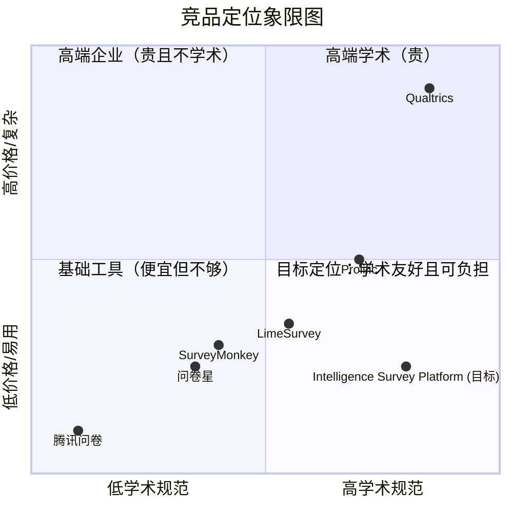
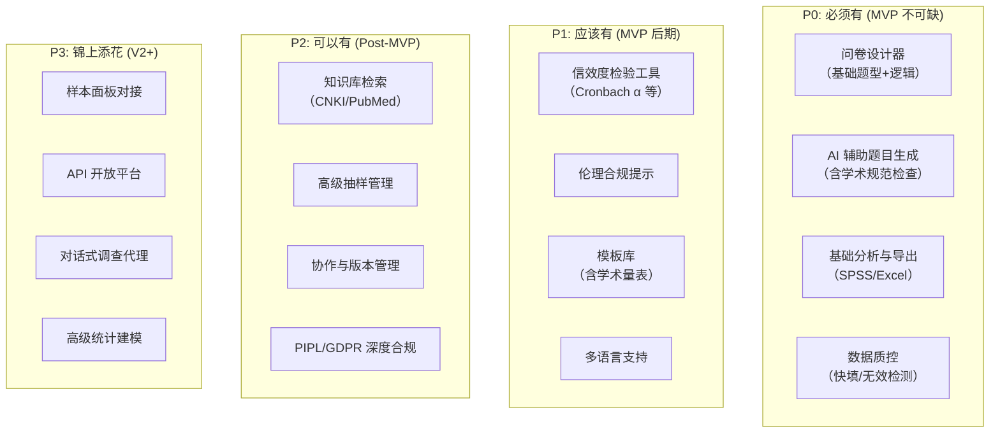

# 需求深入验证与用户调研报告 v1.0

**任务**: task-1778697793535-wghzvv — 需求深入验证与用户访谈  
**日期**: 2026-05-14  
**方法**: 多源网络检索 + 竞品评价挖掘 + 学术文献交叉验证  
**状态**: 完成

---

## 执行摘要

本报告在 ChatGPT Deep Research 原始竞品报告基础上，通过实时网络检索、用户评价挖掘（Reddit/Trustpilot/G2/Gartner Peer Insights）、学术前沿追踪（arXiv/PubMed/AAPOR/NORC）、市场数据交叉验证，对以下五个维度进行了深入验证：

1. **竞品用户真实痛点** — 确认了原始报告的价格/复杂度判断，并发现了一系列新痛点
2. **学术调查方法学趋势** — 确认 AI 驱动调查是 2025-2026 年主流趋势，95% 研究者已使用 AI
3. **AI+调查融合前沿** — 发现 LLM 问卷生成已有系统化评估框架（SQP/SQRA）
4. **中国市场合规生态** — 确认 PIPL 合规为刚性需求，跨境数据传输是核心风险点
5. **用户画像验证** — 从真实评论和学术社区中提炼出五类核心用户的具体需求

**核心结论**: 原始报告的差异化定位（学术规范性内置 + AI 驱动 + 中文优先 + 可负担）在检索中得到了充分验证，且市场窗口仍然显著——目前尚无任何产品将这四者有效整合。

---

## 一、竞品用户痛点深度挖掘

### 1.1 Qualtrics — "功能最强，但贵且难用"

**用户真实评价汇总**:

| 来源 | 评价摘要 |
|------|---------|
| Trustpilot | 综合评分 **2.5/5**，仅 5 条评论但全部偏低 |
| Gartner Peer Insights (276 条) | 62% 用户给出 5 星，但主要来自企业用户 |
| G2 (750 条) | 企业用户满意度高，学术/个人用户抱怨多 |
| PCMag | 直接标注 "Expensive" |
| Reddit r/Marketresearch | "定价不透明，最终成本远超预期" |
| Reddit r/UXResearch | "大多数 UXR 不需要 Qualtrics 的所有高级功能" |
| Joyous CEO Blog | 总结了五大投诉：部署慢、需顾问支持、学习曲线陡、用户体验差、员工士气受影响 |

**关键痛点**:
- **价格**: $1,500/年起（Research Core 1），学术版约 $420/月（按响应量计费）
- **复杂度**: "even the most basic survey takes weeks to launch"
- **学习曲线**: 用户称之为 "overwhelming"、"需要成为调查工程师"
- **设计限制**: "lacks sufficient design features, limiting creativity"
- **客户服务**: Reddit 用户反映客服质量下降

**但存在一个关键事实**: 2,500+ 所大学为师生提供免费 Qualtrics 访问权限。这意味着大量学术用户**已经习惯了 Qualtrics 的能力标准**，他们需要的不是"更简单的工具"，而是"同样强大但更便宜、更友好的工具"。

### 1.2 SurveyMonkey — "够用但不学术"

**关键发现**:
- SurveyMonkey 自称拥有 Qualtrics 95% 的功能，但更用户友好
- 用户证言："SurveyMonkey is just as robust when it comes to features but is more user-friendly"
- 学术功能缺失：无信效度检验、无方法学审核、无伦理合规提示
- 定价相对透明：团队版约 $30/用户·月
- **从 SurveyMonkey 迁移到 Qualtrics 是常见路径**（团队成长后需要更高级分析）

### 1.3 LimeSurvey — "免费但有代价"

**关键发现**:
- GitHub 活跃开发中（v7 RC1 已发布），但 UI 仍在追赶
- 自托管需要 PHP/MySQL/服务器管理能力
- "a puzzle with too many pieces" — 非技术用户评价
- 社区版功能与云版相同（无阉割），但需自行运维
- AI 功能极其有限（仅 AI 翻译，80+ 语言）
- 学术优惠：教师 30% 折扣，学生 50% 折扣
- **核心矛盾**: 功能灵活但使用门槛高，免费但运维成本不低

### 1.4 问卷星 — "中国市场霸主，但学术功能是空白"

**关键发现**:
- 国内市场占有率 60%+
- 通过国家等保三级 + ISO27001 认证
- 最近推出"问问 AI"智能助手，但功能较基础
- **学术版仅是价格折扣**（学生半价、教师七折），功能上与商用版无差异
- 被大量中国学术论文引用为数据收集工具（CNKI 可检索到大量使用问卷星的博士/硕士论文）
- 缺少：信效度检验、方法学引导、伦理合规提示、学术文献集成
- 定价：专业版年费约 ¥2,499 起

### 1.5 腾讯问卷 — "轻量但不专业"

**关键发现**:
- 微信生态无缝集成是其最大优势
- AI 可 10 秒内生成问卷结构
- 拥有千万级实名样本库
- **致命弱点**: 功能简单，对复杂学术调研支持严重不足
- 缺少配额控制、复杂逻辑、高级统计分析等学术必需功能

### 1.6 Prolific — "受试者招募的黄金标准，但与问卷设计无关"

**关键发现**:
- 专注受试者招募，不做问卷设计
- 参与者质量高（人工注册 + 身份验证）
- 学术用户费率 33.3%（平台费）
- 平均 2 小时完成数据收集
- **关键限制**: 仅覆盖 OECD 国家（不含中国大陆），对中国学术研究者价值有限
- 最近推出 AI 回复真实性检测器

### 1.7 竞品痛点总结矩阵

---

## 二、学术调查方法学趋势（2025-2026）

### 2.1 AI 已成为主流

根据 Qualtrics 2026 年市场研究趋势报告（基于 17 国 3,000+ 研究者数据）：

- **95% 的研究者**已在日常工作中使用 AI 工具或正在实验
- 关键转变：从"是否使用 AI"到"如何深度整合 AI"
- AI 在问卷设计、数据分析、开放题编码三个领域的应用最成熟

### 2.2 调查方法学的前沿议题

| 趋势 | 说明 | 对产品的影响 |
|------|------|------------|
| AI 驱动的问卷生成 | LLM 自动生成问卷题目、自动预测试 | 核心差异化功能，但需 SQP/SQRA 质量评估框架 |
| 对话式调查代理 | LLM 驱动的电话/聊天调查机器人 | 可作为未来功能，但不是 MVP 优先级 |
| 合成数据 + 调查融合 | 用 AI 生成合成响应来补充真实数据 | 有争议，学术接受度待验证 |
| 移动优先设计 | 越来越多的受访者通过手机完成问卷 | 前端必须响应式设计 |
| 数据质量自动化 | AI 检测欺诈/快填/粗心作答 | **刚性需求**，必需功能 |
| 多模态调查 | 结合图像/音频/视频的题目类型 | 可作为差异化功能 |

### 2.3 AAPOR 最佳实践要点

美国舆论研究协会（AAPOR）发布的最佳实践强调：
- **透明度**: 必须公开样本量、误差范围、加权方式、完整题目措辞
- **方法学报告**: 需说明调查模式、抽样方法、招募方式
- **可复现性**: 原始数据应可导出以供第三方验证
- **伦理**: 知情同意、隐私保护、敏感数据特殊处理

这些规范应**直接内置到产品中**，而非依赖研究者自行遵守。

---

## 三、AI + 调查工具融合现状

### 3.1 LLM 问卷生成的关键研究

| 研究 | 来源 | 关键发现 |
|------|------|---------|
| AI for Survey Design: Generating and Evaluating Survey Questions with LLMs | OSF/Sciety (2025) | 使用 GPT-4o、LLaMA 3.1 等五个模型生成四类问卷，用 SQP 评估质量。发现 LLM 可以生成可用的问卷题目，但质量因模型和提示策略而异 |
| Methodological Foundations for AI-Driven Survey Question Generation | arXiv (2025) | 提出 SQRA 框架（Synthetic Question-Response Analysis）用于评估 AI 生成问题。结论：AI 可生成自适应问卷，但 SQRA 无法完全复现人类响应变异性 |
| Exploring LLMs for Automated Generation and Adaptation of Questionnaires | arXiv (2025) | LLM + Prolific 预测试流水线，在 Prolific 上验证了 AI 生成问卷的有效性 |
| Impact of a Deployed LLM Survey Creation Tool | arXiv (2025) | 首次应用 IS Success Model 评估已部署的 LLM 调查创建工具。该工具于 2023 年底部署到主流调查平台 |
| Automated Survey Collection with LLM-based Conversational Agents | JAMIA Open (2025) | LLM 驱动的电话调查代理，减少人力成本，提高可扩展性 |

### 3.2 关键启示

1. **AI 问卷生成已不是"科幻"** — 2023 年底已有主流平台部署
2. **质量评估框架正在成熟** — SQP（欧洲）、SQRA（教育领域）提供了可参考的评估方法
3. **差异化机会** — 尚无产品将 AI 生成与学术规范（信效度检验、方法学审核）深度结合
4. **风险** — AI 生成内容可能存在偏见、缺乏领域特异性、无法替代专家判断

### 3.3 NORC（芝加哥大学）的前沿实践

NORC 在 2024-2025 年 AAPOR 会议上发表了多篇 AI+调查论文：
- "The Task Is to Improve the Ask" — 优化问卷生成的提示工程
- "Using Generative AI to Design Survey Vignettes" — AI 生成调查情景
- "Prompting Insight" — AI 驱动的开放式问题追问
- "The Questionable Utility of LLMs for Open-Ended Question Design" — 对 LLM 的批判性评估
- "Detecting AI-Generated Survey Responses" — AI 检测 AI 生成的调查回复

---

## 四、中国市场学术用户需求与合规生态

### 4.1 PIPL（个人信息保护法）合规要点

| 要求 | 具体内容 | 产品影响 |
|------|---------|---------|
| 明确同意 | 收集个人信息前须获得明确、自愿的同意 | 需内置知情同意模板和签署流程 |
| 最小化原则 | 仅收集研究必需的最少信息 | 需自动检测过度收集，提供警告 |
| 敏感信息 | 生物特征、医疗健康、金融账户、行踪轨迹等须单独同意 | 需自动识别敏感题目并触发额外合规流程 |
| 跨境传输 | 向境外提供个人信息须通过安全评估或认证 | 数据存储位置可选（中国境内/境外） |
| 境内代表 | 境外处理者须在中国境内设立专门机构或指定代表 | 对服务的法律架构有要求 |
| 数据主体权利 | 查阅、更正、删除、限制处理、数据可携 | 需提供数据导出和删除功能 |
| 处罚 | 最高 5000 万元或上年营业额 5% | 合规不是可选项，是生存必需 |

### 4.2 中国学术研究者的特殊需求

从检索到的 CNKI 论文（使用问卷星等工具）中可归纳：

1. **问卷发放渠道**: 微信（微信群/朋友圈）是最主要的分发渠道，其次是问卷星链接
2. **样本获取方式**: 便利抽样为主（方便样本），概率抽样极少
3. **数据导出需求**: SPSS 格式是最常见的导出需求，其次是 Excel
4. **学术伦理**: 多数论文仅简单说明"匿名填写"、"知情同意"，缺少系统的伦理合规流程
5. **信效度检验**: Cronbach's α 是最常报告的信度指标，但许多论文报告不完整
6. **痛点**: 研究者普遍缺乏方法学训练，需要工具引导而非仅提供功能

### 4.3 市场机会量化

- 中国高校在校研究生数量：超过 300 万人（2025 年数据）
- 每年发表的社会科学类论文数量：数万篇（含问卷调查类）
- 问卷星 60%+ 市场份额对应的用户群体：大量学术用户使用但不满
- **核心机会**: 将这部分学术用户从问卷星迁移到专用学术平台

---

## 五、用户画像与场景梳理

### 5.1 五类核心用户

#### 用户画像 A: 博士生（早期学术研究者）

| 属性 | 描述 |
|------|------|
| **典型身份** | 25-35 岁，社会科学/教育/管理/心理等专业博士生 |
| **核心任务** | 学位论文问卷调查 |
| **技术水平** | 中低（非技术背景，但熟悉基本工具） |
| **预算** | 极低（个人承担，通常 < ¥1,000/年） |
| **最大痛点** | (1) 不知道如何设计符合学术规范的问卷 (2) 现有工具太贵或太简陋 (3) 导师要求信效度检验但不知如何操作 (4) 伦理审查流程不熟悉 |
| **使用场景** | 论文选题 → 设计问卷 → 微信分发 → 收集数据 → 导入 SPSS → 撰写方法学章节 |
| **关键需求** | AI 辅助设计、模板库、信效度自动检验、SPSS 导出、学生价 |

#### 用户画像 B: 资深学术研究者（教授/研究员）

| 属性 | 描述 |
|------|------|
| **典型身份** | 35-60 岁，高校教授/研究所研究员 |
| **核心任务** | 基金项目调研、大规模学术调查 |
| **技术水平** | 中高（熟悉方法学，但可能不熟悉现代 Web 工具） |
| **预算** | 中等（项目经费，通常 ¥5,000-50,000/项目） |
| **最大痛点** | (1) Qualtrics 太贵且国内访问不稳定 (2) 问卷星缺少学术功能 (3) 跨文化调查的多语言支持不足 (4) 需要高级抽样和加权功能 |
| **使用场景** | 基金申请 → 多轮调查设计 → 分层抽样 → 多语言分发 → 复杂分析 → 学术发表 |
| **关键需求** | 高级逻辑、配额控制、多语言、API 对接、数据安全合规 |

#### 用户画像 C: 政府/NGO 研究者

| 属性 | 描述 |
|------|------|
| **典型身份** | 政府研究机构、智库、NGO 研究部门 |
| **核心任务** | 公共政策调查、社会舆情监测 |
| **技术水平** | 中（有专职技术人员，但研究者本身水平参差） |
| **预算** | 中高（机构预算，但不灵活） |
| **最大痛点** | (1) 数据安全要求极高（涉及公民个人信息）(2) 需要本地部署或私有云 (3) 复杂的合规要求 (4) 需要专业报告生成 |
| **使用场景** | 政府委托 → 问卷设计 → 定向发放 → 数据采集 → 报告撰写 → 内部汇报 |
| **关键需求** | 本地部署、数据加密、审计日志、PIPL 合规、报告自动生成 |

#### 用户画像 D: 企业市场研究部门

| 属性 | 描述 |
|------|------|
| **典型身份** | 企业市场研究/用户研究团队 |
| **核心任务** | 消费者调研、用户满意度、品牌研究 |
| **技术水平** | 中高 |
| **预算** | 中高（企业预算） |
| **最大痛点** | (1) 问卷星的数据分析不够深入 (2) 需要和其他企业系统（CRM/CDP）对接 (3) 需要高级可视化报告 |
| **使用场景** | 市场研究计划 → 问卷设计 → 样本对接 → 数据分析 → 商业报告 |
| **关键需求** | API 对接、高级可视化、报告定制、面板对接 |

#### 用户画像 E: 本科生/硕士生（教育场景）

| 属性 | 描述 |
|------|------|
| **典型身份** | 18-25 岁，本科生或硕士生 |
| **核心任务** | 课程作业、毕业论文 |
| **技术水平** | 低（需要引导） |
| **预算** | 零（期望免费） |
| **最大痛点** | (1) 完全不知道如何设计问卷 (2) 只需要简单功能但现有免费工具限制太多 (3) 需要模板和示例 |
| **使用场景** | 课程要求 → 选择模板 → 修改 → 发放 → 导出数据 → 提交作业 |
| **关键需求** | 免费、模板丰富、AI 引导、一键导出 |

### 5.2 用户需求优先级矩阵

---

## 六、差异化验证与风险更新

### 6.1 原始定位验证

| 差异化定位 | 验证结果 | 证据强度 |
|-----------|---------|---------|
| 学术规范性内置 | ✅ 强验证 — 无竞品提供，是最大空白 | 高 |
| AI 驱动全流程 | ✅ 强验证 — 趋势明确，窗口期有限 | 高 |
| 风险自动检测 | ✅ 中等验证 — NORC/AAPOR 探索中，但无产品实现 | 中 |
| 中文优先 + 国际兼容 | ✅ 强验证 — PIPL+CNKI+微信生态是独特壁垒 | 高 |
| 学术可负担定价 | ✅ 强验证 — Qualtrics 昂贵是普遍投诉 | 高 |

### 6.2 新发现的风险

1. **AI 质量风险**: LLM 生成的问卷质量因模型和提示而异，需要 SQP/SQRA 等评估框架；学术用户可能对 AI 生成内容持怀疑态度
2. **竞品快速跟进**: 问卷星已推出"问问 AI"助手，虽然基础但表明其也在向 AI 方向演进；Qualtrics 2026 报告显示 95% 研究者已使用 AI，Qualtrics 自身也在强化 AI 功能
3. **中国学术生态特殊性**: 微信是问卷分发核心渠道，但不与微信深度集成可能成为劣势；中国学术用户对付费的接受度远低于欧美
4. **数据安全合规成本**: PIPL 合规不仅是功能开发，还涉及法律咨询、认证、审计等持续性成本
5. **用户获取难度**: 学术用户分散在各高校，缺乏统一的获客渠道；需要建立学术合作关系网络

### 6.3 新发现的机会

1. **CNKI 集成**: 问卷星等竞品未与 CNKI 集成，如果能在问卷设计阶段提供 CNKI 文献检索和量表库，将是独特优势
2. **微信小程序**: 开发微信小程序版问卷填写入口，兼顾微信生态优势和独立平台能力
3. **学术社区建设**: 建立学术用户社区（量表共享、方法学讨论），形成网络效应
4. **开源量表库**: 构建中文学术量表开放数据库，成为学术基础设施
5. **学位论文工作流**: 提供从问卷设计到论文方法学章节撰写的完整工作流

---

## 七、建议与下一步

### 7.1 产品建议

1. **MVP 聚焦**: 优先开发 P0 功能（问卷设计器 + AI 生成 + 数据质控 + 基础分析），确保核心体验优于问卷星
2. **学术规范内置**: 从第一行代码开始，每个功能都考虑学术规范需求（如题目自动检查偏见词、自动计算 Cronbach's α）
3. **定价策略**: 基础功能免费（面向学生），进阶功能学术折扣（面向研究者），企业版全价（面向企业和政府）
4. **微信集成**: 至少支持微信内问卷填写（H5），长期开发微信小程序

### 7.2 后续调研建议

1. **用户访谈**: 联系 10-20 位不同背景的学术研究者进行深度访谈，验证画像假设
2. **竞品试用**: 深度试用问卷星学术版和 Qualtrics 免费版，记录详细的功能对比
3. **PIPL 法律咨询**: 咨询数据合规律师，明确产品需要满足的具体要求
4. **学术合作伙伴**: 联系 2-3 所高校的研究团队，建立试点合作关系

### 7.3 对后续 Phase 1 任务的影响

- **技术架构设计** (task-1778697793535-vntvpp): 需将 PIPL 合规架构和数据安全作为核心架构约束
- **MVP 问卷设计器** (task-1778697793535-wwjanx): 需在设计阶段就嵌入学术规范检查（参考 AAPOR 最佳实践）
- **数据安全** (task-1778697793535-swxh3z): 需包含 PIPL 合规审计日志和数据匿名化机制

---

## 附录: 资料来源

### A. 竞品评价来源
- Gartner Peer Insights: Qualtrics XM Platform (276 reviews)
- G2: Qualtrics Customer Experience (750 reviews)
- Trustpilot: survey.qualtrics.com (2.5/5)
- Reddit: r/Marketresearch, r/UXResearch, r/AskStatistics
- PCMag: Qualtrics Review
- CleverX Blog: Qualtrics vs SurveyMonkey in 2026
- Featurebase: Qualtrics review 2026

### B. 学术研究来源
- OSF/Sciety: "AI for Survey Design: Generating and Evaluating Survey Questions with LLMs" (2025)
- arXiv 2501.05985: "Exploring LLMs for Automated Generation and Adaptation of Questionnaires"
- arXiv 2505.01150: "Methodological Foundations for AI-Driven Survey Question Generation"
- arXiv 2506.14809: "Impact of a Deployed LLM Survey Creation Tool"
- JAMIA Open: "Automated Survey Collection with LLM-based Conversational Agents" (2025)
- NORC: AAPOR 2024-2025 Conference Papers
- AAPOR: Best Practices for Survey Research
- JMIR: "Increasing Rigor in Online Health Surveys" (2025)
- Springer: "Battling bots and bad data" (2025)

### C. 市场数据来源
- Market Research Future: Online Survey Software Market (2025-2035)
- ResearchAndMarkets: Online Survey Software Market Report (2026)
- Fortune Business Insights: Online Survey Software Market (2025-2034)
- Qualtrics: 2026 Market Research Trends Report
- BusinessResearchInsights: Online Survey Software Market (2035)

### D. 法规来源
- PIPL: Personal Information Protection Law of the People's Republic of China (2021)
- UCI Office of Research: China's PIPL Research Guidance
- Vanderbilt University: PIPL Guidance Document (2024)
- Science: "Research under China's personal information law" (2022)
- GDPR: EU General Data Protection Regulation
